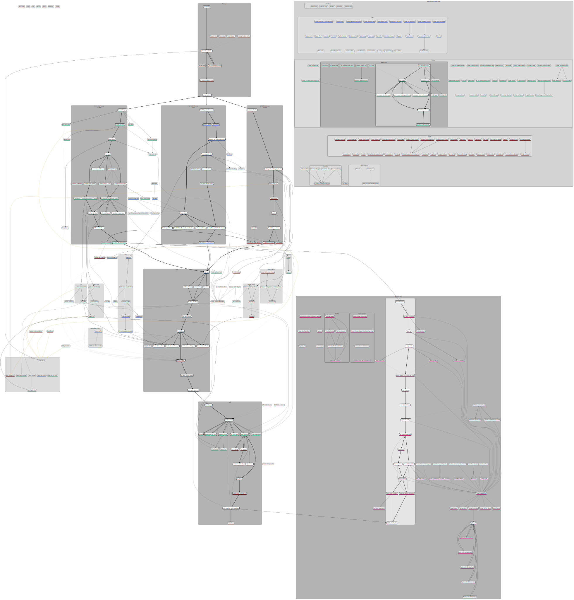

# Witcher 3 Quest Flowchart

A flowchart of all Witcher 3 quests (excluding treasure hunts, mostly).

Made with [https://dreampuf.github.io/GraphvizOnline/][super long link reference].

### Credit

Thanks to [jackhumbert for the inspiration](https://github.com/jackhumbert/the-witcher-3-quest-flowchart).

### Notes

I was getting incredibly annoyed at having to look up all the different storylines and always triple-checking everything, so I spent the last weekend putting this together.

Source of quest info: [witcher.fandom.com](https://witcher.fandom.com/wiki/The_Witcher_3_main_quests)

Any suggestions on how to improve the flowchart are always welcome!

[super long link reference]: https://dreampuf.github.io/GraphvizOnline/#digraph%20G%20%7B%0D%0A%20%20%20%20compound%3Dtrue%3B%0D%0A%20%20%20%20newrank%3Dtrue%3B%0D%0A%20%20%20%20ranksep%3D2.5%3B%0D%0A%20%20%20%20node%20%5B%20style%3D%22rounded%2Cfilled%22%2C%20fillcolor%3Dlightgrey%2C%20shape%3Dbox%20%5D%3B%0D%0A%20%20%20%20%0D%0A%20%20%20%20%23%20main%20quest%20nodes%20must%20be%20initialised%20first%20to%20make%20sure%20they%20have%20the%20right%20colours%0D%0A%20%20%20%20%23%23%23%23%23%23%23%23%23%23%23%23%23%23%23%23%23%23%23%23%23%23%23%23%23%23%23%23%23%23%23%23%23%23%23%23%23%23%0D%0A%20%20%20%20%0D%0A%20%20%20%20%0D%0A%23%23%23%23%23%23%23%23%23%23%23%23%23%23%23%23%23%23%23%23%23%23%23%23%23%23%23%23%23%23%23%23%23%23%23%23%20NODES%20%23%23%23%23%23%23%23%23%23%23%23%23%23%23%23%23%23%23%23%23%23%23%23%23%23%23%23%23%23%23%23%23%23%23%23%23%23%0D%0A%0D%0A%20%20%20%20subgraph%20base_game%20%7B%0D%0A%20%20%20%20%20%20%20%20%0D%0A%20%20%20%20%20%20%20%20subgraph%20cluster_prologue_to_act3%20%7B%0D%0A%20%20%20%20%20%20%20%20%20%20%20%20style%3D%22rounded%2Cfilled%22%3B%0D%0A%20%20%20%20%20%20%20%20%20%20%20%20fillcolor%3Dwhite%3B%0D%0A%20%20%20%20%20%20%20%20%20%20%20%20%0D%0A%20%20%20%20%20%20%20%20%20%20%20%20subgraph%20cluster_prologue_to_act2%20%7B%0D%0A%20%20%20%20%20%20%20%20%20%20%20%20%20%20%20%20%0D%0A%20%20%20%20%20%20%20%20%20%20%20%20%20%20%20%20subgraph%20cluster_prologue%20%7B%0D%0A%20%20%20%20%20%20%20%20%20%20%20%20%20%20%20%20%20%20%20%20label%3D%22Prologue%22%3B%0D%0A%20%20%20%20%20%20%20%20%20%20%20%20%20%20%20%20%20%20%20%20fillcolor%3Dgray50%3B%0D%0A%20%20%20%20%20%20%20%20%20%20%20%20%20%20%20%20%20%20%20%20%0D%0A%20%20%20%20%20%20%20%20%20%20%20%20%20%20%20%20%20%20%20%20subgraph%20prologue_main%20%7B%0D%0A%20%20%20%20%20%20%20%20%20%20%20%20%20%20%20%20%20%20%20%20%20%20%20%20node%20%5Bfillcolor%3Dwhite%5D%3B%0D%0A%20%20%20%20%20%20%20%20%20%20%20%20%20%20%20%20%20%20%20%20%20%20%20%20%0D%0A%20%20%20%20%20%20%20%20%20%20%20%20%20%20%20%20%20%20%20%20%20%20%20%20%7B%20rank%3D%22source%22%3B%20mq01%20%5Blabel%3D%22Kaer%20Morhen%22%5D%3B%20%7D%0D%0A%20%20%20%20%20%20%20%20%20%20%20%20%20%20%20%20%20%20%20%20%20%20%20%20%0D%0A%20%20%20%20%20%20%20%20%20%20%20%20%20%20%20%20%20%20%20%20%20%20%20%20mq02%20%5Blabel%3D%22Lilac%20and%20Gooseberries%22%5D%3B%0D%0A%20%20%20%20%20%20%20%20%20%20%20%20%20%20%20%20%20%20%20%20%20%20%20%20mq03%20%5Blabel%3D%22The%20Beast%20of%20White%20Orchard%22%5D%3B%0D%0A%20%20%20%20%20%20%20%20%20%20%20%20%20%20%20%20%20%20%20%20%20%20%20%20mq04%20%5Blabel%3D%22The%20Incident%20at%20White%20Orchard%22%5D%3B%0D%0A%20%20%20%20%20%20%20%20%20%20%20%20%20%20%20%20%20%20%20%20%20%20%20%20mq05%20%5Blabel%3D%22Imperial%20Audience%22%5D%3B%0D%0A%20%20%20%20%20%20%20%20%20%20%20%20%20%20%20%20%20%20%20%20%7D%0D%0A%20%20%20%20%20%20%20%20%20%20%20%20%20%20%20%20%20%20%20%20%0D%0A%20%20%20%20%20%20%20%20%20%20%20%20%20%20%20%20%20%20%20%20subgraph%20prologue_side%20%7B%0D%0A%20%20%20%20%20%20%20%20%20%20%20%20%20%20%20%20%20%20%20%20%20%20%20%20sq007%20%5Blabel%3D%22A%20Frying%20Pan%2C%20Spick%20and%20Span%22%5D%3B%0D%0A%20%20%20%20%20%20%20%20%20%20%20%20%20%20%20%20%20%20%20%20%20%20%20%20sq009%20%5Blabel%3D%22Missing%20in%20Action%22%5D%3B%0D%0A%20%20%20%20%20%20%20%20%20%20%20%20%20%20%20%20%20%20%20%20%20%20%20%20sq010%20%5Blabel%3D%22On%20Death's%20Bed%22%5D%3B%0D%0A%20%20%20%20%20%20%20%20%20%20%20%20%20%20%20%20%20%20%20%20%20%20%20%20sq011%20%5Blabel%3D%22Precious%20Cargo%22%5D%3B%0D%0A%20%20%20%20%20%20%20%20%20%20%20%20%20%20%20%20%20%20%20%20%20%20%20%20sq012%20%5Blabel%3D%22Twisted%20Firestarter%22%5D%3B%0D%0A%20%20%20%20%20%20%20%20%20%20%20%20%20%20%20%20%20%20%20%20%7D%0D%0A%20%20%20%20%20%20%20%20%20%20%20%20%20%20%20%20%20%20%20%20%0D%0A%20%20%20%20%20%20%20%20%20%20%20%20%20%20%20%20%20%20%20%20white_orchard%20%5Blabel%3D%22white%20orchard%20unlocked%22%2Cstyle%3Dinvis%5D%3B%0D%0A%20%20%20%20%20%20%20%20%20%20%20%20%20%20%20%20%7D%0D%0A%20%20%20%20%20%20%20%20%20%20%20%20%20%20%20%20%0D%0A%20%20%20%20%20%20%20%20%20%20%20%20%20%20%20%20subgraph%20act1%20%7B%0D%0A%20%20%20%20%20%20%20%20%20%20%20%20%20%20%20%20%20%20%20%20%0D%0A%20%20%20%20%20%20%20%20%20%20%20%20%20%20%20%20%20%20%20%20subgraph%20cluster_act1_velen%20%7B%0D%0A%20%20%20%20%20%20%20%20%20%20%20%20%20%20%20%20%20%20%20%20%20%20%20%20label%3D%22Act%20I%3A%20In%20Ciri's%20Footsteps%5Cn(Velen)%22%3B%0D%0A%20%20%20%20%20%20%20%20%20%20%20%20%20%20%20%20%20%20%20%20%20%20%20%20style%3D%22rounded%2Cfilled%22%3B%0D%0A%20%20%20%20%20%20%20%20%20%20%20%20%20%20%20%20%20%20%20%20%20%20%20%20fillcolor%3Dgray50%3B%0D%0A%20%20%20%20%20%20%20%20%20%20%20%20%20%20%20%20%20%20%20%20%20%20%20%20%0D%0A%20%20%20%20%20%20%20%20%20%20%20%20%20%20%20%20%20%20%20%20%20%20%20%20subgraph%20act1_velen_main%20%7B%0D%0A%20%20%20%20%20%20%20%20%20%20%20%20%20%20%20%20%20%20%20%20%20%20%20%20%20%20%20%20node%20%5Bfillcolor%3Dwhite%5D%3B%0D%0A%20%20%20%20%20%20%20%20%20%20%20%20%20%20%20%20%20%20%20%20%20%20%20%20%20%20%20%20%0D%0A%20%20%20%20%20%20%20%20%20%20%20%20%20%20%20%20%20%20%20%20%20%20%20%20%20%20%20%20mq06%20%5Blabel%3D%22The%20Nilfgaardian%20Connection%22%5D%3B%0D%0A%20%20%20%20%20%20%20%20%20%20%20%20%20%20%20%20%20%20%20%20%20%20%20%20%20%20%20%20mq07%20%5Blabel%3D%22Bloody%20Baron%22%5D%3B%0D%0A%20%20%20%20%20%20%20%20%20%20%20%20%20%20%20%20%20%20%20%20%20%20%20%20%20%20%20%20mq08%20%5Blabel%3D%22Ciri's%20Story%3A%20The%20King%20of%20the%20Wolves%22%5D%3B%0D%0A%20%20%20%20%20%20%20%20%20%20%20%20%20%20%20%20%20%20%20%20%20%20%20%20%20%20%20%20mq09%20%5Blabel%3D%22Family%20Matters%22%5D%3B%0D%0A%20%20%20%20%20%20%20%20%20%20%20%20%20%20%20%20%20%20%20%20%20%20%20%20%20%20%20%20mq09_a%20%5Blabel%3D%22Family%20Matters%20(Find%20the%20Baron's%20wife)%22%5D%3B%0D%0A%20%20%20%20%20%20%20%20%20%20%20%20%20%20%20%20%20%20%20%20%20%20%20%20%20%20%20%20mq09_b%20%5Blabel%3D%22Family%20Matters%20(Find%20the%20Baron's%20daughter)%22%5D%3B%0D%0A%20%20%20%20%20%20%20%20%20%20%20%20%20%20%20%20%20%20%20%20%20%20%20%20%20%20%20%20mq10%20%5Blabel%3D%22A%20Princess%20in%20Distress%22%5D%3B%0D%0A%20%20%20%20%20%20%20%20%20%20%20%20%20%20%20%20%20%20%20%20%20%20%20%20%20%20%20%20mq11%20%5Blabel%3D%22Ciri's%20Story%3A%20The%20Race%22%5D%3B%0D%0A%20%20%20%20%20%20%20%20%20%20%20%20%20%20%20%20%20%20%20%20%20%20%20%20%20%20%20%20mq12%20%5Blabel%3D%22Ciri's%20Story%3A%20Out%20of%20the%20Shadows%22%5D%3B%0D%0A%20%20%20%20%20%20%20%20%20%20%20%20%20%20%20%20%20%20%20%20%20%20%20%20%20%20%20%20mq13%20%5Blabel%3D%22Hunting%20a%20Witch%22%5D%3B%0D%0A%20%20%20%20%20%20%20%20%20%20%20%20%20%20%20%20%20%20%20%20%20%20%20%20%20%20%20%20mq14%20%5Blabel%3D%22Wandering%20in%20the%20Dark%22%5D%3B%0D%0A%20%20%20%20%20%20%20%20%20%20%20%20%20%20%20%20%20%20%20%20%20%20%20%20%20%20%20%20mq15%20%5Blabel%3D%22Ladies%20of%20the%20Wood%22%5D%3B%0D%0A%20%20%20%20%20%20%20%20%20%20%20%20%20%20%20%20%20%20%20%20%20%20%20%20%20%20%20%20mq16%20%5Blabel%3D%22Ciri's%20Story%3A%20Fleeing%20the%20Bog%22%5D%3B%20%20%20%0D%0A%20%20%20%20%20%20%20%20%20%20%20%20%20%20%20%20%20%20%20%20%20%20%20%20%7D%0D%0A%20%20%20%20%20%20%20%20%20%20%20%20%20%20%20%20%20%20%20%20%20%20%20%20%0D%0A%20%20%20%20%20%20%20%20%20%20%20%20%20%20%20%20%20%20%20%20%20%20%20%20subgraph%20act1_velen_side%20%7B%0D%0A%20%20%20%20%20%20%20%20%20%20%20%20%20%20%20%20%20%20%20%20%20%20%20%20%20%20%20%20sq050%20%5Blabel%3D%22The%20Whispering%20Hillock%22%5D%3B%0D%0A%20%20%20%20%20%20%20%20%20%20%20%20%20%20%20%20%20%20%20%20%20%20%20%20%7D%0D%0A%20%20%20%20%20%20%20%20%20%20%20%20%20%20%20%20%20%20%20%20%20%20%20%20%0D%0A%20%20%20%20%20%20%20%20%20%20%20%20%20%20%20%20%20%20%20%20%7D%0D%0A%20%20%20%20%20%20%20%20%20%20%20%20%20%20%20%20%20%20%20%20%20%20%20%20%0D%0A%20%20%20%20%20%20%20%20%20%20%20%20%20%20%20%20%20%20%20%20subgraph%20cluster_act1_novigrad%20%7B%0D%0A%20%20%20%20%20%20%20%20%20%20%20%20%20%20%20%20%20%20%20%20%20%20%20%20label%3D%22Act%20I%3A%20In%20Ciri's%20Footsteps%5Cn(Novigrad)%22%3B%0D%0A%20%20%20%20%20%20%20%20%20%20%20%20%20%20%20%20%20%20%20%20%20%20%20%20style%3D%22rounded%2Cfilled%22%3B%0D%0A%20%20%20%20%20%20%20%20%20%20%20%20%20%20%20%20%20%20%20%20%20%20%20%20fillcolor%3Dgray50%3B%0D%0A%20%20%20%20%20%20%20%20%20%20%20%20%20%20%20%20%20%20%20%20%20%20%20%20%0D%0A%20%20%20%20%20%20%20%20%20%20%20%20%20%20%20%20%20%20%20%20%20%20%20%20subgraph%20act1_novigrad_main%20%7B%0D%0A%20%20%20%20%20%20%20%20%20%20%20%20%20%20%20%20%20%20%20%20%20%20%20%20%20%20%20%20node%20%5Bfillcolor%3Dwhite%5D%3B%0D%0A%20%20%20%20%20%20%20%20%20%20%20%20%20%20%20%20%20%20%20%20%20%20%20%20%20%20%20%20%0D%0A%20%20%20%20%20%20%20%20%20%20%20%20%20%20%20%20%20%20%20%20%20%20%20%20%20%20%20%20mq17%20%5Blabel%3D%22Pyres%20of%20Novigrad%22%5D%3B%0D%0A%20%20%20%20%20%20%20%20%20%20%20%20%20%20%20%20%20%20%20%20%20%20%20%20%20%20%20%20mq18%20%5Blabel%3D%22Novigrad%20Dreaming%22%5D%3B%0D%0A%20%20%20%20%20%20%20%20%20%20%20%20%20%20%20%20%20%20%20%20%20%20%20%20%20%20%20%20mq19%20%5Blabel%3D%22Broken%20Flowers%22%5D%3B%0D%0A%20%20%20%20%20%20%20%20%20%20%20%20%20%20%20%20%20%20%20%20%20%20%20%20%20%20%20%20mq20%20%5Blabel%3D%22Get%20Junior%22%5D%3B%0D%0A%20%20%20%20%20%20%20%20%20%20%20%20%20%20%20%20%20%20%20%20%20%20%20%20%20%20%20%20mq20_a%20%5Blabel%3D%22Get%20Junior%20(Search%20Hideout)%22%5D%3B%0D%0A%20%20%20%20%20%20%20%20%20%20%20%20%20%20%20%20%20%20%20%20%20%20%20%20%20%20%20%20mq20_b%20%5Blabel%3D%22Get%20Junior%20(Search%20Arena)%22%5D%3B%0D%0A%20%20%20%20%20%20%20%20%20%20%20%20%20%20%20%20%20%20%20%20%20%20%20%20%20%20%20%20mq20_c%20%5Blabel%3D%22Get%20Junior%20(Search%20Casino)%22%5D%3B%0D%0A%20%20%20%20%20%20%20%20%20%20%20%20%20%20%20%20%20%20%20%20%20%20%20%20%20%20%20%20mq20_d%20%5Blabel%3D%22Get%20Junior%20(Meet%20the%20Redanian%20contact)%22%5D%3B%0D%0A%20%20%20%20%20%20%20%20%20%20%20%20%20%20%20%20%20%20%20%20%20%20%20%20%20%20%20%20mq21%20%5Blabel%3D%22Ciri's%20Story%3A%20Visiting%20Junior%22%5D%3B%0D%0A%20%20%20%20%20%20%20%20%20%20%20%20%20%20%20%20%20%20%20%20%20%20%20%20%20%20%20%20mq22%20%5Blabel%3D%22Count%20Reuven's%20Treasure%22%5D%3B%0D%0A%20%20%20%20%20%20%20%20%20%20%20%20%20%20%20%20%20%20%20%20%20%20%20%20%20%20%20%20mq22_a%20%5Blabel%3D%22Count%20Reuven's%20Treasure%20(Witch%20Hunters'%20Outpost)%22%5D%3B%0D%0A%20%20%20%20%20%20%20%20%20%20%20%20%20%20%20%20%20%20%20%20%20%20%20%20%20%20%20%20mq23%20%5Blabel%3D%22A%20Favor%20for%20Radovid%22%5D%3B%0D%0A%20%20%20%20%20%20%20%20%20%20%20%20%20%20%20%20%20%20%20%20%20%20%20%20%20%20%20%20mq24%20%5Blabel%3D%22The%20Play's%20the%20Thing%22%5D%3B%0D%0A%20%20%20%20%20%20%20%20%20%20%20%20%20%20%20%20%20%20%20%20%20%20%20%20%20%20%20%20mq25%20%5Blabel%3D%22A%20Poet%20Under%20Pressure%22%5D%3B%0D%0A%20%20%20%20%20%20%20%20%20%20%20%20%20%20%20%20%20%20%20%20%20%20%20%20%20%20%20%20mq26%20%5Blabel%3D%22Ciri's%20Story%3A%20Breakneck%20Speed%22%5D%3B%0D%0A%20%20%20%20%20%20%20%20%20%20%20%20%20%20%20%20%20%20%20%20%20%20%20%20%7D%0D%0A%20%20%20%20%20%20%20%20%20%20%20%20%20%20%20%20%20%20%20%20%20%20%20%20%0D%0A%20%20%20%20%20%20%20%20%20%20%20%20%20%20%20%20%20%20%20%20%20%20%20%20subgraph%20act1_novigrad_side%20%7B%0D%0A%20%20%20%20%20%20%20%20%20%20%20%20%20%20%20%20%20%20%20%20%20%20%20%20%20%20%20%20sq003%20%5Blabel%3D%22Following%20The%20Thread%22%5D%3B%0D%0A%20%20%20%20%20%20%20%20%20%20%20%20%20%20%20%20%20%20%20%20%20%20%20%20%20%20%20%20sq061%20%5Blabel%3D%22A%20Walk%20on%20the%20Waterfront%22%5D%3B%0D%0A%20%20%20%20%20%20%20%20%20%20%20%20%20%20%20%20%20%20%20%20%20%20%20%20%20%20%20%20sq099%20%5Blabel%3D%22The%20Gangs%20of%20Novigrad%22%5D%3B%0D%0A%20%20%20%20%20%20%20%20%20%20%20%20%20%20%20%20%20%20%20%20%20%20%20%20%7D%0D%0A%20%20%20%20%20%20%20%20%20%20%20%20%20%20%20%20%20%20%20%20%20%20%20%20%0D%0A%20%20%20%20%20%20%20%20%20%20%20%20%20%20%20%20%20%20%20%20%7D%0D%0A%20%20%20%20%20%20%20%20%20%20%20%20%20%20%20%20%20%20%20%20%0D%0A%20%20%20%20%20%20%20%20%20%20%20%20%20%20%20%20%20%20%20%20subgraph%20cluster_act1_skellige%20%7B%0D%0A%20%20%20%20%20%20%20%20%20%20%20%20%20%20%20%20%20%20%20%20%20%20%20%20label%3D%22Act%20I%3A%20In%20Ciri's%20Footsteps%5Cn(Skellige)%22%3B%0D%0A%20%20%20%20%20%20%20%20%20%20%20%20%20%20%20%20%20%20%20%20%20%20%20%20style%3D%22rounded%2Cfilled%22%3B%0D%0A%20%20%20%20%20%20%20%20%20%20%20%20%20%20%20%20%20%20%20%20%20%20%20%20fillcolor%3Dgray50%3B%0D%0A%20%20%20%20%20%20%20%20%20%20%20%20%20%20%20%20%20%20%20%20%20%20%20%20%0D%0A%20%20%20%20%20%20%20%20%20%20%20%20%20%20%20%20%20%20%20%20%20%20%20%20subgraph%20act1_skellige_main%20%7B%0D%0A%20%20%20%20%20%20%20%20%20%20%20%20%20%20%20%20%20%20%20%20%20%20%20%20%20%20%20%20node%20%5Bfillcolor%3Dwhite%5D%3B%0D%0A%20%20%20%20%20%20%20%20%20%20%20%20%20%20%20%20%20%20%20%20%20%20%20%20%20%20%20%20%0D%0A%20%20%20%20%20%20%20%20%20%20%20%20%20%20%20%20%20%20%20%20%20%20%20%20%20%20%20%20mq27%20%5Blabel%3D%22Destination%3A%20Skellige%22%5D%3B%0D%0A%20%20%20%20%20%20%20%20%20%20%20%20%20%20%20%20%20%20%20%20%20%20%20%20%20%20%20%20mq28%20%5Blabel%3D%22The%20King%20is%20Dead%20-%20Long%20Live%20the%20King%22%5D%3B%0D%0A%20%20%20%20%20%20%20%20%20%20%20%20%20%20%20%20%20%20%20%20%20%20%20%20%20%20%20%20mq29%20%5Blabel%3D%22Echoes%20of%20the%20Past%22%5D%3B%0D%0A%20%20%20%20%20%20%20%20%20%20%20%20%20%20%20%20%20%20%20%20%20%20%20%20%20%20%20%20mq30%20%5Blabel%3D%22Missing%20Persons%22%5D%3B%0D%0A%20%20%20%20%20%20%20%20%20%20%20%20%20%20%20%20%20%20%20%20%20%20%20%20%20%20%20%20mq31%20%5Blabel%3D%22Nameless%22%5D%3B%0D%0A%20%20%20%20%20%20%20%20%20%20%20%20%20%20%20%20%20%20%20%20%20%20%20%20%20%20%20%20mq32%20%5Blabel%3D%22The%20Calm%20Before%20the%20Storm%22%5D%3B%0D%0A%20%20%20%20%20%20%20%20%20%20%20%20%20%20%20%20%20%20%20%20%20%20%20%20%20%20%20%20mq33%20%5Blabel%3D%22A%20Mysterious%20Passenger%22%5D%3B%0D%0A%20%20%20%20%20%20%20%20%20%20%20%20%20%20%20%20%20%20%20%20%20%20%20%20%7D%0D%0A%20%20%20%20%20%20%20%20%20%20%20%20%20%20%20%20%20%20%20%20%20%20%20%20%0D%0A%20%20%20%20%20%20%20%20%20%20%20%20%20%20%20%20%20%20%20%20%20%20%20%20subgraph%20act1_skellige_side%20%7B%0D%0A%20%20%20%20%20%20%20%20%20%20%20%20%20%20%20%20%20%20%20%20%20%20%20%20%20%20%20%20sq003_a%20%5Blabel%3D%22Following%20The%20Thread%20(Hammond)%22%5D%3B%0D%0A%20%20%20%20%20%20%20%20%20%20%20%20%20%20%20%20%20%20%20%20%20%20%20%20%20%20%20%20sq120%20%5Blabel%3D%22Flesh%20for%20Sale%22%5D%3B%0D%0A%20%20%20%20%20%20%20%20%20%20%20%20%20%20%20%20%20%20%20%20%20%20%20%20%20%20%20%20sq144%20%5Blabel%3D%22The%20Last%20Wish%22%5D%3B%0D%0A%20%20%20%20%20%20%20%20%20%20%20%20%20%20%20%20%20%20%20%20%20%20%20%20%7D%0D%0A%20%20%20%20%20%20%20%20%20%20%20%20%20%20%20%20%20%20%20%20%7D%0D%0A%20%20%20%20%20%20%20%20%20%20%20%20%20%20%20%20%20%20%20%20%0D%0A%20%20%20%20%20%20%20%20%20%20%20%20%20%20%20%20%7D%0D%0A%20%20%20%20%20%20%20%20%20%20%20%20%20%20%20%20%0D%0A%20%20%20%20%20%20%20%20%20%20%20%20%20%20%20%20mq_act1_end%20%5Blabel%3D%22Act%20I%20end%22%2Cstyle%3Dinvis%5D%3B%0D%0A%20%20%20%20%20%20%20%20%20%20%20%20%20%20%20%20%0D%0A%20%20%20%20%20%20%20%20%20%20%20%20%20%20%20%20subgraph%20cluster_act2%20%7B%0D%0A%20%20%20%20%20%20%20%20%20%20%20%20%20%20%20%20%20%20%20%20%0D%0A%20%20%20%20%20%20%20%20%20%20%20%20%20%20%20%20%20%20%20%20label%3D%22Act%20II%22%3B%0D%0A%20%20%20%20%20%20%20%20%20%20%20%20%20%20%20%20%20%20%20%20style%3D%22rounded%2Cfilled%22%3B%0D%0A%20%20%20%20%20%20%20%20%20%20%20%20%20%20%20%20%20%20%20%20fillcolor%3Dgray50%3B%0D%0A%20%20%20%20%20%20%20%20%20%20%20%20%20%20%20%20%20%20%20%20%0D%0A%20%20%20%20%20%20%20%20%20%20%20%20%20%20%20%20%20%20%20%20subgraph%20act2_main%20%7B%0D%0A%20%20%20%20%20%20%20%20%20%20%20%20%20%20%20%20%20%20%20%20%20%20%20%20node%20%5Bfillcolor%3Dwhite%5D%3B%0D%0A%20%20%20%20%20%20%20%20%20%20%20%20%20%20%20%20%20%20%20%20%20%20%20%20%0D%0A%20%20%20%20%20%20%20%20%20%20%20%20%20%20%20%20%20%20%20%20%20%20%20%20mq34%20%5Blabel%3D%22Ugly%20Baby%22%5D%3B%0D%0A%20%20%20%20%20%20%20%20%20%20%20%20%20%20%20%20%20%20%20%20%20%20%20%20mq34_b%20%5Blabel%3D%22Ugly%20Baby%20(Ending)%22%5D%3B%0D%0A%20%20%20%20%20%20%20%20%20%20%20%20%20%20%20%20%20%20%20%20%20%20%20%20mq35%20%5Blabel%3D%22Disturbance%22%5D%3B%0D%0A%20%20%20%20%20%20%20%20%20%20%20%20%20%20%20%20%20%20%20%20%20%20%20%20mq36%20%5Blabel%3D%22To%20Bait%20a%20Forktail...%22%5D%3B%0D%0A%20%20%20%20%20%20%20%20%20%20%20%20%20%20%20%20%20%20%20%20%20%20%20%20mq37%20%5Blabel%3D%22The%20Final%20Trial%22%5D%3B%0D%0A%20%20%20%20%20%20%20%20%20%20%20%20%20%20%20%20%20%20%20%20%20%20%20%20mq38%20%5Blabel%3D%22No%20Place%20Like%20Home%22%5D%3B%0D%0A%20%20%20%20%20%20%20%20%20%20%20%20%20%20%20%20%20%20%20%20%20%20%20%20mq39%20%5Blabel%3D%22Va%20Fail%2C%20Elaine%22%5D%3B%0D%0A%20%20%20%20%20%20%20%20%20%20%20%20%20%20%20%20%20%20%20%20%20%20%20%20mq40%20%5Blabel%3D%22Brothers%20In%20Arms%3A%20Velen%22%5D%3B%0D%0A%20%20%20%20%20%20%20%20%20%20%20%20%20%20%20%20%20%20%20%20%20%20%20%20mq41%20%5Blabel%3D%22Brothers%20In%20Arms%3A%20Novigrad%22%5D%3B%0D%0A%20%20%20%20%20%20%20%20%20%20%20%20%20%20%20%20%20%20%20%20%20%20%20%20mq42%20%5Blabel%3D%22Brothers%20In%20Arms%3A%20Skellige%22%5D%3B%0D%0A%20%20%20%20%20%20%20%20%20%20%20%20%20%20%20%20%20%20%20%20%20%20%20%20mq43%20%5Blabel%3D%22Brothers%20In%20Arms%3A%20Nilfgaard%22%5D%3B%0D%0A%20%20%20%20%20%20%20%20%20%20%20%20%20%20%20%20%20%20%20%20%20%20%20%20mq44%20%5Blabel%3D%22The%20Isle%20of%20Mists%22%5D%3B%0D%0A%20%20%20%20%20%20%20%20%20%20%20%20%20%20%20%20%20%20%20%20%20%20%20%20mq45%20%5Blabel%3D%22The%20Battle%20of%20Kaer%20Morhen%22%5D%3B%0D%0A%20%20%20%20%20%20%20%20%20%20%20%20%20%20%20%20%20%20%20%20%20%20%20%20mq46%20%5Blabel%3D%22Blood%20on%20the%20Battlefield%22%5D%3B%0D%0A%20%20%20%20%20%20%20%20%20%20%20%20%20%20%20%20%20%20%20%20%7D%0D%0A%20%20%20%20%20%20%20%20%20%20%20%20%20%20%20%20%20%20%20%20%0D%0A%20%20%20%20%20%20%20%20%20%20%20%20%20%20%20%20%20%20%20%20subgraph%20act2_side%20%7B%0D%0A%20%20%20%20%20%20%20%20%20%20%20%20%20%20%20%20%20%20%20%20%20%20%20%20sq154%20%5Blabel%3D%22Berengar's%20Blade%22%5D%3B%0D%0A%20%20%20%20%20%20%20%20%20%20%20%20%20%20%20%20%20%20%20%20%7D%0D%0A%20%20%20%20%20%20%20%20%20%20%20%20%20%20%20%20%7D%0D%0A%20%20%20%20%20%20%20%20%20%20%20%20%20%20%20%20%0D%0A%20%20%20%20%20%20%20%20%20%20%20%20%20%20%20%20subgraph%20side_prologue_to_act2%20%7B%0D%0A%20%20%20%20%20%20%20%20%20%20%20%20%20%20%20%20%20%20%20%20sq022%20%5Blabel%3D%22Ciri's%20Room%22%5D%3B%0D%0A%20%20%20%20%20%20%20%20%20%20%20%20%20%20%20%20%20%20%20%20sq042%20%5Blabel%3D%22Lynch%20Mob%22%5D%3B%0D%0A%20%20%20%20%20%20%20%20%20%20%20%20%20%20%20%20%20%20%20%20sq046%20%5Blabel%3D%22Return%20to%20Crookback%20Bog%22%5D%3B%0D%0A%20%20%20%20%20%20%20%20%20%20%20%20%20%20%20%20%20%20%20%20sq055%20%5Blabel%3D%22A%20Dangerous%20Game%22%5D%3B%0D%0A%20%20%20%20%20%20%20%20%20%20%20%20%20%20%20%20%20%20%20%20sq068%20%5Blabel%3D%22Fencing%20Lessons%22%5D%3B%0D%0A%20%20%20%20%20%20%20%20%20%20%20%20%20%20%20%20%20%20%20%20sq106%20%5Blabel%3D%22Witch%20Hunter%20Raids%22%5D%3B%0D%0A%20%20%20%20%20%20%20%20%20%20%20%20%0D%0A%20%20%20%20%20%20%20%20%20%20%20%20%20%20%20%20%20%20%20%20subgraph%20cluster_assassin%20%7B%0D%0A%20%20%20%20%20%20%20%20%20%20%20%20%20%20%20%20%20%20%20%20%20%20%20%20label%3D%22Assassin's%20Quests%22%3B%0D%0A%20%20%20%20%20%20%20%20%20%20%20%20%20%20%20%20%20%20%20%20%20%20%20%20fillcolor%3Dgainsboro%3B%0D%0A%20%20%20%20%20%20%20%20%20%20%20%20%20%20%20%20%20%20%20%20%20%20%20%20%0D%0A%20%20%20%20%20%20%20%20%20%20%20%20%20%20%20%20%20%20%20%20%20%20%20%20sq056%20%5Blabel%3D%22A%20Deadly%20Plot%22%5D%3B%0D%0A%20%20%20%20%20%20%20%20%20%20%20%20%20%20%20%20%20%20%20%20%20%20%20%20sq063%20%5Blabel%3D%22An%20Eye%20for%20an%20Eye%22%5D%3B%0D%0A%20%20%20%20%20%20%20%20%20%20%20%20%20%20%20%20%20%20%20%20%20%20%20%20sq091%20%5Blabel%3D%22Redania's%20Most%20Wanted%22%5D%3B%0D%0A%20%20%20%20%20%20%20%20%20%20%20%20%20%20%20%20%20%20%20%20%20%20%20%20dummy_assassin%20%5Blabel%3D%22dummy%20assassin%22%2Cstyle%3Dinvis%5D%3B%0D%0A%20%20%20%20%20%20%20%20%20%20%20%20%20%20%20%20%20%20%20%20%7D%0D%0A%20%20%20%20%20%20%20%20%20%20%20%20%20%20%20%20%20%20%20%20%0D%0A%20%20%20%20%20%20%20%20%20%20%20%20%20%20%20%20%20%20%20%20subgraph%20cluster_triss%20%7B%0D%0A%20%20%20%20%20%20%20%20%20%20%20%20%20%20%20%20%20%20%20%20%20%20%20%20label%3D%22Triss%22%3B%0D%0A%20%20%20%20%20%20%20%20%20%20%20%20%20%20%20%20%20%20%20%20%20%20%20%20fillcolor%3Dgainsboro%3B%0D%0A%20%20%20%20%20%20%20%20%20%20%20%20%20%20%20%20%20%20%20%20%20%20%20%20%0D%0A%20%20%20%20%20%20%20%20%20%20%20%20%20%20%20%20%20%20%20%20%20%20%20%20sq059%20%5Blabel%3D%22A%20Matter%20of%20Life%20and%20Death%22%5D%3B%0D%0A%20%20%20%20%20%20%20%20%20%20%20%20%20%20%20%20%20%20%20%20%20%20%20%20sq084%20%5Blabel%3D%22Now%20or%20Never%22%5D%3B%0D%0A%20%20%20%20%20%20%20%20%20%20%20%20%20%20%20%20%20%20%20%20%7D%0D%0A%20%20%20%20%20%20%20%20%20%20%20%20%20%20%20%20%20%20%20%20%0D%0A%20%20%20%20%20%20%20%20%20%20%20%20%20%20%20%20%20%20%20%20subgraph%20cluster_dandelion%20%7B%0D%0A%20%20%20%20%20%20%20%20%20%20%20%20%20%20%20%20%20%20%20%20%20%20%20%20label%3D%22Dandelion%22%3B%0D%0A%20%20%20%20%20%20%20%20%20%20%20%20%20%20%20%20%20%20%20%20%20%20%20%20fillcolor%3Dgainsboro%3B%0D%0A%20%20%20%20%20%20%20%20%20%20%20%20%20%20%20%20%20%20%20%20%20%20%20%20%0D%0A%20%20%20%20%20%20%20%20%20%20%20%20%20%20%20%20%20%20%20%20%20%20%20%20sq064%20%5Blabel%3D%22Cabaret%22%5D%3B%0D%0A%20%20%20%20%20%20%20%20%20%20%20%20%20%20%20%20%20%20%20%20%20%20%20%20sq065%20%5Blabel%3D%22Carnal%20Sins%22%5D%3B%0D%0A%20%20%20%20%20%20%20%20%20%20%20%20%20%20%20%20%20%20%20%20%7D%0D%0A%20%20%20%20%20%20%20%20%20%20%20%20%20%20%20%20%20%20%20%20%0D%0A%20%20%20%20%20%20%20%20%20%20%20%20%20%20%20%20%20%20%20%20subgraph%20cluster_keira%20%7B%0D%0A%20%20%20%20%20%20%20%20%20%20%20%20%20%20%20%20%20%20%20%20%20%20%20%20label%3D%22Keira%22%3B%0D%0A%20%20%20%20%20%20%20%20%20%20%20%20%20%20%20%20%20%20%20%20%20%20%20%20fillcolor%3Dgainsboro%3B%0D%0A%20%20%20%20%20%20%20%20%20%20%20%20%20%20%20%20%20%20%20%20%20%20%20%20%0D%0A%20%20%20%20%20%20%20%20%20%20%20%20%20%20%20%20%20%20%20%20%20%20%20%20sq014%20%5Blabel%3D%22A%20Favor%20for%20a%20Friend%22%5D%3B%0D%0A%20%20%20%20%20%20%20%20%20%20%20%20%20%20%20%20%20%20%20%20%20%20%20%20sq016%20%5Blabel%3D%22A%20Towerful%20of%20Mice%22%5D%3B%0D%0A%20%20%20%20%20%20%20%20%20%20%20%20%20%20%20%20%20%20%20%20%20%20%20%20sq017%20%5Blabel%3D%22An%20Invitation%20from%20Keira%20Metz%22%5D%3B%0D%0A%20%20%20%20%20%20%20%20%20%20%20%20%20%20%20%20%20%20%20%20%20%20%20%20sq030%20%5Blabel%3D%22For%20the%20Advancement%20of%20Learning%22%5D%3B%0D%0A%20%20%20%20%20%20%20%20%20%20%20%20%20%20%20%20%20%20%20%20%20%20%20%20sq043%20%5Blabel%3D%22Magic%20Lamp%22%5D%3B%0D%0A%20%20%20%20%20%20%20%20%20%20%20%20%20%20%20%20%20%20%20%20%7D%0D%0A%20%20%20%20%20%20%20%20%20%20%20%20%20%20%20%20%20%20%20%20%0D%0A%20%20%20%20%20%20%20%20%20%20%20%20%20%20%20%20%20%20%20%20subgraph%20cluster_reardon_manor%20%7B%0D%0A%20%20%20%20%20%20%20%20%20%20%20%20%20%20%20%20%20%20%20%20%20%20%20%20label%3D%22Reardon%20Manor%20(Letho)%22%3B%0D%0A%20%20%20%20%20%20%20%20%20%20%20%20%20%20%20%20%20%20%20%20%20%20%20%20fillcolor%3Dgainsboro%3B%0D%0A%20%20%20%20%20%20%20%20%20%20%20%20%20%20%20%20%20%20%20%20%20%20%20%20%0D%0A%20%20%20%20%20%20%20%20%20%20%20%20%20%20%20%20%20%20%20%20%20%20%20%20sq033%20%5Blabel%3D%22Ghosts%20of%20the%20Past%22%5D%3B%0D%0A%20%20%20%20%20%20%20%20%20%20%20%20%20%20%20%20%20%20%20%20%20%20%20%20sq048%20%5Blabel%3D%22The%20Fall%20of%20the%20House%20of%20Reardon%22%5D%3B%0D%0A%20%20%20%20%20%20%20%20%20%20%20%20%20%20%20%20%20%20%20%20%7D%0D%0A%20%20%20%20%20%20%20%20%20%20%20%20%20%20%20%20%20%20%20%20%0D%0A%20%20%20%20%20%20%20%20%20%20%20%20%20%20%20%20%20%20%20%20subgraph%20cluster_skellige_inheritance%20%7B%0D%0A%20%20%20%20%20%20%20%20%20%20%20%20%20%20%20%20%20%20%20%20%20%20%20%20%0D%0A%20%20%20%20%20%20%20%20%20%20%20%20%20%20%20%20%20%20%20%20%20%20%20%20subgraph%20cluster_lugos_boys%20%7B%0D%0A%20%20%20%20%20%20%20%20%20%20%20%20%20%20%20%20%20%20%20%20%20%20%20%20%20%20%20%20label%3D%22Lugos%20Sr.%20and%20Jr.%22%3B%0D%0A%20%20%20%20%20%20%20%20%20%20%20%20%20%20%20%20%20%20%20%20%20%20%20%20%20%20%20%20fillcolor%3Dgainsboro%3B%0D%0A%20%20%20%20%20%20%20%20%20%20%20%20%20%20%20%20%20%20%20%20%20%20%20%20%20%20%20%20%0D%0A%20%20%20%20%20%20%20%20%20%20%20%20%20%20%20%20%20%20%20%20%20%20%20%20%20%20%20%20sq110%20%5Blabel%3D%22An%20Unpaid%20Debt%22%5D%3B%0D%0A%20%20%20%20%20%20%20%20%20%20%20%20%20%20%20%20%20%20%20%20%20%20%20%20%20%20%20%20sq135%20%5Blabel%3D%22Stranger%20in%20a%20Strange%20Land%22%5D%3B%0D%0A%20%20%20%20%20%20%20%20%20%20%20%20%20%20%20%20%20%20%20%20%20%20%20%20%20%20%20%20sq137%20%5Blabel%3D%22The%20Cave%20of%20Dreams%22%5D%3B%0D%0A%20%20%20%20%20%20%20%20%20%20%20%20%20%20%20%20%20%20%20%20%20%20%20%20%20%20%20%20contract30%20%5Blabel%3D%22Contract%3A%20The%20Phantom%20of%20Eldberg%22%5D%3B%0D%0A%20%20%20%20%20%20%20%20%20%20%20%20%20%20%20%20%20%20%20%20%20%20%20%20%7D%0D%0A%20%20%20%20%20%20%20%20%20%20%20%20%20%20%20%20%20%20%20%20%20%20%20%20%0D%0A%20%20%20%20%20%20%20%20%20%20%20%20%20%20%20%20%20%20%20%20%20%20%20%20subgraph%20cluster_cerys_hjalmar%20%7B%0D%0A%20%20%20%20%20%20%20%20%20%20%20%20%20%20%20%20%20%20%20%20%20%20%20%20%20%20%20%20label%3D%22Cerys%20and%20Hjalmar%22%3B%0D%0A%20%20%20%20%20%20%20%20%20%20%20%20%20%20%20%20%20%20%20%20%20%20%20%20%20%20%20%20fillcolor%3Dgainsboro%3B%0D%0A%20%20%20%20%20%20%20%20%20%20%20%20%20%20%20%20%20%20%20%20%20%20%20%20%20%20%20%20%0D%0A%20%20%20%20%20%20%20%20%20%20%20%20%20%20%20%20%20%20%20%20%20%20%20%20%20%20%20%20sq114%20%5Blabel%3D%22Coronation%22%5D%3B%0D%0A%20%20%20%20%20%20%20%20%20%20%20%20%20%20%20%20%20%20%20%20%20%20%20%20%20%20%20%20sq128%20%5Blabel%3D%22King's%20Gambit%22%5D%3B%0D%0A%20%20%20%20%20%20%20%20%20%20%20%20%20%20%20%20%20%20%20%20%20%20%20%20%20%20%20%20sq131%20%5Blabel%3D%22Possession%22%5D%3B%0D%0A%20%20%20%20%20%20%20%20%20%20%20%20%20%20%20%20%20%20%20%20%20%20%20%20%20%20%20%20sq145%20%5Blabel%3D%22The%20Lord%20of%20Undvik%22%5D%3B%0D%0A%20%20%20%20%20%20%20%20%20%20%20%20%20%20%20%20%20%20%20%20%20%20%20%20%7D%0D%0A%20%20%20%20%20%20%20%20%20%20%20%20%20%20%20%20%20%20%20%20%7D%0D%0A%20%20%20%20%20%20%20%20%20%20%20%20%20%20%20%20%20%20%20%20%0D%0A%20%20%20%20%20%20%20%20%20%20%20%20%20%20%20%20%20%20%20%20subgraph%20best_place_to_put_these_prologue_to_act_2%20%7B%0D%0A%20%20%20%20%20%20%20%20%20%20%20%20%20%20%20%20%20%20%20%20%20%20%20%20sq015%20%5Blabel%3D%22A%20Greedy%20God%22%5D%3B%0D%0A%20%20%20%20%20%20%20%20%20%20%20%20%20%20%20%20%20%20%20%20%20%20%20%20sq031%20%5Blabel%3D%22Forefathers'%20Eve%22%5D%3B%0D%0A%20%20%20%20%20%20%20%20%20%20%20%20%20%20%20%20%20%20%20%20%20%20%20%20sq039%20%5Blabel%3D%22Last%20Rites%22%5D%3B%0D%0A%20%20%20%20%20%20%20%20%20%20%20%20%20%20%20%20%20%20%20%20%20%20%20%20sq051%20%5Blabel%3D%22Thou%20Shalt%20Not%20Pass%22%5D%3B%0D%0A%20%20%20%20%20%20%20%20%20%20%20%20%20%20%20%20%20%20%20%20%20%20%20%20sq057%20%5Blabel%3D%22A%20Feast%20for%20Crows%22%5D%3B%0D%0A%20%20%20%20%20%20%20%20%20%20%20%20%20%20%20%20%20%20%20%20%20%20%20%20sq073%20%5Blabel%3D%22Haunted%20House%22%5D%3B%0D%0A%20%20%20%20%20%20%20%20%20%20%20%20%20%20%20%20%20%20%20%20%20%20%20%20sq076%20%5Blabel%3D%22High%20Stakes%22%5D%3B%0D%0A%20%20%20%20%20%20%20%20%20%20%20%20%20%20%20%20%20%20%20%20%20%20%20%20sq077%20%5Blabel%3D%22Honor%20Among%20Thieves%22%5D%3B%0D%0A%20%20%20%20%20%20%20%20%20%20%20%20%20%20%20%20%20%20%20%20%20%20%20%20sq083%20%5Blabel%3D%22Novigrad%2C%20Closed%20City%22%5D%3B%0D%0A%20%20%20%20%20%20%20%20%20%20%20%20%20%20%20%20%20%20%20%20%20%20%20%20sq087%20%5Blabel%3D%22Out%20On%20Your%20Arse!%22%5D%3B%0D%0A%20%20%20%20%20%20%20%20%20%20%20%20%20%20%20%20%20%20%20%20%20%20%20%20sq088%20%5Blabel%3D%22Race%3A%20The%20Great%20Erasmus%20Vegelbud%20Memorial%20Derby%22%5D%3B%0D%0A%20%20%20%20%20%20%20%20%20%20%20%20%20%20%20%20%20%20%20%20%20%20%20%20sq096%20%5Blabel%3D%22Suspicious%20Shakedown%22%5D%3B%0D%0A%20%20%20%20%20%20%20%20%20%20%20%20%20%20%20%20%20%20%20%20%20%20%20%20sq125%20%5Blabel%3D%22In%20Wolf's%20Clothing%22%5D%3B%0D%0A%20%20%20%20%20%20%20%20%20%20%20%20%20%20%20%20%20%20%20%20%20%20%20%20sq139%20%5Blabel%3D%22The%20Four%20Faces%20of%20Hemdall%22%5D%3B%0D%0A%20%20%20%20%20%20%20%20%20%20%20%20%20%20%20%20%20%20%20%20%20%20%20%20contract08%20%5Blabel%3D%22Contract%3A%20Swamp%20Thing%22%5D%3B%0D%0A%20%20%20%20%20%20%20%20%20%20%20%20%20%20%20%20%20%20%20%20%20%20%20%20contract14%20%5Blabel%3D%22Contract%3A%20Woodland%20Beast%22%5D%3B%0D%0A%20%20%20%20%20%20%20%20%20%20%20%20%20%20%20%20%20%20%20%20%20%20%20%20contract15%20%5Blabel%3D%22Contract%3A%20An%20Elusive%20Thief%22%5D%3B%0D%0A%20%20%20%20%20%20%20%20%20%20%20%20%20%20%20%20%20%20%20%20%20%20%20%20contract16%20%5Blabel%3D%22Contract%3A%20Deadly%20Delights%22%5D%3B%0D%0A%20%20%20%20%20%20%20%20%20%20%20%20%20%20%20%20%20%20%20%20%20%20%20%20contract25%20%5Blabel%3D%22Contract%3A%20Missing%20Miners%22%5D%3B%0D%0A%20%20%20%20%20%20%20%20%20%20%20%20%20%20%20%20%20%20%20%20%20%20%20%20contract28%20%5Blabel%3D%22Contract%3A%20Skellige's%20Most%20Wanted%22%5D%3B%0D%0A%20%20%20%20%20%20%20%20%20%20%20%20%20%20%20%20%20%20%20%20%20%20%20%20%0D%0A%20%20%20%20%20%20%20%20%20%20%20%20%20%20%20%20%20%20%20%20%20%20%20%20subgraph%20cluster_fake_papers%20%7B%0D%0A%20%20%20%20%20%20%20%20%20%20%20%20%20%20%20%20%20%20%20%20%20%20%20%20%20%20%20%20label%3D%22%22%3B%0D%0A%20%20%20%20%20%20%20%20%20%20%20%20%20%20%20%20%20%20%20%20%20%20%20%20%20%20%20%20color%3Dtransparent%3B%0D%0A%20%20%20%20%20%20%20%20%20%20%20%20%20%20%20%20%20%20%20%20%20%20%20%20%20%20%20%20style%3D%22%22%3B%0D%0A%20%20%20%20%20%20%20%20%20%20%20%20%20%20%20%20%20%20%20%20%20%20%20%20%20%20%20%20%0D%0A%20%20%20%20%20%20%20%20%20%20%20%20%20%20%20%20%20%20%20%20%20%20%20%20%20%20%20%20sq019%20%5Blabel%3D%22Bitter%20Harvest%22%5D%3B%0D%0A%20%20%20%20%20%20%20%20%20%20%20%20%20%20%20%20%20%20%20%20%20%20%20%20%20%20%20%20sq027%20%5Blabel%3D%22Fake%20Papers%22%5D%3B%0D%0A%20%20%20%20%20%20%20%20%20%20%20%20%20%20%20%20%20%20%20%20%20%20%20%20%7D%0D%0A%20%20%20%20%20%20%20%20%20%20%20%20%20%20%20%20%20%20%20%20%7D%0D%0A%20%20%20%20%20%20%20%20%20%20%20%20%20%20%20%20%7D%0D%0A%20%20%20%20%20%20%20%20%20%20%20%20%7D%0D%0A%20%20%20%20%20%20%20%20%20%20%20%20%0D%0A%20%20%20%20%20%20%20%20%20%20%20%20subgraph%20cluster_act3%20%7B%0D%0A%20%20%20%20%20%20%20%20%20%20%20%20%20%20%20%20label%3D%22Act%20III%22%3B%0D%0A%20%20%20%20%20%20%20%20%20%20%20%20%20%20%20%20style%3D%22rounded%2Cfilled%22%3B%0D%0A%20%20%20%20%20%20%20%20%20%20%20%20%20%20%20%20fillcolor%3Dgray50%3B%0D%0A%20%20%20%20%20%20%20%20%20%20%20%20%20%20%20%20%0D%0A%20%20%20%20%20%20%20%20%20%20%20%20%20%20%20%20subgraph%20act3_main%20%7B%0D%0A%20%20%20%20%20%20%20%20%20%20%20%20%20%20%20%20%20%20%20%20node%20%5Bfillcolor%3Dwhite%5D%3B%0D%0A%20%20%20%20%20%20%20%20%20%20%20%20%20%20%20%20%20%20%20%20%0D%0A%20%20%20%20%20%20%20%20%20%20%20%20%20%20%20%20%20%20%20%20mq47%20%5Blabel%3D%22Bald%20Mountain%22%5D%3B%0D%0A%20%20%20%20%20%20%20%20%20%20%20%20%20%20%20%20%20%20%20%20mq48%20%5Blabel%3D%22Final%20Preparations%22%5D%3B%0D%0A%20%20%20%20%20%20%20%20%20%20%20%20%20%20%20%20%20%20%20%20mq49%20%5Blabel%3D%22Blindingly%20Obvious%22%5D%3B%0D%0A%20%20%20%20%20%20%20%20%20%20%20%20%20%20%20%20%20%20%20%20mq50%20%5Blabel%3D%22The%20Great%20Escape%22%5D%3B%0D%0A%20%20%20%20%20%20%20%20%20%20%20%20%20%20%20%20%20%20%20%20mq51%20%5Blabel%3D%22Payback%22%5D%3B%0D%0A%20%20%20%20%20%20%20%20%20%20%20%20%20%20%20%20%20%20%20%20mq52%20%5Blabel%3D%22Through%20Time%20and%20Space%22%5D%3B%0D%0A%20%20%20%20%20%20%20%20%20%20%20%20%20%20%20%20%20%20%20%20mq53%20%5Blabel%3D%22Battle%20Preparations%22%5D%3B%0D%0A%20%20%20%20%20%20%20%20%20%20%20%20%20%20%20%20%20%20%20%20mq54%20%5Blabel%3D%22The%20Sunstone%22%5D%3B%0D%0A%20%20%20%20%20%20%20%20%20%20%20%20%20%20%20%20%20%20%20%20mq55%20%5Blabel%3D%22Veni%20Vidi%20Vigo%22%5D%3B%0D%0A%20%20%20%20%20%20%20%20%20%20%20%20%20%20%20%20%20%20%20%20mq56%20%5Blabel%3D%22Child%20of%20the%20Elder%20Blood%22%5D%3B%0D%0A%20%20%20%20%20%20%20%20%20%20%20%20%20%20%20%20%20%20%20%20mq57%20%5Blabel%3D%22Skjall's%20Grave%22%5D%3B%0D%0A%20%20%20%20%20%20%20%20%20%20%20%20%20%20%20%20%20%20%20%20mq58%20%5Blabel%3D%22On%20Thin%20Ice%22%5D%3B%0D%0A%20%20%20%20%20%20%20%20%20%20%20%20%20%20%20%20%20%20%20%20mq59%20%5Blabel%3D%22Tedd%20Deireadh%2C%20The%20Final%20Age%22%5D%3B%0D%0A%20%20%20%20%20%20%20%20%20%20%20%20%20%20%20%20%20%20%20%20mq60%20%5Blabel%3D%22Something%20Ends%2C%20Something%20Begins%22%5D%3B%0D%0A%20%20%20%20%20%20%20%20%20%20%20%20%20%20%20%20%7D%0D%0A%20%20%20%20%20%20%20%20%20%20%20%20%20%20%20%20%0D%0A%20%20%20%20%20%20%20%20%20%20%20%20%20%20%20%20subgraph%20act3_side%20%7B%0D%0A%20%20%20%20%20%20%20%20%20%20%20%20%20%20%20%20%20%20%20%20sq008%20%5Blabel%3D%22Faithful%20Friend%22%5D%3B%0D%0A%20%20%20%20%20%20%20%20%20%20%20%20%20%20%20%20%20%20%20%20sq058%20%5Blabel%3D%22A%20Final%20Kindness%22%5D%3B%0D%0A%20%20%20%20%20%20%20%20%20%20%20%20%20%20%20%20%20%20%20%20sq078%20%5Blabel%3D%22It%20Takes%20Three%20to%20Tango%22%5D%3B%0D%0A%20%20%20%20%20%20%20%20%20%20%20%20%20%20%20%20%20%20%20%20sq090%20%5Blabel%3D%22Reason%20of%20State%22%5D%3B%0D%0A%20%20%20%20%20%20%20%20%20%20%20%20%20%20%20%20%7D%0D%0A%20%20%20%20%20%20%20%20%20%20%20%20%20%20%20%20%0D%0A%20%20%20%20%20%20%20%20%20%20%20%20%7D%0D%0A%20%20%20%20%20%20%20%20%20%20%20%20%0D%0A%20%20%20%20%20%20%20%20%20%20%20%20subgraph%20side_prologue_to_act3%20%7B%0D%0A%20%20%20%20%20%20%20%20%20%20%20%20%20%20%20%20sq101%20%5Blabel%3D%22The%20Nobleman%20Statuette%22%5D%3B%0D%0A%20%20%20%20%20%20%20%20%20%20%20%20%20%20%20%20sq103%20%5Blabel%3D%22The%20Soldier%20Statuette%22%5D%3B%0D%0A%20%20%20%20%20%20%20%20%20%20%20%20%20%20%20%20contract01%20%5Blabel%3D%22Contract%3A%20Devil%20by%20the%20Well%22%5D%3B%0D%0A%20%20%20%20%20%20%20%20%20%20%20%20%7D%0D%0A%20%20%20%20%20%20%20%20%20%20%20%20%0D%0A%20%20%20%20%20%20%20%20%7D%0D%0A%20%20%20%20%20%20%20%20%0D%0A%20%20%20%20%20%20%20%20subgraph%20side%20%7B%0D%0A%20%20%20%20%20%20%20%20%20%20%20%20%0D%0A%20%20%20%20%20%20%20%20%20%20%20%20subgraph%20gwent%20%7B%0D%0A%20%20%20%20%20%20%20%20%20%20%20%20%20%20%20%20subgraph%20cluster_gwent%20%7B%0D%0A%20%20%20%20%20%20%20%20%20%20%20%20%20%20%20%20%20%20%20%20label%3D%22Gwent%22%3B%0D%0A%20%20%20%20%20%20%20%20%20%20%20%20%20%20%20%20%20%20%20%20style%3D%22rounded%2Cfilled%22%3B%0D%0A%20%20%20%20%20%20%20%20%20%20%20%20%20%20%20%20%20%20%20%20fillcolor%3Dgainsboro%3B%0D%0A%20%20%20%20%20%20%20%20%20%20%20%20%20%20%20%20%20%20%20%20%0D%0A%20%20%20%20%20%20%20%20%20%20%20%20%20%20%20%20%20%20%20%20sq002%20%5Blabel%3D%22Collect%20'Em%20All%22%5D%3B%0D%0A%20%20%20%20%20%20%20%20%20%20%20%20%20%20%20%20%20%20%20%20%0D%0A%20%20%20%20%20%20%20%20%20%20%20%20%20%20%20%20%20%20%20%20sq004%20%5Blabel%3D%22Gwent%3A%20Old%20Pals%22%5D%3B%0D%0A%20%20%20%20%20%20%20%20%20%20%20%20%20%20%20%20%20%20%20%20sq034%20%5Blabel%3D%22Gwent%3A%20Velen%20Players%22%5D%3B%0D%0A%20%20%20%20%20%20%20%20%20%20%20%20%20%20%20%20%20%20%20%20sq070%20%5Blabel%3D%22Gwent%3A%20Big%20City%20Players%22%5D%3B%0D%0A%20%20%20%20%20%20%20%20%20%20%20%20%20%20%20%20%20%20%20%20sq071%20%5Blabel%3D%22Gwent%3A%20Playing%20Innkeeps%22%5D%3B%0D%0A%20%20%20%20%20%20%20%20%20%20%20%20%20%20%20%20%20%20%20%20sq072%20%5Blabel%3D%22Gwent%3A%20Playing%20Thaler%22%5D%3B%0D%0A%20%20%20%20%20%20%20%20%20%20%20%20%20%20%20%20%20%20%20%20sq123%20%5Blabel%3D%22Gwent%3A%20Skellige%20Style%22%5D%3B%0D%0A%20%20%20%20%20%20%20%20%20%20%20%20%20%20%20%20%7D%0D%0A%20%20%20%20%20%20%20%20%20%20%20%20%20%20%20%20sq132%20%5Blabel%3D%22Practicum%20in%20Advanced%20Alchemy%22%5D%3B%0D%0A%20%20%20%20%20%20%20%20%20%20%20%20%20%20%20%20sq133%20%5Blabel%3D%22Shock%20Therapy%22%5D%3B%0D%0A%20%20%20%20%20%20%20%20%20%20%20%20%7D%0D%0A%20%20%20%20%20%20%20%20%20%20%20%20%0D%0A%20%20%20%20%20%20%20%20%20%20%20%20subgraph%20cluster_no_main_story_connection%20%7B%0D%0A%20%20%20%20%20%20%20%20%20%20%20%20%20%20%20%20label%3D%22NO%20MAIN%20STORY%20CONNECTIONS%22%3B%0D%0A%20%20%20%20%20%20%20%20%20%20%20%20%20%20%20%20style%3D%22rounded%2Cfilled%22%3B%0D%0A%20%20%20%20%20%20%20%20%20%20%20%20%20%20%20%20%0D%0A%20%20%20%20%20%20%20%20%20%20%20%20%20%20%20%20subgraph%20cluster_multiple_regions%20%7B%0D%0A%20%20%20%20%20%20%20%20%20%20%20%20%20%20%20%20%20%20%20%20label%3D%22Multiple%20Regions%22%3B%0D%0A%20%20%20%20%20%20%20%20%20%20%20%20%20%20%20%20%20%20%20%20fillcolor%3Dgainsboro%3B%0D%0A%20%20%20%20%20%20%20%20%20%20%20%20%20%20%20%20%20%20%20%20%0D%0A%20%20%20%20%20%20%20%20%20%20%20%20%20%20%20%20%20%20%20%20subgraph%20cluster_master_armorer%20%7B%0D%0A%20%20%20%20%20%20%20%20%20%20%20%20%20%20%20%20%20%20%20%20%20%20%20%20label%3D%22%22%3B%0D%0A%20%20%20%20%20%20%20%20%20%20%20%20%20%20%20%20%20%20%20%20%20%20%20%20color%3Dtransparent%3B%0D%0A%20%20%20%20%20%20%20%20%20%20%20%20%20%20%20%20%20%20%20%20%20%20%20%20style%3D%22%22%3B%0D%0A%20%20%20%20%20%20%20%20%20%20%20%20%20%20%20%20%20%20%20%20%20%20%20%20sq005%20%5Blabel%3D%22Master%20Armorers%22%5D%3B%0D%0A%20%20%20%20%20%20%20%20%20%20%20%20%20%20%20%20%20%20%20%20%20%20%20%20contract11%20%5Blabel%3D%22Contract%3A%20The%20Griffin%20from%20the%20Highlands%22%5D%3B%0D%0A%20%20%20%20%20%20%20%20%20%20%20%20%20%20%20%20%20%20%20%20%7D%0D%0A%20%20%20%20%20%20%20%20%20%20%20%20%20%20%20%20%20%20%20%20sq001%20%5Blabel%3D%22Black%20Pearl%22%5D%3B%0D%0A%20%20%20%20%20%20%20%20%20%20%20%20%20%20%20%20%20%20%20%20%0D%0A%20%20%20%20%20%20%20%20%20%20%20%20%20%20%20%20%20%20%20%20dummy1_a%20%5Bstyle%3Dinvis%5D%3B%0D%0A%20%20%20%20%20%20%20%20%20%20%20%20%20%20%20%20%20%20%20%20%7B%20rank%3D%22same%22%3B%20dummy1_a%3B%20sq005%3B%20sq001%3B%20%7D%0D%0A%20%20%20%20%20%20%20%20%20%20%20%20%20%20%20%20%20%20%20%20dummy1_b%20%5Bstyle%3Dinvis%5D%3B%0D%0A%20%20%20%20%20%20%20%20%20%20%20%20%20%20%20%20%20%20%20%20%7B%20rank%3D%22same%22%3B%20dummy1_b%3B%20contract11%3B%20%7D%0D%0A%20%20%20%20%20%20%20%20%20%20%20%20%20%20%20%20%7D%0D%0A%20%20%20%20%20%20%20%20%20%20%20%20%20%20%20%20%0D%0A%20%20%20%20%20%20%20%20%20%20%20%20%20%20%20%20subgraph%20cluster_kaer_morhen%20%7B%0D%0A%20%20%20%20%20%20%20%20%20%20%20%20%20%20%20%20%20%20%20%20label%3D%22Kaer%20Morhen%22%3B%0D%0A%20%20%20%20%20%20%20%20%20%20%20%20%20%20%20%20%20%20%20%20fillcolor%3Dgainsboro%3B%0D%0A%20%20%20%20%20%20%20%20%20%20%20%20%20%20%20%20%20%20%20%20%0D%0A%20%20%20%20%20%20%20%20%20%20%20%20%20%20%20%20%20%20%20%20sq155%20%5Blabel%3D%22Greenhouse%20Effect%22%5D%3B%0D%0A%20%20%20%20%20%20%20%20%20%20%20%20%20%20%20%20%20%20%20%20sq156%20%5Blabel%3D%22Monster%20Slayer%22%5D%3B%0D%0A%20%20%20%20%20%20%20%20%20%20%20%20%20%20%20%20%20%20%20%20sq157%20%5Blabel%3D%22The%20Bastion%22%5D%3B%0D%0A%20%20%20%20%20%20%20%20%20%20%20%20%20%20%20%20%20%20%20%20sq158%20%5Blabel%3D%22The%20Witchers'%20Forge%22%5D%3B%0D%0A%20%20%20%20%20%20%20%20%20%20%20%20%20%20%20%20%20%20%20%20sq159%20%5Blabel%3D%22Trail%20of%20Echoes%22%5D%3B%0D%0A%20%20%20%20%20%20%20%20%20%20%20%20%20%20%20%20%20%20%20%20%0D%0A%20%20%20%20%20%20%20%20%20%20%20%20%20%20%20%20%20%20%20%20dummy2%20%5Bstyle%3Dinvis%5D%3B%0D%0A%20%20%20%20%20%20%20%20%20%20%20%20%20%20%20%20%20%20%20%20%7B%20rank%3D%22same%22%3B%20dummy2%3B%20sq155%3B%20sq156%3B%20sq157%3B%20sq158%3B%20sq159%3B%20%7D%0D%0A%20%20%20%20%20%20%20%20%20%20%20%20%20%20%20%20%7D%0D%0A%20%20%20%20%20%20%20%20%20%20%20%20%20%20%20%20%0D%0A%20%20%20%20%20%20%20%20%20%20%20%20%20%20%20%20subgraph%20cluster_velen%20%7B%0D%0A%20%20%20%20%20%20%20%20%20%20%20%20%20%20%20%20%20%20%20%20label%3D%22Velen%22%3B%0D%0A%20%20%20%20%20%20%20%20%20%20%20%20%20%20%20%20%20%20%20%20fillcolor%3Dgainsboro%3B%0D%0A%20%20%20%20%20%20%20%20%20%20%20%20%20%20%20%20%20%20%20%20%0D%0A%20%20%20%20%20%20%20%20%20%20%20%20%20%20%20%20%20%20%20%20sq013%20%5Blabel%3D%22A%20Dog's%20Life%22%5D%3B%0D%0A%20%20%20%20%20%20%20%20%20%20%20%20%20%20%20%20%20%20%20%20sq018%20%5Blabel%3D%22At%20the%20Mercy%20of%20Strangers%22%5D%3B%20%23%20done%3F%0D%0A%20%20%20%20%20%20%20%20%20%20%20%20%20%20%20%20%20%20%20%20sq024%20%5Blabel%3D%22Death%20By%20Fire%22%5D%3B%0D%0A%20%20%20%20%20%20%20%20%20%20%20%20%20%20%20%20%20%20%20%20sq021%20%5Blabel%3D%22Caravan%20Attack%22%5D%3B%0D%0A%20%20%20%20%20%20%20%20%20%20%20%20%20%20%20%20%20%20%20%20sq023%20%5Blabel%3D%22Deadly%20Crossing%22%5D%3B%0D%0A%20%20%20%20%20%20%20%20%20%20%20%20%20%20%20%20%20%20%20%20sq025%20%5Blabel%3D%22Defender%20of%20the%20Faith%22%5D%3B%0D%0A%20%20%20%20%20%20%20%20%20%20%20%20%20%20%20%20%20%20%20%20sq026%20%5Blabel%3D%22Face%20Me%20if%20You%20Dare!%22%5D%3B%0D%0A%20%20%20%20%20%20%20%20%20%20%20%20%20%20%20%20%20%20%20%20sq029%20%5Blabel%3D%22Fools'%20Gold%22%5D%3B%0D%0A%20%20%20%20%20%20%20%20%20%20%20%20%20%20%20%20%20%20%20%20sq032%20%5Blabel%3D%22Funeral%20Pyres%22%5D%3B%0D%0A%20%20%20%20%20%20%20%20%20%20%20%20%20%20%20%20%20%20%20%20sq035%20%5Blabel%3D%22Harassing%20a%20Troll%22%5D%3B%0D%0A%20%20%20%20%20%20%20%20%20%20%20%20%20%20%20%20%20%20%20%20sq036%20%5Blabel%3D%22Hazardous%20Goods%22%5D%3B%0D%0A%20%20%20%20%20%20%20%20%20%20%20%20%20%20%20%20%20%20%20%20sq037%20%5Blabel%3D%22Highway%20Robbery%22%5D%3B%0D%0A%20%20%20%20%20%20%20%20%20%20%20%20%20%20%20%20%20%20%20%20sq038%20%5Blabel%3D%22Highwayman's%20Cache%22%5D%3B%0D%0A%20%20%20%20%20%20%20%20%20%20%20%20%20%20%20%20%20%20%20%20sq040%20%5Blabel%3D%22Looters%22%5D%3B%0D%0A%20%20%20%20%20%20%20%20%20%20%20%20%20%20%20%20%20%20%20%20sq041%20%5Blabel%3D%22Love's%20Cruel%20Snares%22%5D%3B%0D%0A%20%20%20%20%20%20%20%20%20%20%20%20%20%20%20%20%20%20%20%20sq044%20%5Blabel%3D%22Man's%20Best%20Friend%22%5D%3B%0D%0A%20%20%20%20%20%20%20%20%20%20%20%20%20%20%20%20%20%20%20%20sq045%20%5Blabel%3D%22Races%3A%20Crows's%20Perch%22%5D%3B%0D%0A%20%20%20%20%20%20%20%20%20%20%20%20%20%20%20%20%20%20%20%20sq049%20%5Blabel%3D%22The%20Truth%20is%20in%20the%20Stars%22%5D%3B%0D%0A%20%20%20%20%20%20%20%20%20%20%20%20%20%20%20%20%20%20%20%20sq052_b%20%5Blabel%3D%22Wild%20at%20Heart%22%5D%3B%0D%0A%20%20%20%20%20%20%20%20%20%20%20%20%20%20%20%20%20%20%20%20contract02%20%5Blabel%3D%22Contract%3A%20Jenny%20o'%20the%20Woods%22%5D%3B%0D%0A%20%20%20%20%20%20%20%20%20%20%20%20%20%20%20%20%20%20%20%20contract03%20%5Blabel%3D%22Contract%3A%20Missing%20Brother%22%5D%3B%0D%0A%20%20%20%20%20%20%20%20%20%20%20%20%20%20%20%20%20%20%20%20contract04%20%5Blabel%3D%22Contract%3A%20Mysterious%20Tracks%22%5D%3B%0D%0A%20%20%20%20%20%20%20%20%20%20%20%20%20%20%20%20%20%20%20%20contract06%20%5Blabel%3D%22Contract%3A%20Phantom%20of%20the%20Trade%20Route%22%5D%3B%0D%0A%20%20%20%20%20%20%20%20%20%20%20%20%20%20%20%20%20%20%20%20contract07%20%5Blabel%3D%22Contract%3A%20Shrieker%22%5D%3B%0D%0A%20%20%20%20%20%20%20%20%20%20%20%20%20%20%20%20%20%20%20%20contract13%20%5Blabel%3D%22Contract%3A%20The%20Mystery%20of%20the%20Byways%20Murders%22%5D%3B%0D%0A%20%20%20%20%20%20%20%20%20%20%20%20%20%20%20%20%20%20%20%20%0D%0A%20%20%20%20%20%20%20%20%20%20%20%20%20%20%20%20%20%20%20%20subgraph%20cluster_storylines%20%7B%0D%0A%20%20%20%20%20%20%20%20%20%20%20%20%20%20%20%20%20%20%20%20%20%20%20%20label%3D%22%22%3B%0D%0A%20%20%20%20%20%20%20%20%20%20%20%20%20%20%20%20%20%20%20%20%20%20%20%20color%3Dtransparent%3B%0D%0A%20%20%20%20%20%20%20%20%20%20%20%20%20%20%20%20%20%20%20%20%20%20%20%20%0D%0A%20%20%20%20%20%20%20%20%20%20%20%20%20%20%20%20%20%20%20%20%20%20%20%20subgraph%20cluster_velen_nilfgaardian_camp%20%7B%0D%0A%20%20%20%20%20%20%20%20%20%20%20%20%20%20%20%20%20%20%20%20%20%20%20%20%20%20%20%20label%3D%22%22%3B%0D%0A%20%20%20%20%20%20%20%20%20%20%20%20%20%20%20%20%20%20%20%20%20%20%20%20%20%20%20%20color%3Dtransparent%3B%0D%0A%20%20%20%20%20%20%20%20%20%20%20%20%20%20%20%20%20%20%20%20%20%20%20%20%20%20%20%20sq020%20%5Blabel%3D%22Blood%20Ties%22%5D%3B%0D%0A%20%20%20%20%20%20%20%20%20%20%20%20%20%20%20%20%20%20%20%20%20%20%20%20%20%20%20%20contract05%20%5Blabel%3D%22Contract%3A%20Patrol%20Gone%20Missing%22%5D%3B%0D%0A%20%20%20%20%20%20%20%20%20%20%20%20%20%20%20%20%20%20%20%20%20%20%20%20%7D%0D%0A%20%20%20%20%20%20%20%20%20%20%20%20%20%20%20%20%20%20%20%20%20%20%20%20%0D%0A%20%20%20%20%20%20%20%20%20%20%20%20%20%20%20%20%20%20%20%20%20%20%20%20subgraph%20cluster_velen_honorton%20%7B%0D%0A%20%20%20%20%20%20%20%20%20%20%20%20%20%20%20%20%20%20%20%20%20%20%20%20%20%20%20%20label%3D%22%22%3B%0D%0A%20%20%20%20%20%20%20%20%20%20%20%20%20%20%20%20%20%20%20%20%20%20%20%20%20%20%20%20color%3Dtransparent%3B%0D%0A%20%20%20%20%20%20%20%20%20%20%20%20%20%20%20%20%20%20%20%20%20%20%20%20%20%20%20%20sq047%20%5Blabel%3D%22Take%20What%20You%20Want%22%5D%3B%0D%0A%20%20%20%20%20%20%20%20%20%20%20%20%20%20%20%20%20%20%20%20%20%20%20%20%20%20%20%20sq052_a%20%5Blabel%3D%22Where%20the%20Cat%20and%20Wolf%20Play...%22%5D%3B%0D%0A%20%20%20%20%20%20%20%20%20%20%20%20%20%20%20%20%20%20%20%20%20%20%20%20%20%20%20%20contract09%20%5Blabel%3D%22Contract%3A%20The%20Beast%20of%20Honorton%22%5D%3B%0D%0A%20%20%20%20%20%20%20%20%20%20%20%20%20%20%20%20%20%20%20%20%20%20%20%20%7D%0D%0A%20%20%20%20%20%20%20%20%20%20%20%20%20%20%20%20%20%20%20%20%20%20%20%20%0D%0A%20%20%20%20%20%20%20%20%20%20%20%20%20%20%20%20%20%20%20%20%20%20%20%20subgraph%20cluster_velen_lindenvale%20%7B%0D%0A%20%20%20%20%20%20%20%20%20%20%20%20%20%20%20%20%20%20%20%20%20%20%20%20%20%20%20%20label%3D%22%22%3B%0D%0A%20%20%20%20%20%20%20%20%20%20%20%20%20%20%20%20%20%20%20%20%20%20%20%20%20%20%20%20color%3Dtransparent%3B%0D%0A%20%20%20%20%20%20%20%20%20%20%20%20%20%20%20%20%20%20%20%20%20%20%20%20%20%20%20%20sq053%20%5Blabel%3D%22Witcher%20Wannabe%22%5D%3B%0D%0A%20%20%20%20%20%20%20%20%20%20%20%20%20%20%20%20%20%20%20%20%20%20%20%20%20%20%20%20contract12%20%5Blabel%3D%22Contract%3A%20The%20Merry%20Widow%22%5D%3B%0D%0A%20%20%20%20%20%20%20%20%20%20%20%20%20%20%20%20%20%20%20%20%20%20%20%20%7D%0D%0A%20%20%20%20%20%20%20%20%20%20%20%20%20%20%20%20%20%20%20%20%7D%0D%0A%20%20%20%20%20%20%20%20%20%20%20%20%20%20%20%20%20%20%20%20%0D%0A%20%20%20%20%20%20%20%20%20%20%20%20%20%20%20%20%20%20%20%20dummy3_a%20%5Bstyle%3Dinvis%5D%3B%0D%0A%20%20%20%20%20%20%20%20%20%20%20%20%20%20%20%20%20%20%20%20%7B%20rank%3D%22same%22%3B%20dummy3_a%3B%20contract02%3B%20contract03%3B%20contract04%3B%20contract05%3B%20contract06%3B%20contract07%3B%20contract09%3B%20contract12%3B%20contract13%3B%20%7D%0D%0A%20%20%20%20%20%20%20%20%20%20%20%20%20%20%20%20%20%20%20%20dummy3_1%20%5Bstyle%3Dinvis%5D%3B%0D%0A%20%20%20%20%20%20%20%20%20%20%20%20%20%20%20%20%20%20%20%20%7B%20rank%3D%22same%22%3B%20dummy3_1%3B%20sq020%3B%20sq052_a%3B%20sq053%3B%20sq013%3B%20sq018%3B%20sq024%3B%20sq021%3B%20sq023%3B%20sq025%3B%20sq026%3B%20sq029%3B%20sq032%3B%20sq035%3B%20sq036%3B%20%7D%0D%0A%20%20%20%20%20%20%20%20%20%20%20%20%20%20%20%20%20%20%20%20dummy3_b%20%5Bstyle%3Dinvis%5D%3B%0D%0A%20%20%20%20%20%20%20%20%20%20%20%20%20%20%20%20%20%20%20%20%7B%20rank%3D%22same%22%3B%20dummy3_b%3B%20sq047%3B%20sq037%3B%20sq038%3B%20sq040%3B%20sq041%3B%20%20sq044%3B%20sq045%3B%20sq049%3B%20sq052_b%3B%20%7D%0D%0A%20%20%20%20%20%20%20%20%20%20%20%20%20%20%20%20%20%20%20%20%0D%0A%20%20%20%20%20%20%20%20%20%20%20%20%20%20%20%20%7D%0D%0A%20%20%20%20%20%20%20%20%20%20%20%20%20%20%20%20%0D%0A%20%20%20%20%20%20%20%20%20%20%20%20%20%20%20%20subgraph%20cluster_novigrad%20%7B%0D%0A%20%20%20%20%20%20%20%20%20%20%20%20%20%20%20%20%20%20%20%20label%3D%22Novigrad%22%3B%0D%0A%20%20%20%20%20%20%20%20%20%20%20%20%20%20%20%20%20%20%20%20fillcolor%3Dgainsboro%3B%0D%0A%20%20%20%20%20%20%20%20%20%20%20%20%20%20%20%20%20%20%20%20%0D%0A%20%20%20%20%20%20%20%20%20%20%20%20%20%20%20%20%20%20%20%20sq006_a%20%5Blabel%3D%22Never%20Trust%20Children%20(Novigrad)%22%5D%3B%0D%0A%20%20%20%20%20%20%20%20%20%20%20%20%20%20%20%20%20%20%20%20sq054%20%5Blabel%3D%22A%20Barnful%20of%20Trouble%22%5D%3B%0D%0A%20%20%20%20%20%20%20%20%20%20%20%20%20%20%20%20%20%20%20%20sq060%20%5Blabel%3D%22A%20Tome%20Entombed%22%5D%3B%0D%0A%20%20%20%20%20%20%20%20%20%20%20%20%20%20%20%20%20%20%20%20sq062%20%5Blabel%3D%22A%20Warm%20Welcome%22%5D%3B%0D%0A%20%20%20%20%20%20%20%20%20%20%20%20%20%20%20%20%20%20%20%20sq066%20%5Blabel%3D%22Drunken%20Rabble%22%5D%3B%0D%0A%20%20%20%20%20%20%20%20%20%20%20%20%20%20%20%20%20%20%20%20sq067%20%5Blabel%3D%22Empty%20Coop%22%5D%3B%0D%0A%20%20%20%20%20%20%20%20%20%20%20%20%20%20%20%20%20%20%20%20sq074%20%5Blabel%3D%22Hey%2C%20You%20Wanna%20Look%20at%20my%20Stuff%3F%22%5D%3B%0D%0A%20%20%20%20%20%20%20%20%20%20%20%20%20%20%20%20%20%20%20%20sq075%20%5Blabel%3D%22Hidden%20Messages%20of%20the%20Nilfgaardian%20Kind%22%5D%3B%0D%0A%20%20%20%20%20%20%20%20%20%20%20%20%20%20%20%20%20%20%20%20sq079%20%5Blabel%3D%22Karmic%20Justice%22%5D%3B%0D%0A%20%20%20%20%20%20%20%20%20%20%20%20%20%20%20%20%20%20%20%20sq080%20%5Blabel%3D%22Little%20Red%22%5D%3B%0D%0A%20%20%20%20%20%20%20%20%20%20%20%20%20%20%20%20%20%20%20%20sq081%20%5Blabel%3D%22Message%20from%20an%20Old%20Friend%22%5D%3B%0D%0A%20%20%20%20%20%20%20%20%20%20%20%20%20%20%20%20%20%20%20%20sq082%20%5Blabel%3D%22Novigrad%20Hospitality%22%5D%3B%0D%0A%20%20%20%20%20%20%20%20%20%20%20%20%20%20%20%20%20%20%20%20sq085%20%5Blabel%3D%22Of%20Dairy%20and%20Darkness%22%5D%3B%0D%0A%20%20%20%20%20%20%20%20%20%20%20%20%20%20%20%20%20%20%20%20sq086%20%5Blabel%3D%22Of%20Swords%20and%20Dumplings%22%5D%3B%0D%0A%20%20%20%20%20%20%20%20%20%20%20%20%20%20%20%20%20%20%20%20sq089%20%5Blabel%3D%22Racists%20of%20Novigrad%22%5D%3B%0D%0A%20%20%20%20%20%20%20%20%20%20%20%20%20%20%20%20%20%20%20%20sq093%20%5Blabel%3D%22Spooked%20Mare%22%5D%3B%0D%0A%20%20%20%20%20%20%20%20%20%20%20%20%20%20%20%20%20%20%20%20sq094%20%5Blabel%3D%22Strangers%20in%20the%20Night%22%5D%3B%0D%0A%20%20%20%20%20%20%20%20%20%20%20%20%20%20%20%20%20%20%20%20sq095%20%5Blabel%3D%22Strumpet%20in%20Distress%22%5D%3B%0D%0A%20%20%20%20%20%20%20%20%20%20%20%20%20%20%20%20%20%20%20%20sq097%20%5Blabel%3D%22The%20Dwarven%20Document%20Dilemna%22%5D%3B%0D%0A%20%20%20%20%20%20%20%20%20%20%20%20%20%20%20%20%20%20%20%20sq098%20%5Blabel%3D%22The%20Flame%20of%20Hatred%22%5D%3B%0D%0A%20%20%20%20%20%20%20%20%20%20%20%20%20%20%20%20%20%20%20%20sq100%20%5Blabel%3D%22The%20Most%20Truest%20of%20Basilisks%22%5D%3B%0D%0A%20%20%20%20%20%20%20%20%20%20%20%20%20%20%20%20%20%20%20%20sq104%20%5Blabel%3D%22The%20Volunteer%22%5D%3B%0D%0A%20%20%20%20%20%20%20%20%20%20%20%20%20%20%20%20%20%20%20%20sq105%20%5Blabel%3D%22Warehouse%20of%20Woe%22%5D%3B%0D%0A%20%20%20%20%20%20%20%20%20%20%20%20%20%20%20%20%20%20%20%20contract17%20%5Blabel%3D%22Contract%3A%20Doors%20Slamming%20Shut%22%5D%3B%0D%0A%20%20%20%20%20%20%20%20%20%20%20%20%20%20%20%20%20%20%20%20contract18%20%5Blabel%3D%22Contract%3A%20Lord%20of%20the%20Wood%22%5D%3B%0D%0A%20%20%20%20%20%20%20%20%20%20%20%20%20%20%20%20%20%20%20%20contract19%20%5Blabel%3D%22Contract%3A%20The%20Apiarian%20Phantom%22%5D%3B%0D%0A%20%20%20%20%20%20%20%20%20%20%20%20%20%20%20%20%20%20%20%20contract20%20%5Blabel%3D%22Contract%3A%20The%20Creature%20from%20Oxenfurt%20Forest%22%5D%3B%0D%0A%20%20%20%20%20%20%20%20%20%20%20%20%20%20%20%20%20%20%20%20contract22%20%5Blabel%3D%22Contract%3A%20The%20White%20Lady%22%5D%3B%0D%0A%20%20%20%20%20%20%20%20%20%20%20%20%20%20%20%20%20%20%20%20%0D%0A%20%20%20%20%20%20%20%20%20%20%20%20%20%20%20%20%20%20%20%20subgraph%20cluster_novigrad_oxenfurt%7B%0D%0A%20%20%20%20%20%20%20%20%20%20%20%20%20%20%20%20%20%20%20%20%20%20%20%20label%3D%22%22%3B%0D%0A%20%20%20%20%20%20%20%20%20%20%20%20%20%20%20%20%20%20%20%20%20%20%20%20color%3Dtransparent%3B%0D%0A%20%20%20%20%20%20%20%20%20%20%20%20%20%20%20%20%20%20%20%20%20%20%20%20%0D%0A%20%20%20%20%20%20%20%20%20%20%20%20%20%20%20%20%20%20%20%20%20%20%20%20sq092%20%5Blabel%3D%22Rough%20Neigborhood%22%5D%3B%0D%0A%20%20%20%20%20%20%20%20%20%20%20%20%20%20%20%20%20%20%20%20%20%20%20%20sq102%20%5Blabel%3D%22The%20Price%20of%20Passage%22%5D%3B%0D%0A%20%20%20%20%20%20%20%20%20%20%20%20%20%20%20%20%20%20%20%20%20%20%20%20contract21%20%5Blabel%3D%22Contract%3A%20The%20Oxenfurt%20Drunk%22%5D%3B%0D%0A%20%20%20%20%20%20%20%20%20%20%20%20%20%20%20%20%20%20%20%20%7D%0D%0A%20%20%20%20%20%20%20%20%20%20%20%20%20%20%20%20%20%20%20%20%0D%0A%20%20%20%20%20%20%20%20%20%20%20%20%20%20%20%20%20%20%20%20subgraph%20cluster_HoS%20%7B%0D%0A%20%20%20%20%20%20%20%20%20%20%20%20%20%20%20%20%20%20%20%20%20%20%20%20label%3D%22Hearts%20of%20Stone%22%3B%0D%0A%20%20%20%20%20%20%20%20%20%20%20%20%20%20%20%20%20%20%20%20%20%20%20%20fillcolor%3Dgray50%3B%0D%0A%20%20%20%20%20%20%20%20%20%20%20%20%20%20%20%20%20%20%20%20%20%20%20%20%0D%0A%20%20%20%20%20%20%20%20%20%20%20%20%20%20%20%20%20%20%20%20%20%20%20%20subgraph%20cluster_HoS_main%20%7B%0D%0A%20%20%20%20%20%20%20%20%20%20%20%20%20%20%20%20%20%20%20%20%20%20%20%20%20%20%20%20label%3D%22%22%3B%0D%0A%20%20%20%20%20%20%20%20%20%20%20%20%20%20%20%20%20%20%20%20%20%20%20%20%20%20%20%20fillcolor%3Dgray60%3B%0D%0A%20%20%20%20%20%20%20%20%20%20%20%20%20%20%20%20%20%20%20%20%20%20%20%20%20%20%20%20node%20%5Bfillcolor%3Dwhite%5D%3B%0D%0A%20%20%20%20%20%20%20%20%20%20%20%20%20%20%20%20%20%20%20%20%20%20%20%20%20%20%20%20%0D%0A%20%20%20%20%20%20%20%20%20%20%20%20%20%20%20%20%20%20%20%20%20%20%20%20%20%20%20%20HOSmq1%20%5Blabel%3D%22Evil's%20Soft%20First%20Touches%22%5D%3B%0D%0A%20%20%20%20%20%20%20%20%20%20%20%20%20%20%20%20%20%20%20%20%20%20%20%20%20%20%20%20HOSmq2%20%5Blabel%3D%22Dead%20Man's%20Party%22%5D%3B%0D%0A%20%20%20%20%20%20%20%20%20%20%20%20%20%20%20%20%20%20%20%20%20%20%20%20%20%20%20%20HOSmq3%20%5Blabel%3D%22Open%20Sesame!%22%5D%3B%0D%0A%20%20%20%20%20%20%20%20%20%20%20%20%20%20%20%20%20%20%20%20%20%20%20%20%20%20%20%20HOSmq4%20%5Blabel%3D%22Open%20Sesame%3A%20Witcher%20Seasonings%22%5D%3B%0D%0A%20%20%20%20%20%20%20%20%20%20%20%20%20%20%20%20%20%20%20%20%20%20%20%20%20%20%20%20HOSmq5%20%5Blabel%3D%22Open%20Sesame%3A%20Breaking%20and%20Entering%22%5D%3B%0D%0A%20%20%20%20%20%20%20%20%20%20%20%20%20%20%20%20%20%20%20%20%20%20%20%20%20%20%20%20HOSmq6%20%5Blabel%3D%22Open%20Sesame%3A%20The%20Safecracker%22%5D%3B%0D%0A%20%20%20%20%20%20%20%20%20%20%20%20%20%20%20%20%20%20%20%20%20%20%20%20%20%20%20%20HOSmq7%20%5Blabel%3D%22Scenes%20From%20a%20Marriage%22%5D%3B%0D%0A%20%20%20%20%20%20%20%20%20%20%20%20%20%20%20%20%20%20%20%20%20%20%20%20%20%20%20%20HOSmq8%20%5Blabel%3D%22Whatsoever%20a%20Man%20Soweth...%22%5D%3B%0D%0A%20%20%20%20%20%20%20%20%20%20%20%20%20%20%20%20%20%20%20%20%20%20%20%20%7D%0D%0A%20%20%20%20%20%20%20%20%20%20%20%20%20%20%20%20%20%20%20%20%20%20%20%20%0D%0A%20%20%20%20%20%20%20%20%20%20%20%20%20%20%20%20%20%20%20%20%20%20%20%20subgraph%20HOS_side%20%7B%0D%0A%20%20%20%20%20%20%20%20%20%20%20%20%20%20%20%20%20%20%20%20%20%20%20%20%20%20%20%20HOSsq1%20%5Blabel%3D%22A%20Midnight%20Clear%22%5D%3B%0D%0A%20%20%20%20%20%20%20%20%20%20%20%20%20%20%20%20%20%20%20%20%20%20%20%20%20%20%20%20HOSsq2%20%5Blabel%3D%22Avid%20Collector%22%5D%3B%0D%0A%20%20%20%20%20%20%20%20%20%20%20%20%20%20%20%20%20%20%20%20%20%20%20%20%20%20%20%20HOSsq3%20%5Blabel%3D%22Enchanting%3A%20Quality%20Has%20Its%20Price%22%5D%3B%0D%0A%20%20%20%20%20%20%20%20%20%20%20%20%20%20%20%20%20%20%20%20%20%20%20%20%20%20%20%20HOSsq4%20%5Blabel%3D%22Enchanting%3A%20Start-up%20Costs%22%5D%3B%0D%0A%20%20%20%20%20%20%20%20%20%20%20%20%20%20%20%20%20%20%20%20%20%20%20%20%20%20%20%20HOSsq5%20%5Blabel%3D%22Races%3A%20Swift%20as%20the%20Western%20Winds%22%5D%3B%0D%0A%20%20%20%20%20%20%20%20%20%20%20%20%20%20%20%20%20%20%20%20%20%20%20%20%20%20%20%20HOSsq6%20%5Blabel%3D%22Rose%20on%20a%20Red%20Field%22%5D%3B%0D%0A%20%20%20%20%20%20%20%20%20%20%20%20%20%20%20%20%20%20%20%20%20%20%20%20%20%20%20%20HOSsq7%20%5Blabel%3D%22The%20Taxman%20Cometh%22%5D%3B%0D%0A%20%20%20%20%20%20%20%20%20%20%20%20%20%20%20%20%20%20%20%20%20%20%20%20%20%20%20%20HOSsq8%20%5Blabel%3D%22Without%20a%20Trace%22%5D%3B%0D%0A%20%20%20%20%20%20%20%20%20%20%20%20%20%20%20%20%20%20%20%20%20%20%20%20%20%20%20%20%0D%0A%20%20%20%20%20%20%20%20%20%20%20%20%20%20%20%20%20%20%20%20%20%20%20%20%20%20%20%20HOStreasure%20%5Blabel%3D%22A%20Dark%20Legacy%22%5D%3B%23%20treausure%20hunt%20that%20relies%20on%20a%20quest%0D%0A%20%20%20%20%20%20%20%20%20%20%20%20%20%20%20%20%20%20%20%20%20%20%20%20%7D%0D%0A%20%20%20%20%20%20%20%20%20%20%20%20%20%20%20%20%20%20%20%20%20%20%20%20%0D%0A%20%20%20%20%20%20%20%20%20%20%20%20%20%20%20%20%20%20%20%20%7D%0D%0A%20%20%20%20%20%20%20%20%20%20%20%20%20%20%20%20%20%20%20%20%0D%0A%20%20%20%20%20%20%20%20%20%20%20%20%20%20%20%20%20%20%20%20dummy4_a%20%5Bstyle%3Dinvis%5D%3B%0D%0A%20%20%20%20%20%20%20%20%20%20%20%20%20%20%20%20%20%20%20%20%7B%20rank%3D%22same%22%3B%20dummy4_a%3B%20sq097%3B%20sq098%3B%20sq100%3B%20sq104%3B%20sq105%3B%20contract17%3B%20contract18%3B%20contract19%3B%20contract21%3B%20contract22%3B%20HOSsq2%3B%20HOSsq4%3B%20HOSsq5%3B%20HOSsq7%3B%20HOSsq8%3B%20HOSmq1%3B%20%7D%0D%0A%20%20%20%20%20%20%20%20%20%20%20%20%20%20%20%20%20%20%20%20dummy4_1%20%5Bstyle%3Dinvis%5D%3B%0D%0A%20%20%20%20%20%20%20%20%20%20%20%20%20%20%20%20%20%20%20%20%7B%20rank%3D%22same%22%3B%20dummy4_1%3B%20sq006_a%3B%20sq054%3B%20sq060%3B%20sq062%3B%20sq066%3B%20sq067%3B%20sq074%3B%20sq079%3B%20sq080%3B%20sq081%3B%20HOSsq3%3B%20HOSmq3%3B%20HOSmq2%3B%20HOSsq6%3B%20sq092%3B%20sq102%3B%20%7D%0D%0A%20%20%20%20%20%20%20%20%20%20%20%20%20%20%20%20%20%20%20%20dummy4_2%20%5Bstyle%3Dinvis%5D%3B%0D%0A%20%20%20%20%20%20%20%20%20%20%20%20%20%20%20%20%20%20%20%20%7B%20rank%3D%22same%22%3B%20dummy4_2%3B%20sq075%3B%20sq082%3B%20sq085%3B%20sq086%3B%20sq089%3B%20sq093%3B%20sq094%3B%20sq095%3B%20HOSmq6%3B%20%7D%0D%0A%20%20%20%20%20%20%20%20%20%20%20%20%20%20%20%20%20%20%20%20dummy4_b%20%5Bstyle%3Dinvis%5D%3B%0D%0A%20%20%20%20%20%20%20%20%20%20%20%20%20%20%20%20%20%20%20%20%7B%20rank%3D%22same%22%3B%20dummy4_b%3B%20HOSmq8%3B%20%7D%0D%0A%20%20%20%20%20%20%20%20%20%20%20%20%20%20%20%20%7D%0D%0A%20%20%20%20%20%20%20%20%20%20%20%20%20%20%20%20%0D%0A%20%20%20%20%20%20%20%20%20%20%20%20%20%20%20%20subgraph%20cluster_skellige%20%7B%0D%0A%20%20%20%20%20%20%20%20%20%20%20%20%20%20%20%20%20%20%20%20label%3D%22Skellige%22%3B%0D%0A%20%20%20%20%20%20%20%20%20%20%20%20%20%20%20%20%20%20%20%20fillcolor%3Dgainsboro%3B%0D%0A%20%20%20%20%20%20%20%20%20%20%20%20%20%20%20%20%20%20%20%20%0D%0A%20%20%20%20%20%20%20%20%20%20%20%20%20%20%20%20%20%20%20%20sq006_b%20%5Blabel%3D%22Never%20Trust%20Children%20(Skellige)%22%5D%3B%0D%0A%20%20%20%20%20%20%20%20%20%20%20%20%20%20%20%20%20%20%20%20sq107%20%5Blabel%3D%22A%20Bard's%20Beloved%22%5D%3B%0D%0A%20%20%20%20%20%20%20%20%20%20%20%20%20%20%20%20%20%20%20%20sq108%20%5Blabel%3D%22A%20Hallowed%20Horn%22%5D%3B%0D%0A%20%20%20%20%20%20%20%20%20%20%20%20%20%20%20%20%20%20%20%20sq109%20%5Blabel%3D%22Abandoned%20Sawmill%22%5D%3B%0D%0A%20%20%20%20%20%20%20%20%20%20%20%20%20%20%20%20%20%20%20%20sq111%20%5Blabel%3D%22Armed%20Assault%22%5D%3B%0D%0A%20%20%20%20%20%20%20%20%20%20%20%20%20%20%20%20%20%20%20%20sq112%20%5Blabel%3D%22Brave%20Fools%20Die%20Young%22%5D%3B%0D%0A%20%20%20%20%20%20%20%20%20%20%20%20%20%20%20%20%20%20%20%20sq113%20%5Blabel%3D%22Call%20of%20the%20Wild%22%5D%3B%0D%0A%20%20%20%20%20%20%20%20%20%20%20%20%20%20%20%20%20%20%20%20sq115%20%5Blabel%3D%22Crime%20and%20Punishment%22%5D%3B%0D%0A%20%20%20%20%20%20%20%20%20%20%20%20%20%20%20%20%20%20%20%20sq116%20%5Blabel%3D%22Farting%20Trolls%22%5D%3B%0D%0A%20%20%20%20%20%20%20%20%20%20%20%20%20%20%20%20%20%20%20%20sq117%20%5Blabel%3D%22Finders%20Keepers%22%5D%3B%0D%0A%20%20%20%20%20%20%20%20%20%20%20%20%20%20%20%20%20%20%20%20sq121%20%5Blabel%3D%22For%20Fame%20and%20Glory%22%5D%3B%0D%0A%20%20%20%20%20%20%20%20%20%20%20%20%20%20%20%20%20%20%20%20sq122_a%20%5Blabel%3D%22Free%20Spirit%22%5D%3B%0D%0A%20%20%20%20%20%20%20%20%20%20%20%20%20%20%20%20%20%20%20%20sq122_b%20%5Blabel%3D%22From%20a%20Land%20Far%2C%20Far%20Away%22%5D%3B%0D%0A%20%20%20%20%20%20%20%20%20%20%20%20%20%20%20%20%20%20%20%20sq124%20%5Blabel%3D%22Hard%20Times%22%5D%3B%0D%0A%20%20%20%20%20%20%20%20%20%20%20%20%20%20%20%20%20%20%20%20sq130%20%5Blabel%3D%22Peace%20Disturbed%22%5D%3B%0D%0A%20%20%20%20%20%20%20%20%20%20%20%20%20%20%20%20%20%20%20%20sq134%20%5Blabel%3D%22Siren's%20Call%22%5D%3B%0D%0A%20%20%20%20%20%20%20%20%20%20%20%20%20%20%20%20%20%20%20%20sq136%20%5Blabel%3D%22Taken%20as%20a%20Lass%22%5D%3B%0D%0A%20%20%20%20%20%20%20%20%20%20%20%20%20%20%20%20%20%20%20%20sq138%20%5Blabel%3D%22The%20Family%20Blade%22%5D%3B%0D%0A%20%20%20%20%20%20%20%20%20%20%20%20%20%20%20%20%20%20%20%20sq140%20%5Blabel%3D%22The%20Heroes'%20Pursuits%3A%20Fayrlund%22%5D%3B%0D%0A%20%20%20%20%20%20%20%20%20%20%20%20%20%20%20%20%20%20%20%20sq141%20%5Blabel%3D%22The%20Heroes'%20Pursuits%3A%20For%20the%20Goddess'%20Glory%22%5D%3B%0D%0A%20%20%20%20%20%20%20%20%20%20%20%20%20%20%20%20%20%20%20%20sq142%20%5Blabel%3D%22The%20Heroes'%20Pursuits%3A%20Fyresdal%22%5D%3B%0D%0A%20%20%20%20%20%20%20%20%20%20%20%20%20%20%20%20%20%20%20%20sq143%20%5Blabel%3D%22The%20Heroes'%20Pursuits%3A%20Kaer%20Trolde%22%5D%3B%0D%0A%20%20%20%20%20%20%20%20%20%20%20%20%20%20%20%20%20%20%20%20sq146%20%5Blabel%3D%22The%20Nithing%22%5D%3B%0D%0A%20%20%20%20%20%20%20%20%20%20%20%20%20%20%20%20%20%20%20%20sq148%20%5Blabel%3D%22The%20Price%20of%20Honor%22%5D%3B%0D%0A%20%20%20%20%20%20%20%20%20%20%20%20%20%20%20%20%20%20%20%20sq149%20%5Blabel%3D%22The%20Sad%20Tale%20of%20the%20Grossbart%20Brothers%22%5D%3B%0D%0A%20%20%20%20%20%20%20%20%20%20%20%20%20%20%20%20%20%20%20%20sq151%20%5Blabel%3D%22Woe%20is%20Me%22%5D%3B%0D%0A%20%20%20%20%20%20%20%20%20%20%20%20%20%20%20%20%20%20%20%20sq152%20%5Blabel%3D%22Worthy%20of%20Trust%22%5D%3B%0D%0A%20%20%20%20%20%20%20%20%20%20%20%20%20%20%20%20%20%20%20%20sq153%20%5Blabel%3D%22Yustianna%20Disturbed%22%5D%3B%0D%0A%20%20%20%20%20%20%20%20%20%20%20%20%20%20%20%20%20%20%20%20contract23%20%5Blabel%3D%22Contract%3A%20Dragon%22%5D%3B%0D%0A%20%20%20%20%20%20%20%20%20%20%20%20%20%20%20%20%20%20%20%20contract24%20%5Blabel%3D%22Contract%3A%20Here%20Comes%20the%20Groom%22%5D%3B%0D%0A%20%20%20%20%20%20%20%20%20%20%20%20%20%20%20%20%20%20%20%20contract26%20%5Blabel%3D%22Contract%3A%20Missing%20Son%22%5D%3B%0D%0A%20%20%20%20%20%20%20%20%20%20%20%20%20%20%20%20%20%20%20%20contract27%20%5Blabel%3D%22Contract%3A%20Muire%20D'yaeblen%22%5D%3B%0D%0A%20%20%20%20%20%20%20%20%20%20%20%20%20%20%20%20%20%20%20%20contract29%20%5Blabel%3D%22Contract%3A%20Strange%20Beast%22%5D%3B%0D%0A%20%20%20%20%20%20%20%20%20%20%20%20%20%20%20%20%20%20%20%20contract31%20%5Blabel%3D%22In%20the%20Heart%20of%20the%20Woods%22%5D%3B%0D%0A%20%20%20%20%20%20%20%20%20%20%20%20%20%20%20%20%20%20%20%20%0D%0A%20%20%20%20%20%20%20%20%20%20%20%20%20%20%20%20%20%20%20%20subgraph%20cluster_skellige_an_skellig%20%7B%0D%0A%20%20%20%20%20%20%20%20%20%20%20%20%20%20%20%20%20%20%20%20%20%20%20%20label%3D%22%22%3B%0D%0A%20%20%20%20%20%20%20%20%20%20%20%20%20%20%20%20%20%20%20%20%20%20%20%20color%3Dtransparent%3B%0D%0A%20%20%20%20%20%20%20%20%20%20%20%20%20%20%20%20%20%20%20%20%20%20%20%20sq147%20%5Blabel%3D%22The%20Path%20of%20Warriors%22%5D%3B%0D%0A%20%20%20%20%20%20%20%20%20%20%20%20%20%20%20%20%20%20%20%20%20%20%20%20sq150%20%5Blabel%3D%22The%20Tower%20Outta%20Nowheres%22%5D%3B%0D%0A%20%20%20%20%20%20%20%20%20%20%20%20%20%20%20%20%20%20%20%20%7D%0D%0A%20%20%20%20%20%20%20%20%20%20%20%20%20%20%20%20%20%20%20%20%0D%0A%20%20%20%20%20%20%20%20%20%20%20%20%20%20%20%20%20%20%20%20dummy5_a%20%5Bstyle%3Dinvis%5D%3B%0D%0A%20%20%20%20%20%20%20%20%20%20%20%20%20%20%20%20%20%20%20%20%7B%20rank%3D%22same%22%3B%20dummy5_a%3B%20sq121%3B%20sq122_a%3B%20sq122_b%3B%20sq124%3B%20sq130%3B%20sq134%3B%20sq136%3B%20sq138%3B%20sq140%3B%20sq142%3B%20sq143%3B%20sq150%3B%20contract23%3B%20contract24%3B%20contract26%3B%20contract27%3B%20contract29%3B%20contract31%3B%20%7D%0D%0A%20%20%20%20%20%20%20%20%20%20%20%20%20%20%20%20%20%20%20%20dummy5_b%20%5Bstyle%3Dinvis%5D%3B%0D%0A%20%20%20%20%20%20%20%20%20%20%20%20%20%20%20%20%20%20%20%20%7B%20rank%3D%22same%22%3B%20dummy5_b%3B%20sq141%3B%20sq157%3B%20sq006_b%3B%20sq107%3B%20sq108%3B%20sq109%3B%20sq111%3B%20sq112%3B%20sq113%3B%20sq115%3B%20sq116%3B%20sq117%3B%20sq146%3B%20sq148%3B%20sq149%3B%20sq151%3B%20sq152%3B%20sq153%3B%20%7D%0D%0A%20%20%20%20%20%20%20%20%20%20%20%20%20%20%20%20%7D%0D%0A%20%20%20%20%20%20%20%20%20%20%20%20%0D%0A%20%20%20%20%20%20%20%20%20%20%20%20%20%20%20%20subgraph%20fighting%20%7B%0D%0A%20%20%20%20%20%20%20%20%20%20%20%20%20%20%20%20%20%20%20%20subgraph%20cluster_fighting%20%7B%0D%0A%20%20%20%20%20%20%20%20%20%20%20%20%20%20%20%20%20%20%20%20%20%20%20%20label%3D%22Fists%20of%20Fury%22%3B%0D%0A%20%20%20%20%20%20%20%20%20%20%20%20%20%20%20%20%20%20%20%20%20%20%20%20style%3D%22rounded%2Cfilled%22%3B%0D%0A%20%20%20%20%20%20%20%20%20%20%20%20%20%20%20%20%20%20%20%20%20%20%20%20fillcolor%3Dgainsboro%3B%0D%0A%20%20%20%20%20%20%20%20%20%20%20%20%20%20%20%20%20%20%20%20%20%20%20%20%0D%0A%20%20%20%20%20%20%20%20%20%20%20%20%20%20%20%20%20%20%20%20%20%20%20%20sq028%20%5Blabel%3D%22Fists%20of%20Fury%3A%20Velen%22%5D%3B%0D%0A%20%20%20%20%20%20%20%20%20%20%20%20%20%20%20%20%20%20%20%20%20%20%20%20sq069%20%5Blabel%3D%22Fists%20of%20Fury%3A%20Novigrad%22%5D%3B%0D%0A%20%20%20%20%20%20%20%20%20%20%20%20%20%20%20%20%20%20%20%20%20%20%20%20sq119%20%5Blabel%3D%22Fists%20of%20Fury%3A%20Skellige%22%5D%3B%0D%0A%20%20%20%20%20%20%20%20%20%20%20%20%20%20%20%20%20%20%20%20%20%20%20%20sq118%20%5Blabel%3D%22Fists%20of%20Fury%3A%20Champion%20of%20Champions%22%5D%3B%0D%0A%20%20%20%20%20%20%20%20%20%20%20%20%20%20%20%20%20%20%20%20%7D%0D%0A%20%20%20%20%20%20%20%20%20%20%20%20%20%20%20%20%20%20%20%20sq127%20%5Blabel%3D%22Iron%20Maiden%22%5D%3B%0D%0A%20%20%20%20%20%20%20%20%20%20%20%20%20%20%20%20%20%20%20%20sq129%20%5Blabel%3D%22Master%20of%20the%20Arena%22%5D%3B%0D%0A%20%20%20%20%20%20%20%20%20%20%20%20%20%20%20%20%20%20%20%20%0D%0A%20%20%20%20%20%20%20%20%20%20%20%20%20%20%20%20%20%20%20%20dummy6%20%5Bstyle%3Dinvis%5D%3B%0D%0A%20%20%20%20%20%20%20%20%20%20%20%20%20%20%20%20%20%20%20%20%7B%20rank%3D%22same%22%3B%20dummy6%3B%20sq129%3B%20sq028%3B%20sq069%3B%20sq119%3B%20%7D%0D%0A%20%20%20%20%20%20%20%20%20%20%20%20%20%20%20%20%7D%0D%0A%20%20%20%20%20%20%20%20%20%20%20%20%20%20%20%20%0D%0A%20%20%20%20%20%20%20%20%20%20%20%20%20%20%20%20dummy1_b%20-%3E%20dummy2%20%5Bstyle%3Dinvis%5D%3B%0D%0A%20%20%20%20%20%20%20%20%20%20%20%20%20%20%20%20dummy2%20-%3E%20dummy3_a%20%5Bstyle%3Dinvis%5D%3B%0D%0A%20%20%20%20%20%20%20%20%20%20%20%20%20%20%20%20dummy3_b%20-%3E%20dummy4_a%20%5Bstyle%3Dinvis%5D%3B%0D%0A%20%20%20%20%20%20%20%20%20%20%20%20%20%20%20%20dummy4_b%20-%3E%20dummy5_a%20%5Bstyle%3Dinvis%5D%3B%0D%0A%20%20%20%20%20%20%20%20%20%20%20%20%20%20%20%20dummy5_b%20-%3E%20dummy6%20%5Bstyle%3Dinvis%5D%3B%0D%0A%20%20%20%20%20%20%20%20%20%20%20%20%20%20%20%20%0D%0A%20%20%20%20%20%20%20%20%20%20%20%20%7D%0D%0A%20%20%20%20%20%20%20%20%0D%0A%20%20%20%20%20%20%20%20%7D%0D%0A%20%20%20%20%20%20%20%20%0D%0A%20%20%20%20%7D%0D%0A%20%20%20%20%0D%0A%20%20%20%20subgraph%20cluster_BaW%20%7B%0D%0A%20%20%20%20%20%20%20%20label%3D%22Blood%20and%20Wine%22%3B%0D%0A%20%20%20%20%20%20%20%20style%3D%22rounded%2Cfilled%22%3B%0D%0A%20%20%20%20%20%20%20%20fillcolor%3Dgray50%3B%0D%0A%20%20%20%20%20%20%20%20%0D%0A%20%20%20%20%20%20%20%20subgraph%20cluster_BaW_main%20%7B%0D%0A%20%20%20%20%20%20%20%20%20%20%20%20label%3D%22Main%22%3B%0D%0A%20%20%20%20%20%20%20%20%20%20%20%20fillcolor%3Dlightgrey%3B%0D%0A%20%20%20%20%20%20%20%20%20%20%20%20node%20%5Bfillcolor%3Dwhite%5D%3B%0D%0A%20%20%20%20%20%20%20%20%20%20%20%20%0D%0A%20%20%20%20%20%20%20%20%20%20%20%20%7B%20rank%3D%22source%22%3B%20BAWmq01%20%5Blabel%3D%22Envoys%2C%20Wineboys%22%5D%3B%20%7D%0D%0A%20%20%20%20%20%20%20%20%20%20%20%20%0D%0A%20%20%20%20%20%20%20%20%20%20%20%20BAWmq02%20%5Blabel%3D%22The%20Beast%20of%20Toussaint%22%5D%3B%0D%0A%20%20%20%20%20%20%20%20%20%20%20%20BAWmq03%20%5Blabel%3D%22Blood%20Run%22%5D%3B%0D%0A%20%20%20%20%20%20%20%20%20%20%20%20BAWmq04%20%5Blabel%3D%22La%20Cage%20au%20Fou%22%5D%3B%0D%0A%20%20%20%20%20%20%20%20%20%20%20%20BAWmq05%20%5Blabel%3D%22Where%20Children%20Toil%2C%20Toys%20Waste%20Away%22%5D%3B%0D%0A%20%20%20%20%20%20%20%20%20%20%20%20BAWmq06%20%5Blabel%3D%22Wine%20is%20Sacred%22%5D%3B%0D%0A%20%20%20%20%20%20%20%20%20%20%20%20BAWmq07%20%5Blabel%3D%22The%20Man%20from%20Cintra%22%5D%3B%0D%0A%20%20%20%20%20%20%20%20%20%20%20%20BAWmq08%20%5Blabel%3D%22Capture%20the%20Castle%22%5D%3B%0D%0A%20%20%20%20%20%20%20%20%20%20%20%20BAWmq09%20%5Blabel%3D%22The%20Night%20of%20Long%20Fangs%22%5D%3B%0D%0A%20%20%20%20%20%20%20%20%20%20%20%20BAWmq10%20%5Blabel%3D%22Beyond%20Hill%20and%20Dale%22%5D%3B%0D%0A%20%20%20%20%20%20%20%20%20%20%20%20BAWmq11%20%5Blabel%3D%22Blood%20Simple%22%5D%3B%0D%0A%20%20%20%20%20%20%20%20%20%20%20%20BAWmq12%20%5Blabel%3D%22What%20Lies%20Unseen%22%5D%3B%0D%0A%20%20%20%20%20%20%20%20%20%20%20%20BAWmq13%20%5Blabel%3D%22Tesham%20Mutna%22%5D%3B%0D%0A%20%20%20%20%20%20%20%20%20%20%20%20BAWmq14%20%5Blabel%3D%22Pomp%20and%20Strange%20Circumstance%22%5D%3B%0D%0A%20%20%20%20%20%20%20%20%20%20%20%20BAWmq15%20%5Blabel%3D%22Burlap%20is%20the%20New%20Stripe%22%5D%3B%0D%0A%20%20%20%20%20%20%20%20%20%20%20%20BAWmq16%20%5Blabel%3D%22Be%20It%20Ever%20So%20Humble...%22%5D%3B%0D%0A%20%20%20%20%20%20%20%20%7D%0D%0A%20%20%20%20%20%20%20%20%0D%0A%20%20%20%20%20%20%20%20subgraph%20BaW_side%20%7B%0D%0A%20%20%20%20%20%20%20%20%20%20%20%20BAWsq01%20%5Blabel%3D%22A%20Knight's%20Tales%22%5D%3B%0D%0A%20%20%20%20%20%20%20%20%20%20%20%20BAWsq02%20%5Blabel%3D%22A%20Portrait%20of%20the%20Witcher%20as%20an%20Old%20Man%22%5D%3B%0D%0A%20%20%20%20%20%20%20%20%20%20%20%20BAWsq03%20%5Blabel%3D%22Amidst%20the%20Mill's%20Grist%22%5D%3B%0D%0A%20%20%20%20%20%20%20%20%20%20%20%20subgraph%20cluster_big_feet%20%7B%0D%0A%20%20%20%20%20%20%20%20%20%20%20%20%20%20%20%20label%3D%22%22%3B%0D%0A%20%20%20%20%20%20%20%20%20%20%20%20%20%20%20%20color%3Dtransparent%3B%0D%0A%20%20%20%20%20%20%20%20%20%20%20%20%20%20%20%20%0D%0A%20%20%20%20%20%20%20%20%20%20%20%20%20%20%20%20BAWsq04%20%5Blabel%3D%22Big%20Feet%20to%20Fill%22%2Cordering%3D%22out%22%5D%3B%0D%0A%20%20%20%20%20%20%20%20%20%20%20%20%20%20%20%20BAWsq05%20%5Blabel%3D%22Big%20Feet%20to%20Fill%3A%20The%20First%20Group%22%5D%3B%0D%0A%20%20%20%20%20%20%20%20%20%20%20%20%20%20%20%20BAWsq06%20%5Blabel%3D%22Big%20Feet%20to%20Fill%3A%20The%20Second%20Group%22%5D%3B%0D%0A%20%20%20%20%20%20%20%20%20%20%20%20%20%20%20%20BAWsq07%20%5Blabel%3D%22Big%20Feet%20to%20Fill%3A%20The%20Third%20Group%22%5D%3B%0D%0A%20%20%20%20%20%20%20%20%20%20%20%20%20%20%20%20BAWsq08%20%5Blabel%3D%22Big%20Feet%20to%20Fill%3A%20The%20Fourth%20Group%22%5D%3B%0D%0A%20%20%20%20%20%20%20%20%20%20%20%20%20%20%20%20BAWsq09%20%5Blabel%3D%22Big%20Feet%20to%20Fill%3A%20The%20Fifth%20Group%22%5D%3B%0D%0A%20%20%20%20%20%20%20%20%20%20%20%20%7D%0D%0A%20%20%20%20%20%20%20%20%20%20%20%20BAWsq10%20%5Blabel%3D%22Duck%2C%20Duck%2C%20Goosed!%22%5D%3B%0D%0A%20%20%20%20%20%20%20%20%20%20%20%20BAWsq11%20%5Blabel%3D%22Extreme%20Cosplay%22%5D%3B%0D%0A%20%20%20%20%20%20%20%20%20%20%20%20BAWsq12%20%5Blabel%3D%22Father%20Knows%20Worst%22%5D%3B%0D%0A%20%20%20%20%20%20%20%20%20%20%20%20BAWsq13%20%5Blabel%3D%22Fists%20of%20Fury%3A%20Toussaint%22%5D%3B%0D%0A%20%20%20%20%20%20%20%20%20%20%20%20BAWsq14%20%5Blabel%3D%22Goodness%2C%20Gracious%2C%20Great%20Balls%20of%20Granite!%22%5D%3B%0D%0A%20%20%20%20%20%20%20%20%20%20%20%20BAWsq15%20%5Blabel%3D%22Gwent%3A%20Never%20Fear%2C%20Skellige's%20Here%22%5D%3B%0D%0A%20%20%20%20%20%20%20%20%20%20%20%20BAWsq16%20%5Blabel%3D%22Gwent%3A%20To%20Everything%20-%20Turn%2C%20Turn%2C%20Tournament!%22%5D%3B%0D%0A%20%20%20%20%20%20%20%20%20%20%20%20BAWsq17%20%5Blabel%3D%22Knight%20for%20Hire%22%5D%3B%0D%0A%20%20%20%20%20%20%20%20%20%20%20%20BAWsq18%20%5Blabel%3D%22Master%20Master%20Master%20Master!%22%5D%3B%0D%0A%20%20%20%20%20%20%20%20%20%20%20%20BAWsq19%20%5Blabel%3D%22Mutual%20of%20Beauclair's%20Wild%20Kingdom%22%5D%3B%0D%0A%20%20%20%20%20%20%20%20%20%20%20%20BAWsq20%20%5Blabel%3D%22No%20Place%20Like%20Home%22%5D%3B%0D%0A%20%20%20%20%20%20%20%20%20%20%20%20BAWsq21%20%5Blabel%3D%22Of%20Sheers%20and%20a%20Witcher%20I%20sing%22%5D%3B%0D%0A%20%20%20%20%20%20%20%20%20%20%20%20BAWsq22%20%5Blabel%3D%22Paperchase%22%5D%3B%0D%0A%20%20%20%20%20%20%20%20%20%20%20%20BAWsq23%20%5Blabel%3D%22Raging%20Wolf%22%5D%3B%0D%0A%20%20%20%20%20%20%20%20%20%20%20%20BAWsq24%20%5Blabel%3D%22The%20Hunger%20Game%22%5D%3B%0D%0A%20%20%20%20%20%20%20%20%20%20%20%20BAWsq25%20%5Blabel%3D%22The%20Perks%20of%20Being%20a%20Jailbird%22%5D%3B%0D%0A%20%20%20%20%20%20%20%20%20%20%20%20BAWsq26%20%5Blabel%3D%22The%20Warble%20of%20a%20Smitten%20Knight%22%5D%3B%0D%0A%20%20%20%20%20%20%20%20%20%20%20%20BAWsq27%20%5Blabel%3D%22The%20Words%20of%20the%20Prophets%20Are%20Written%20on%20Sarcophagi%22%5D%3B%0D%0A%20%20%20%20%20%20%20%20%20%20%20%20BAWsq28%20%5Blabel%3D%22There%20Can%20Be%20Only%20One%22%5D%3B%0D%0A%20%20%20%20%20%20%20%20%20%20%20%20BAWsq29%20%5Blabel%3D%22Till%20Death%20Do%20You%20Part%22%5D%3B%0D%0A%20%20%20%20%20%20%20%20%20%20%20%20BAWsq30%20%5Blabel%3D%22Turn%20and%20Face%20the%20Strange%22%5D%3B%0D%0A%20%20%20%20%20%20%20%20%20%20%20%20subgraph%20cluster_vintner_contracts%20%7B%0D%0A%20%20%20%20%20%20%20%20%20%20%20%20%20%20%20%20label%3D%22Vintner's%20Contracts%22%3B%0D%0A%20%20%20%20%20%20%20%20%20%20%20%20%20%20%20%20BAWsq31%20%5Blabel%3D%22Vintner's%20Contract%3A%20Chuchote%20Cave%22%5D%3B%0D%0A%20%20%20%20%20%20%20%20%20%20%20%20%20%20%20%20BAWsq32%20%5Blabel%3D%22Vintner's%20Contract%3A%20Cleaning%20Those%20Hard-to-Reach%20Places%22%5D%3B%0D%0A%20%20%20%20%20%20%20%20%20%20%20%20%20%20%20%20BAWsq33%20%5Blabel%3D%22Vintner's%20Contract%3A%20Duchaton%20Crest%22%5D%3B%0D%0A%20%20%20%20%20%20%20%20%20%20%20%20%20%20%20%20BAWsq34%20%5Blabel%3D%22Vintner's%20Contract%3A%20Dun%20Tynne%20Hillside%22%5D%3B%0D%0A%20%20%20%20%20%20%20%20%20%20%20%20%7D%0D%0A%20%20%20%20%20%20%20%20%20%20%20%20subgraph%20cluster_wine_wars%20%7B%0D%0A%20%20%20%20%20%20%20%20%20%20%20%20%20%20%20%20label%3D%22Wine%20Wars%22%3B%0D%0A%20%20%20%20%20%20%20%20%20%20%20%20%20%20%20%20BAWsq35%20%5Blabel%3D%22Wine%20Wars%3A%20Belgaard%22%5D%3B%0D%0A%20%20%20%20%20%20%20%20%20%20%20%20%20%20%20%20BAWsq36%20%5Blabel%3D%22Wine%20Wars%3A%20Consorting%22%5D%3B%0D%0A%20%20%20%20%20%20%20%20%20%20%20%20%20%20%20%20BAWsq37%20%5Blabel%3D%22Wine%20Wars%3A%20Coronata%22%5D%3B%0D%0A%20%20%20%20%20%20%20%20%20%20%20%20%20%20%20%20BAWsq38%20%5Blabel%3D%22Wine%20Wars%3A%20The%20Deus%20in%20the%20Machina%22%5D%3B%0D%0A%20%20%20%20%20%20%20%20%20%20%20%20%20%20%20%20BAWsq39%20%5Blabel%3D%22Wine%20Wars%3A%20Vermentino%22%5D%3B%0D%0A%20%20%20%20%20%20%20%20%20%20%20%20%7D%0D%0A%20%20%20%20%20%20%20%20%20%20%20%20%0D%0A%20%20%20%20%20%20%20%20%7D%0D%0A%20%20%20%20%20%20%20%20%0D%0A%20%20%20%20%20%20%20%20subgraph%20BaW_contracts%20%7B%0D%0A%20%20%20%20%20%20%20%20%20%20%20%20BAWcontract1%20%5Blabel%3D%22Big%20Game%20Hunter%22%5D%3B%0D%0A%20%20%20%20%20%20%20%20%20%20%20%20BAWcontract2%20%5Blabel%3D%22Contract%3A%20Bovine%20Blues%22%5D%3B%0D%0A%20%20%20%20%20%20%20%20%20%20%20%20BAWcontract3%20%5Blabel%3D%22Contract%3A%20The%20Tufo%20Monster%22%5D%3B%0D%0A%20%20%20%20%20%20%20%20%20%20%20%20BAWcontract4%20%5Blabel%3D%22Equine%20Phantoms%22%5D%3B%0D%0A%20%20%20%20%20%20%20%20%20%20%20%20BAWcontract5%20%5Blabel%3D%22Feet%20as%20Cold%20as%20Ice%22%5D%3B%0D%0A%20%20%20%20%20%20%20%20%7D%0D%0A%20%20%20%20%20%20%20%20%0D%0A%20%20%20%20%20%20%20%20toussaint%20%5Blabel%3D%22toussaint%22%2Cstyle%3Dinvis%5D%3B%20%23%20TODO%3A%20hide%0D%0A%20%20%20%20%7D%0D%0A%20%20%20%20%0D%0A%23%23%23%23%23%23%23%23%23%23%23%23%23%23%23%23%23%23%23%23%23%23%23%23%23%23%23%23%23%23%23%23%23%23%23%23%20EDGES%20%23%23%23%23%23%23%23%23%23%23%23%23%23%23%23%23%23%23%23%23%23%23%23%23%23%23%23%23%23%23%23%23%23%23%23%23%23%0D%0A%0D%0A%20%20%20%20%23%20align%20nodes%20correctly%0D%0A%20%20%20%20%0D%0A%20%20%20%20%20%20%20%20%23%20prologue%0D%0A%20%20%20%20%20%20%20%20%20%20%20%20mq03%20-%3E%20mq04%20%5Bstyle%3Dinvis%5D%3B%20%23%20align%20nodes%20correctly%0D%0A%20%20%20%20%20%20%20%20%20%20%20%20%7B%20rank%3D%22same%22%3B%20mq03%3B%20sq010%3B%20%7D%0D%0A%20%20%20%20%20%20%20%20%20%20%20%20%23%20white%20orchard%20unlocked%0D%0A%20%20%20%20%20%20%20%20%20%20%20%20%20%20%20%20mq01%20-%3E%20white_orchard%20%5Bstyle%3Dinvis%5D%3B%0D%0A%20%20%20%20%20%20%20%20%20%20%20%20%20%20%20%20white_orchard%20-%3E%20mq02%20%5Bstyle%3Dinvis%5D%3B%0D%0A%20%20%20%20%20%20%20%20%20%20%20%20%20%20%20%20white_orchard%20-%3E%20sq007%20%5Bstyle%3Dinvis%5D%3B%0D%0A%20%20%20%20%20%20%20%20%20%20%20%20%20%20%20%20white_orchard%20-%3E%20sq009%20%5Bstyle%3Dinvis%5D%3B%0D%0A%20%20%20%20%20%20%20%20%20%20%20%20%20%20%20%20white_orchard%20-%3E%20sq010%20%5Bstyle%3Dinvis%5D%3B%0D%0A%20%20%20%20%20%20%20%20%20%20%20%20%20%20%20%20white_orchard%20-%3E%20sq011%20%5Bstyle%3Dinvis%5D%3B%0D%0A%20%20%20%20%20%20%20%20%20%20%20%20%20%20%20%20white_orchard%20-%3E%20sq012%20%5Bstyle%3Dinvis%5D%3B%0D%0A%20%20%20%20%0D%0A%20%20%20%20%20%20%20%20%23%20act%201%0D%0A%20%20%20%20%20%20%20%20%20%20%20%20%7B%20rank%3D%22same%22%3B%20mq06%3B%20mq17%3B%20mq27%3B%20%7D%0D%0A%20%20%20%20%20%20%20%20%0D%0A%20%20%20%20%20%20%20%20%23%20act%201%20Velen%0D%0A%20%20%20%20%20%20%20%20%20%20%20%20%7B%20rank%3D%22same%22%3B%20mq13%20-%3E%20mq07%20%5Bstyle%3Dinvis%5D%3B%20%7D%20%23%20Bloody%20Baron%20%2B%20Hunting%20a%20Witch%0D%0A%20%20%20%20%20%20%20%20%20%20%20%20%7B%20mq08%20-%3E%20mq14%20%5Bstyle%3Dinvis%5D%3B%20%7D%20%23%20Ciri's%20Story%3A%20The%20King%20of%20the%20Wolves%20%2B%20Wandering%20in%20the%20Dark%0D%0A%20%20%20%20%20%20%20%20%20%20%20%20%7B%20rank%3D%22same%22%3B%20mq11%20-%3E%20mq09_b%20-%3E%20mq10%20-%3E%20mq09_a%20%5Bstyle%3Dinvis%5D%3B%20%7D%0D%0A%20%20%20%20%20%20%20%20%20%20%20%20%7B%20rank%3D%22same%22%3B%20mq15%3B%20sq050%3B%20%7D%20%23%20The%20Whispering%20Hillock%20%2B%20Ladies%20of%20the%20Wood%0D%0A%20%20%20%20%20%20%20%20%0D%0A%20%20%20%20%20%20%20%20%23%20end%20of%20Act%201%0D%0A%20%20%20%20%20%20%20%20%20%20%20%20mq12%20-%3E%20mq_act1_end%20%5Bstyle%3Dinvis%2Cweight%3D1000%5D%3B%20%23%20align%20clusters%20correctly%0D%0A%20%20%20%20%20%20%20%20%20%20%20%20mq26%20-%3E%20mq_act1_end%20%5Bstyle%3Dinvis%2Cweight%3D1000%5D%3B%20%23%20align%20clusters%20correctly%0D%0A%20%20%20%20%20%20%20%20%20%20%20%20mq33%20-%3E%20mq_act1_end%20%5Bstyle%3Dinvis%2Cweight%3D1000%5D%3B%20%23%20align%20clusters%20correctly%0D%0A%20%20%20%20%20%20%20%20%20%20%20%20sq003%20-%3E%20mq_act1_end%20%5Bstyle%3Dinvis%5D%3B%0D%0A%20%20%20%20%20%20%20%20%20%20%20%20sq144%20-%3E%20mq_act1_end%20%5Bstyle%3Dinvis%5D%3B%0D%0A%20%20%20%20%20%20%20%20%20%20%20%20%7B%20rank%3D%22same%22%3B%20sq003%3B%20sq003_a%3B%20%7D%0D%0A%20%20%20%20%20%20%20%20%23%20start%20of%20Act%201%0D%0A%20%20%20%20%20%20%20%20%20%20%20%20mq_act1_end%20-%3E%20mq34%20%5Bstyle%3Dinvis%2Cweight%3D1000%5D%3B%0D%0A%20%20%20%20%20%20%20%20%0D%0A%20%20%20%20%20%20%20%20%23%20Act%202%0D%0A%20%20%20%20%20%20%20%20%20%20%20%20%7B%20rank%3D%22same%22%3B%20mq35%3B%20mq36%3B%20mq37%3B%20%7D%0D%0A%20%20%20%20%20%20%20%20%0D%0A%20%20%20%20%20%20%20%20%23%20Act%203%0D%0A%20%20%20%20%20%20%20%20%20%20%20%20mq56%20-%3E%20mq58%20%5Bstyle%3Dinvis%5D%3B%0D%0A%20%20%20%20%20%20%20%20%0D%0A%20%20%20%20%20%20%20%20%23%20side%20quests%0D%0A%20%20%20%20%20%20%20%20%20%20%20%20%7B%20rank%3D%22same%22%3B%20sq135%3B%20sq137%3B%20%7D%0D%0A%20%20%20%20%20%20%20%20%20%20%20%20%7B%20rank%3D%22same%22%3B%20sq091%3B%20mq35%3B%20%7D%0D%0A%20%20%20%20%20%20%20%20%20%20%20%20%7B%20rank%3D%22same%22%3B%20sq135%3B%20sq059%20%7D%0D%0A%20%20%20%20%20%20%20%20%20%20%20%20%7B%20rank%3D%22same%22%3B%20sq055%3B%20mq41%3B%20%7D%0D%0A%20%20%20%20%20%20%20%20%20%20%20%20%7B%20rank%3D%22same%22%3B%20sq131%3B%20sq145%3B%20%7D%0D%0A%20%20%20%20%20%20%20%20%20%20%20%20sq091%20-%3E%20sq063%20-%3E%20sq056%20%5Bstyle%3Dinvis%5D%3B%0D%0A%20%20%20%20%20%20%20%20%20%20%20%20sq091%20-%3E%20dummy_assassin%20%5Bstyle%3Dinvis%5D%3B%0D%0A%20%20%20%20%20%20%20%20%20%20%20%20sq063%20-%3E%20dummy_assassin%20%5Bstyle%3Dinvis%5D%3B%0D%0A%20%20%20%20%20%20%20%20%20%20%20%20%7B%20rank%3D%22same%22%3B%20sq056%20-%3E%20dummy_assassin%20%5Bstyle%3Dinvis%5D%3B%20%7D%0D%0A%20%20%20%20%20%20%20%20%20%20%20%20dummy_assassin%20-%3E%20sq090%20%5Bltail%3Dcluster_assassin%5D%3B%0D%0A%20%20%20%20%20%20%20%20%20%20%20%20dummy_assassin%20-%3E%20mq44%20%5Bltail%3Dcluster_assassin%2Carrowhead%3Dbox%2Cstyle%3Ddotted%5D%3B%0D%0A%20%20%20%20%20%20%20%20%20%20%20%20dummy_assassin%20-%3E%20sq033%20%5Bstyle%3Dinvis%5D%3B%0D%0A%20%20%20%20%20%20%20%20%0D%0A%20%20%20%20%20%20%20%20%23%20gwent%0D%0A%20%20%20%20%20%20%20%20%20%20%20%20sq002%20-%3E%20sq004%20%5Bstyle%3Dinvis%5D%3B%0D%0A%20%20%20%20%20%20%20%20%20%20%20%20sq002%20-%3E%20sq034%20%5Bstyle%3Dinvis%5D%3B%0D%0A%20%20%20%20%20%20%20%20%20%20%20%20sq002%20-%3E%20sq070%20%5Bstyle%3Dinvis%5D%3B%0D%0A%20%20%20%20%20%20%20%20%20%20%20%20sq002%20-%3E%20sq071%20%5Bstyle%3Dinvis%5D%3B%0D%0A%20%20%20%20%20%20%20%20%20%20%20%20sq002%20-%3E%20sq072%20%5Bstyle%3Dinvis%5D%3B%0D%0A%20%20%20%20%20%20%20%20%20%20%20%20sq002%20-%3E%20sq123%20%5Bstyle%3Dinvis%5D%3B%0D%0A%20%20%20%20%20%20%20%20%20%20%20%20%7B%20rank%3D%22same%22%3B%20sq132%3B%20sq133%3B%20%7D%0D%0A%20%20%20%20%20%20%20%20%20%20%20%20dummy_gwent%20%5Bstyle%3Dinvis%5D%3B%0D%0A%20%20%20%20%20%20%20%20%20%20%20%20sq132%20-%3E%20dummy_gwent%20%5Bstyle%3Dinvis%5D%3B%0D%0A%20%20%20%20%20%20%20%20%20%20%20%20sq133%20-%3E%20dummy_gwent%20%5Bstyle%3Dinvis%5D%3B%0D%0A%20%20%20%20%20%20%20%20%20%20%20%20dummy_gwent%20-%3E%20sq002%20%5Bstyle%3Dinvis%5D%3B%0D%0A%20%20%20%20%20%20%20%20%0D%0A%20%20%20%20%20%20%20%20%23%20Blood%20and%20Wine%0D%0A%20%20%20%20%20%20%20%20%20%20%20%20BAWsq27%20-%3E%20BAWsq18%20%5Bstyle%3Dinvis%5D%3B%0D%0A%20%20%20%20%20%20%20%20%20%20%20%20BAWsq27%20-%3E%20BAWsq22%20%5Bstyle%3Dinvis%5D%3B%0D%0A%20%20%20%20%20%20%20%20%20%20%20%20BAWsq18%20-%3E%20BAWsq17%20%5Bstyle%3Dinvis%5D%3B%0D%0A%20%20%20%20%20%20%20%20%20%20%20%20BAWsq22%20-%3E%20BAWsq11%20%5Bstyle%3Dinvis%5D%3B%0D%0A%20%20%20%20%20%20%20%20%20%20%20%20BAWsq19%20-%3E%20BAWsq16%20%5Bstyle%3Dinvis%5D%3B%0D%0A%20%20%20%20%20%20%20%20%20%20%20%20BAWsq14%20-%3E%20BAWsq29%20%5Bstyle%3Dinvis%5D%3B%0D%0A%20%20%20%20%20%20%20%20%20%20%20%20BAWsq12%20-%3E%20BAWsq01%20%5Bstyle%3Dinvis%5D%3B%0D%0A%20%20%20%20%20%20%20%20%20%20%20%20BAWsq03%20-%3E%20BAWsq25%20%5Bstyle%3Dinvis%5D%3B%0D%0A%20%20%20%20%20%20%20%20%20%20%20%20BAWsq05%20-%3E%20BAWsq06%20-%3E%20BAWsq07%20-%3E%20BAWsq08%20-%3E%20BAWsq09%20%5Bstyle%3Dinvis%5D%3B%0D%0A%20%20%20%20%20%20%20%20%20%20%20%20BAWsq31%20-%3E%20BAWsq32%20-%3E%20BAWsq33%20-%3E%20BAWsq34%20%5Bstyle%3Dinvis%5D%3B%20%23%20align%20nodes%20vertically%20to%20save%20space%0D%0A%20%20%20%20%20%20%20%20%20%20%20%20BAWsq25%20-%3E%20BAWmq16%20%5Bstyle%3Dinvis%5D%3B%0D%0A%20%20%20%20%20%20%20%20%20%20%20%20%7B%20rank%3D%22same%22%3B%20BAWsq24%20-%3E%20BAWsq30%20%5Bstyle%3Dinvis%5D%3B%20%7D%0D%0A%20%20%20%20%20%20%20%20%20%20%20%20%7B%20rank%3D%22same%22%3B%20BAWmq10%3B%20BAWmq12%3B%20%7D%20%23%20TODO%3A%20add%20an%20invisible%20node%20between%20these%0D%0A%20%20%20%20%20%20%20%20%20%20%20%20%7B%20rank%3D%22same%22%3B%20BAWmq14%3B%20BAWmq15%3B%20%7D%0D%0A%20%20%20%20%20%20%20%20%20%20%20%20%23%20toussaint%20unlocked%0D%0A%20%20%20%20%20%20%20%20%20%20%20%20%20%20%20%20%7B%20rank%3D%22same%22%3B%20BAWmq01%3B%20toussaint%3B%20%7D%0D%0A%20%20%20%20%20%20%20%20%20%20%20%20%20%20%20%20toussaint%20-%3E%20BAWsq11%20%5Bstyle%3Dinvis%5D%3B%0D%0A%20%20%20%20%20%20%20%20%20%20%20%20%20%20%20%20toussaint%20-%3E%20BAWsq17%20%5Bstyle%3Dinvis%5D%3B%0D%0A%20%20%20%20%20%20%20%20%20%20%20%20%20%20%20%20toussaint%20-%3E%20BAWsq18%20%5Bstyle%3Dinvis%5D%3B%0D%0A%20%20%20%20%20%20%20%20%20%20%20%20%20%20%20%20toussaint%20-%3E%20BAWsq22%20%5Bstyle%3Dinvis%5D%3B%0D%0A%20%20%20%20%20%20%20%20%20%20%20%20%20%20%20%20toussaint%20-%3E%20BAWsq27%20%5Bstyle%3Dinvis%5D%3B%0D%0A%20%20%20%20%20%20%20%20%20%20%20%20%20%20%20%20toussaint%20-%3E%20BAWsq35%20%5Bstyle%3Dinvis%5D%3B%0D%0A%20%20%20%20%20%20%20%20%20%20%20%20%20%20%20%20toussaint%20-%3E%20BAWsq31%20%5Bstyle%3Dinvis%5D%3B%0D%0A%20%20%20%20%20%20%20%20%20%20%20%20%0D%0A%20%20%20%20%0D%0A%20%20%20%20%23%23%23%23%23%23%23%23%23%23%23%23%23%23%23%23%23%23%23%23%23%23%23%23%23%23%23%23%23%23%23%23%20BASE%20GAME%20%23%23%23%23%23%23%23%23%23%23%23%23%23%23%23%23%23%23%23%23%23%23%23%23%23%23%23%23%23%23%23%23%23%0D%0A%20%20%20%20%20%20%20%20%0D%0A%20%20%20%20%20%20%20%20%23%23%23%23%23%23%23%23%23%23%23%23%23%23%23%23%23%23%23%23%23%23%23%23%23%23%23%23%23%20MAIN%20QUESTS%20%23%23%23%23%23%23%23%23%23%23%23%23%23%23%23%23%23%23%23%23%23%23%23%23%23%23%23%23%23%23%0D%0A%20%20%20%20%20%20%20%20%0D%0A%20%20%20%20%20%20%20%20%23%20Prologue%0D%0A%20%20%20%20%20%20%20%20%20%20%20%20%0D%0A%20%20%20%20%20%20%20%20%20%20%20%20%23%20mq01%0D%0A%20%20%20%20%20%20%20%20%20%20%20%20%20%20%20%20mq01%20-%3E%20mq02%20%5Bweight%3D300%2Cpenwidth%3D2.75%5D%3B%0D%0A%20%20%20%20%20%20%20%20%20%20%20%20%0D%0A%20%20%20%20%20%20%20%20%20%20%20%20%23%20mq02%0D%0A%20%20%20%20%20%20%20%20%20%20%20%20%20%20%20%20mq02%20-%3E%20sq002%20%5Barrowhead%3Dempty%5D%3B%0D%0A%20%20%20%20%20%20%20%20%20%20%20%20%20%20%20%20mq02%20-%3E%20mq03%20%5Barrowhead%3Dempty%2Cpenwidth%3D2%5D%3B%20%23%20griffin%20subquest%0D%0A%20%20%20%20%20%20%20%20%20%20%20%20%20%20%20%20mq03%20-%3E%20mq02%20%5Barrowhead%3Dinv%2Cconstraint%3Dfalse%2Cpenwidth%3D2%5D%3B%20%23%20continue%20after%20griffin%20subquest%0D%0A%20%20%20%20%20%20%20%20%20%20%20%20%20%20%20%20sq007%20-%3E%20mq02%20%5Barrowhead%3Dobox%2Cstyle%3Ddotted%5D%3B%0D%0A%20%20%20%20%20%20%20%20%20%20%20%20%20%20%20%20sq009%20-%3E%20mq02%20%5Barrowhead%3Dobox%2Cstyle%3Ddotted%5D%3B%0D%0A%20%20%20%20%20%20%20%20%20%20%20%20%20%20%20%20sq010%20-%3E%20mq02%20%5Barrowhead%3Dobox%2Cstyle%3Ddotted%5D%3B%0D%0A%20%20%20%20%20%20%20%20%20%20%20%20%20%20%20%20sq011%20-%3E%20mq02%20%5Barrowhead%3Dobox%2Cstyle%3Ddotted%5D%3B%0D%0A%20%20%20%20%20%20%20%20%20%20%20%20%20%20%20%20sq012%20-%3E%20mq02%20%5Barrowhead%3Dobox%2Cstyle%3Ddotted%5D%3B%0D%0A%20%20%20%20%20%20%20%20%20%20%20%20%20%20%20%20mq02%20-%3E%20mq04%20%5Bweight%3D200%2Cpenwidth%3D2.75%5D%3B%0D%0A%20%20%20%20%20%20%20%20%20%20%20%20%0D%0A%20%20%20%20%20%20%20%20%20%20%20%20%23%20mq03%0D%0A%20%20%20%20%20%20%20%20%20%20%20%20%20%20%20%20mq03%20-%3E%20sq010%20%5Barrowhead%3Dempty%5D%3B%0D%0A%20%20%20%20%20%20%20%20%20%20%20%20%0D%0A%20%20%20%20%20%20%20%20%20%20%20%20%23%20mq04%0D%0A%20%20%20%20%20%20%20%20%20%20%20%20%20%20%20%20mq04%20-%3E%20mq05%20%5Bweight%3D300%2Cpenwidth%3D2.75%5D%3B%0D%0A%20%20%20%20%20%20%20%20%0D%0A%20%20%20%20%20%20%20%20%23%20Prologue%20-%3E%20Act%201%0D%0A%20%20%20%20%20%20%20%20%20%20%20%20%0D%0A%20%20%20%20%20%20%20%20%20%20%20%20%23%20mq05%0D%0A%20%20%20%20%20%20%20%20%20%20%20%20%20%20%20%20mq05%20-%3E%20mq06%20%5Blhead%3Dcluster_act1_velen%2Cweight%3D10%2Cpenwidth%3D2.75%5D%3B%20%23%20Act%201%20Velen%0D%0A%20%20%20%20%20%20%20%20%20%20%20%20%20%20%20%20mq05%20-%3E%20mq17%20%5Blhead%3Dcluster_act1_novigrad%2Cweight%3D10%2Cpenwidth%3D2.75%5D%3B%20%23%20Act%201%20Novigrad%0D%0A%20%20%20%20%20%20%20%20%20%20%20%20%20%20%20%20mq05%20-%3E%20mq27%20%5Blhead%3Dcluster_act1_skellige%2Cweight%3D10%2Cpenwidth%3D2.75%5D%3B%20%23%20Act%201%20Skellige%0D%0A%20%20%20%20%20%20%20%20%0D%0A%20%20%20%20%20%20%20%20%23%20Act%201%0D%0A%20%20%20%20%20%20%20%20%0D%0A%20%20%20%20%20%20%20%20%20%20%20%20%23%20Velen%0D%0A%20%20%20%20%20%20%20%20%20%20%20%20%20%20%20%20%0D%0A%20%20%20%20%20%20%20%20%20%20%20%20%20%20%20%20%23%20mq06%0D%0A%20%20%20%20%20%20%20%20%20%20%20%20%20%20%20%20%20%20%20%20mq06%20-%3E%20mq07%20%5Bweight%3D10%2Cpenwidth%3D2.75%5D%3B%20%23%20Bloody%20Baron%20storyline%0D%0A%20%20%20%20%20%20%20%20%20%20%20%20%20%20%20%20%20%20%20%20mq06%20-%3E%20mq13%20%5Bweight%3D10%2Cpenwidth%3D2.75%5D%3B%20%23%20Keira%20Metz%20storyline%0D%0A%20%20%20%20%20%20%20%20%20%20%20%20%20%20%20%20%0D%0A%20%20%20%20%20%20%20%20%20%20%20%20%20%20%20%20%23%20mq07%0D%0A%20%20%20%20%20%20%20%20%20%20%20%20%20%20%20%20%20%20%20%20mq07%20-%3E%20mq08%20%5Bweight%3D10%2Cpenwidth%3D2.75%5D%3B%0D%0A%20%20%20%20%20%20%20%20%20%20%20%20%20%20%20%20%0D%0A%20%20%20%20%20%20%20%20%20%20%20%20%20%20%20%20%23%20mq08%0D%0A%20%20%20%20%20%20%20%20%20%20%20%20%20%20%20%20%20%20%20%20mq08%20-%3E%20mq09%20%5Bweight%3D10%2Cpenwidth%3D2.75%5D%3B%0D%0A%20%20%20%20%20%20%20%20%20%20%20%20%20%20%20%20%20%20%20%20mq08%20-%3E%20sq022%20%5Bweight%3D100%5D%3B%0D%0A%20%20%20%20%20%20%20%20%20%20%20%20%20%20%20%20%0D%0A%20%20%20%20%20%20%20%20%20%20%20%20%20%20%20%20%23%20mq09%0D%0A%20%20%20%20%20%20%20%20%20%20%20%20%20%20%20%20%20%20%20%20%23sq016%20-%3E%20mq09%20%5Barrowhead%3Dhalfopen%2Ccolor%3Dgray35%5D%3B%20%23%20If%20completed%2C%20Pellar%20will%20directly%20approach%20to%20give%20quest%20(can%20still%20be%20found%20otherwise)%0D%0A%20%20%20%20%20%20%20%20%20%20%20%20%20%20%20%20%20%20%20%20sq027%20-%3E%20mq09%20%5Barrowhead%3Dhalfopen%2Ccolor%3Dgray35%2Cweight%3D100%5D%3B%20%23%20If%20completed%2C%20can%20use%20fake%20transit%20pass%20to%20get%20into%20Oxenfurt%0D%0A%20%20%20%20%20%20%20%20%20%20%20%20%20%20%20%20%20%20%20%20contract14%20-%3E%20mq09%20%5Barrowhead%3Dhalfopen%2Ccolor%3Dgray35%5D%3B%20%23%20If%20rewarded%20with%20papers%2C%20can%20use%20those%20to%20get%20into%20Oxenfurt%0D%0A%20%20%20%20%20%20%20%20%20%20%20%20%20%20%20%20%20%20%20%20mq09%20-%3E%20mq10%20%5Barrowhead%3Dempty%2Cweight%3D10%2Cpenwidth%3D2%5D%3B%20%23%20goat%20subquest%0D%0A%20%20%20%20%20%20%20%20%20%20%20%20%20%20%20%20%20%20%20%20mq10%20-%3E%20mq09%20%5Barrowhead%3Dinv%5D%3B%0D%0A%20%20%20%20%20%20%20%20%20%20%20%20%20%20%20%20%20%20%20%20mq09%20-%3E%20mq11%20%5Barrowhead%3Dempty%2Cweight%3D10%2Cpenwidth%3D2%5D%3B%20%23%20ciri%20interlude%0D%0A%20%20%20%20%20%20%20%20%20%20%20%20%20%20%20%20%20%20%20%20mq11%20-%3E%20mq09%20%5Barrowhead%3Dinv%5D%3B%0D%0A%20%20%20%20%20%20%20%20%20%20%20%20%20%20%20%20%20%20%20%20mq09%20-%3E%20mq09_b%20%5Barrowhead%3Dempty%2Cweight%3D100%2Cpenwidth%3D2%5D%3B%20%23%20find%20Tamara%20subquest%0D%0A%20%20%20%20%20%20%20%20%20%20%20%20%20%20%20%20%20%20%20%20mq09%20-%3E%20mq09_a%20%5Barrowhead%3Dempty%2Cweight%3D100%2Cpenwidth%3D2.75%5D%3B%20%23%20find%20Anna%20subquest%0D%0A%20%20%20%20%20%20%20%20%20%20%20%20%20%20%20%20%0D%0A%20%20%20%20%20%20%20%20%20%20%20%20%20%20%20%20%23%20mq09_a%20-%20storylines%20merge%20during%20the%20search%20for%20Anna%0D%0A%20%20%20%20%20%20%20%20%20%20%20%20%20%20%20%20%20%20%20%20mq16%20-%3E%20mq09_a%20%5Barrowhead%3Dinv%2Cpenwidth%3D2.75%5D%3B%20%23%20found%20Anna%0D%0A%20%20%20%20%20%20%20%20%20%20%20%20%20%20%20%20%20%20%20%20mq09_b%20-%3E%20mq09_a%20%5Barrowhead%3Dobox%2Cstyle%3Ddotted%2Cconstraint%3Dfalse%5D%3B%0D%0A%20%20%20%20%20%20%20%20%20%20%20%20%20%20%20%20%20%20%20%20mq09_a%20-%3E%20mq12%20%5Bweight%3D100%2Cpenwidth%3D2.75%5D%3B%0D%0A%20%20%20%20%20%20%20%20%20%20%20%20%20%20%20%20%0D%0A%20%20%20%20%20%20%20%20%20%20%20%20%20%20%20%20%23%20mq12%20-%20Act%201%20main%20story%20for%20Velen%20ends%0D%0A%20%20%20%20%20%20%20%20%20%20%20%20%20%20%20%20%20%20%20%20mq12%20-%3E%20sq046%3B%20%23%20Baron%20storyline%20continues%20in%20sidequest%0D%0A%20%20%20%20%20%20%20%20%20%20%20%20%20%20%20%20%0D%0A%20%20%20%20%20%20%20%20%20%20%20%20%20%20%20%20%23%20mq13%0D%0A%20%20%20%20%20%20%20%20%20%20%20%20%20%20%20%20%20%20%20%20mq13%20-%3E%20mq14%20%5Bweight%3D100%2Cpenwidth%3D2.75%5D%3B%0D%0A%20%20%20%20%20%20%20%20%20%20%20%20%20%20%20%20%0D%0A%20%20%20%20%20%20%20%20%20%20%20%20%20%20%20%20%23%20mq14%0D%0A%20%20%20%20%20%20%20%20%20%20%20%20%20%20%20%20%20%20%20%20mq14%20-%3E%20mq15%20%5Bweight%3D100%2Cpenwidth%3D2.75%5D%3B%0D%0A%20%20%20%20%20%20%20%20%20%20%20%20%20%20%20%20%20%20%20%20mq14%20-%3E%20sq043%3B%20%23%20magic%20Lamp%20storyline%0D%0A%20%20%20%20%20%20%20%20%20%20%20%20%20%20%20%20%20%20%20%20mq14%20-%3E%20contract08%3B%0D%0A%20%20%20%20%20%20%20%20%20%20%20%20%20%20%20%20%0D%0A%20%20%20%20%20%20%20%20%20%20%20%20%20%20%20%20%23%20mq15%0D%0A%20%20%20%20%20%20%20%20%20%20%20%20%20%20%20%20%20%20%20%20mq15%20-%3E%20sq050%20%5Barrowhead%3Dinvempty%2Cweight%3D10%2Cpenwidth%3D2%5D%3B%20%23%20whispering%20hillock%20subquest%20(already%20available%20earlier)%0D%0A%20%20%20%20%20%20%20%20%20%20%20%20%20%20%20%20%20%20%20%20sq050%20-%3E%20mq15%20%5Barrowhead%3Dinv%2Cpenwidth%3D2%5D%3B%0D%0A%20%20%20%20%20%20%20%20%20%20%20%20%20%20%20%20%20%20%20%20mq15%20-%3E%20mq16%20%5Bweight%3D100%2Cpenwidth%3D2.75%5D%3B%0D%0A%20%20%20%20%20%20%20%20%20%20%20%20%0D%0A%20%20%20%20%20%20%20%20%20%20%20%20%23%20Novigrad%0D%0A%20%20%20%20%20%20%20%20%20%20%20%20%20%20%20%20%0D%0A%20%20%20%20%20%20%20%20%20%20%20%20%20%20%20%20%23%20mq17%0D%0A%20%20%20%20%20%20%20%20%20%20%20%20%20%20%20%20%20%20%20%20mq17%20-%3E%20sq076%20%5Barrowhead%3Dempty%5D%3B%0D%0A%20%20%20%20%20%20%20%20%20%20%20%20%20%20%20%20%20%20%20%20mq17%20-%3E%20mq18%20%5Bpenwidth%3D2.75%5D%3B%0D%0A%20%20%20%20%20%20%20%20%20%20%20%20%20%20%20%20%20%20%20%20mq17%20-%3E%20sq096%3B%0D%0A%20%20%20%20%20%20%20%20%20%20%20%20%20%20%20%20%20%20%20%20mq17%20-%3E%20sq106%3B%0D%0A%20%20%20%20%20%20%20%20%20%20%20%20%20%20%20%20%0D%0A%20%20%20%20%20%20%20%20%20%20%20%20%20%20%20%20%23%20mq18%0D%0A%20%20%20%20%20%20%20%20%20%20%20%20%20%20%20%20%20%20%20%20mq18%20-%3E%20mq19%20%5Bpenwidth%3D2.75%5D%3B%0D%0A%20%20%20%20%20%20%20%20%20%20%20%20%20%20%20%20%20%20%20%20mq18%20-%3E%20sq073%3B%0D%0A%20%20%20%20%20%20%20%20%20%20%20%20%20%20%20%20%0D%0A%20%20%20%20%20%20%20%20%20%20%20%20%20%20%20%20%23%20mq19%0D%0A%20%20%20%20%20%20%20%20%20%20%20%20%20%20%20%20%20%20%20%20mq19%20-%3E%20mq20%20%5Bpenwidth%3D2.75%5D%3B%0D%0A%20%20%20%20%20%20%20%20%20%20%20%20%20%20%20%20%20%20%20%20mq19%20-%3E%20sq057%3B%0D%0A%20%20%20%20%20%20%20%20%20%20%20%20%20%20%20%20%20%20%20%20mq19%20-%3E%20sq068%3B%0D%0A%20%20%20%20%20%20%20%20%20%20%20%20%20%20%20%20%20%20%20%20%0D%0A%20%20%20%20%20%20%20%20%20%20%20%20%20%20%20%20%23%20mq20%0D%0A%20%20%20%20%20%20%20%20%20%20%20%20%20%20%20%20%20%20%20%20mq20%20-%3E%20mq22%20%5Barrowhead%3Dempty%2Cpenwidth%3D2.75%5D%3B%0D%0A%20%20%20%20%20%20%20%20%20%20%20%20%20%20%20%20%20%20%20%20mq20%20-%3E%20sq099%20%5Barrowhead%3Dempty%5D%3B%0D%0A%20%20%20%20%20%20%20%20%20%20%20%20%20%20%20%20%20%20%20%20mq20%20-%3E%20mq20_a%20%5Barrowhead%3Dempty%2Cpenwidth%3D2%5D%3B%20%23%20hideout%20storyline%0D%0A%20%20%20%20%20%20%20%20%20%20%20%20%20%20%20%20%20%20%20%20mq20%20-%3E%20mq20_b%20%5Barrowhead%3Dempty%2Cpenwidth%3D2%5D%3B%20%23%20arena%20storyline%0D%0A%20%20%20%20%20%20%20%20%20%20%20%20%20%20%20%20%20%20%20%20mq20%20-%3E%20mq20_c%20%5Barrowhead%3Dempty%2Cpenwidth%3D2%5D%3B%20%23%20casino%20storyline%0D%0A%20%20%20%20%20%20%20%20%20%20%20%20%20%20%20%20%20%20%20%20%0D%0A%20%20%20%20%20%20%20%20%20%20%20%20%20%20%20%20%23%20mq20_b%0D%0A%20%20%20%20%20%20%20%20%20%20%20%20%20%20%20%20%20%20%20%20sq099%20-%3E%20mq20_b%20%5Barrowhead%3Dhalfopen%2Ccolor%3Dgray35%5D%3B%20%23%20can%20work%20with%20cleaver's%20men%20to%20raid%20arena%0D%0A%20%20%20%20%20%20%20%20%20%20%20%20%20%20%20%20%20%20%20%20mq20_b%20-%3E%20mq20_d%20%5Bpenwidth%3D2%5D%3B%0D%0A%20%20%20%20%20%20%20%20%20%20%20%20%20%20%20%20%20%20%20%20%0D%0A%20%20%20%20%20%20%20%20%20%20%20%20%20%20%20%20%23%20mq20_c%0D%0A%20%20%20%20%20%20%20%20%20%20%20%20%20%20%20%20%20%20%20%20sq099%20-%3E%20mq20_c%20%5Barrowhead%3Dhalfopen%2Ccolor%3Dgray35%5D%3B%20%23%20can%20work%20with%20cleaver's%20men%20to%20raid%20arena%0D%0A%20%20%20%20%20%20%20%20%20%20%20%20%20%20%20%20%20%20%20%20mq20_c%20-%3E%20mq20_d%20%5Bpenwidth%3D2%5D%3B%0D%0A%20%20%20%20%20%20%20%20%20%20%20%20%20%20%20%20%20%20%20%20mq20_c%20-%3E%20sq077%3B%0D%0A%20%20%20%20%20%20%20%20%20%20%20%20%20%20%20%20%0D%0A%20%20%20%20%20%20%20%20%20%20%20%20%20%20%20%20%23%20mq20_d%20-%20Get%20Junior%20storylines%20merge%20when%20you%20meet%20the%20Redanian%20contact%0D%0A%20%20%20%20%20%20%20%20%20%20%20%20%20%20%20%20%20%20%20%20mq20_a%20-%3E%20mq20_d%20%5Barrowhead%3Dbox%2Cstyle%3Ddotted%5D%3B%0D%0A%20%20%20%20%20%20%20%20%20%20%20%20%20%20%20%20%20%20%20%20mq20_b%20-%3E%20mq20_d%20%5Barrowhead%3Dbox%2Cstyle%3Ddotted%5D%3B%0D%0A%20%20%20%20%20%20%20%20%20%20%20%20%20%20%20%20%20%20%20%20mq20_c%20-%3E%20mq20_d%20%5Barrowhead%3Dbox%2Cstyle%3Ddotted%5D%3B%0D%0A%20%20%20%20%20%20%20%20%20%20%20%20%20%20%20%20%20%20%20%20sq099%20-%3E%20mq20_d%20%5Barrowhead%3Dbox%2Cstyle%3Ddotted%5D%3B%0D%0A%20%20%20%20%20%20%20%20%20%20%20%20%20%20%20%20%20%20%20%20mq20_d%20-%3E%20sq063%20%5Barrowhead%3Dempty%5D%3B%0D%0A%20%20%20%20%20%20%20%20%20%20%20%20%20%20%20%20%20%20%20%20mq20_d%20-%3E%20sq088%20%5Barrowhead%3Dempty%5D%3B%0D%0A%20%20%20%20%20%20%20%20%20%20%20%20%20%20%20%20%20%20%20%20mq20_d%20-%3E%20mq21%20%5Barrowhead%3Dempty%2Cpenwidth%3D2%5D%3B%20%23%20ciri%20interlude%0D%0A%20%20%20%20%20%20%20%20%20%20%20%20%20%20%20%20%20%20%20%20mq21%20-%3E%20mq20_d%20%5Barrowhead%3Dinv%5D%3B%0D%0A%20%20%20%20%20%20%20%20%20%20%20%20%20%20%20%20%20%20%20%20mq20_d%20-%3E%20mq23%20%5Barrowhead%3Dempty%2Cpenwidth%3D2%5D%3B%20%23%20radovid%20subquest%0D%0A%20%20%20%20%20%20%20%20%20%20%20%20%20%20%20%20%20%20%20%20mq23%20-%3E%20mq20_d%20%5Barrowhead%3Dinv%5D%3B%0D%0A%20%20%20%20%20%20%20%20%20%20%20%20%20%20%20%20%20%20%20%20mq20_d%20-%3E%20mq24%20%5Bpenwidth%3D2.75%5D%3B%20%23%20TODO%20delete%20this%20edge%20if%20I%20already%20have%20The%20Play's%20the%20Thing%0D%0A%20%20%20%20%20%20%20%20%20%20%20%20%20%20%20%20%0D%0A%20%20%20%20%20%20%20%20%20%20%20%20%20%20%20%20%23%20mq22%0D%0A%20%20%20%20%20%20%20%20%20%20%20%20%20%20%20%20%20%20%20%20mq22%20-%3E%20mq22_a%20%5Bpenwidth%3D2.75%5D%3B%0D%0A%20%20%20%20%20%20%20%20%20%20%20%20%20%20%20%20%0D%0A%20%20%20%20%20%20%20%20%20%20%20%20%20%20%20%20%23%20mq22_a%0D%0A%20%20%20%20%20%20%20%20%20%20%20%20%20%20%20%20%20%20%20%20sq061%20-%3E%20mq22_a%20%5Barrowhead%3Dbox%2Cstyle%3Ddotted%5D%3B%0D%0A%20%20%20%20%20%20%20%20%20%20%20%20%20%20%20%20%20%20%20%20mq22_a%20-%3E%20sq059%20%5Barrowhead%3Dempty%5D%3B%0D%0A%20%20%20%20%20%20%20%20%20%20%20%20%20%20%20%20%20%20%20%20mq22_a%20-%3E%20mq24%20%5Bpenwidth%3D2.75%5D%3B%0D%0A%20%20%20%20%20%20%20%20%20%20%20%20%20%20%20%20%0D%0A%20%20%20%20%20%20%20%20%20%20%20%20%20%20%20%20%23%20mq23%0D%0A%20%20%20%20%20%20%20%20%20%20%20%20%20%20%20%20%20%20%20%20mq23%20-%3E%20sq091%3B%0D%0A%20%20%20%20%20%20%20%20%20%20%20%20%20%20%20%20%0D%0A%20%20%20%20%20%20%20%20%20%20%20%20%20%20%20%20%23%20mq24%0D%0A%20%20%20%20%20%20%20%20%20%20%20%20%20%20%20%20%20%20%20%20mq24%20-%3E%20mq25%20%5Bpenwidth%3D2.75%5D%3B%0D%0A%20%20%20%20%20%20%20%20%20%20%20%20%20%20%20%20%0D%0A%20%20%20%20%20%20%20%20%20%20%20%20%20%20%20%20%23%20mq25%0D%0A%20%20%20%20%20%20%20%20%20%20%20%20%20%20%20%20%20%20%20%20mq22%20-%3E%20mq25%20%5Barrowhead%3Dhalfopen%2Ccolor%3Dgray35%5D%3B%20%23%20depends%20on%20whether%20you%20found%20Dijkstra's%20treasure%0D%0A%20%20%20%20%20%20%20%20%20%20%20%20%20%20%20%20%20%20%20%20mq25%20-%3E%20mq26%20%5Bpenwidth%3D2.75%5D%3B%0D%0A%20%20%20%20%20%20%20%20%20%20%20%20%20%20%20%20%0D%0A%20%20%20%20%20%20%20%20%20%20%20%20%20%20%20%20%23%20mq26%20-%20Act%201%20main%20story%20for%20Novigrad%20ends%0D%0A%20%20%20%20%20%20%20%20%20%20%20%20%20%20%20%20%20%20%20%20mq26%20-%3E%20sq064%3B%20%23%20Dandelion%20storyline%20continues%20in%20sidequest%0D%0A%20%20%20%20%20%20%20%20%20%20%20%20%20%20%20%20%20%20%20%20mq26%20-%3E%20BAWmq01%3B%20%23%20begins%20Blood%20and%20Wine%20DLC%0D%0A%20%20%20%20%20%20%20%20%20%20%20%20%0D%0A%20%20%20%20%20%20%20%20%20%20%20%20%23%20mq27%0D%0A%20%20%20%20%20%20%20%20%20%20%20%20%20%20%20%20mq27%20-%3E%20mq28%20%5Bpenwidth%3D2.75%5D%3B%0D%0A%20%20%20%20%20%20%20%20%20%20%20%20%0D%0A%20%20%20%20%20%20%20%20%20%20%20%20%23%20mq28%0D%0A%20%20%20%20%20%20%20%20%20%20%20%20%20%20%20%20mq28%20-%3E%20mq29%20%5Bpenwidth%3D2.75%5D%3B%0D%0A%20%20%20%20%20%20%20%20%20%20%20%20%20%20%20%20mq28%20-%3E%20sq131%3B%0D%0A%20%20%20%20%20%20%20%20%20%20%20%20%20%20%20%20mq28%20-%3E%20sq137%3B%0D%0A%20%20%20%20%20%20%20%20%20%20%20%20%20%20%20%20mq28%20-%3E%20sq145%3B%0D%0A%20%20%20%20%20%20%20%20%20%20%20%20%0D%0A%20%20%20%20%20%20%20%20%20%20%20%20%23%20mq29%0D%0A%20%20%20%20%20%20%20%20%20%20%20%20%20%20%20%20mq29%20-%3E%20mq30%20%5Bpenwidth%3D2.75%5D%3B%0D%0A%20%20%20%20%20%20%20%20%20%20%20%20%0D%0A%20%20%20%20%20%20%20%20%20%20%20%20%23%20mq30%0D%0A%20%20%20%20%20%20%20%20%20%20%20%20%20%20%20%20mq30%20-%3E%20sq125%20%5Barrowhead%3Dempty%5D%3B%0D%0A%20%20%20%20%20%20%20%20%20%20%20%20%20%20%20%20mq30%20-%3E%20mq31%20%5Bpenwidth%3D2.75%5D%3B%0D%0A%20%20%20%20%20%20%20%20%20%20%20%20%0D%0A%20%20%20%20%20%20%20%20%20%20%20%20%23%20mq31%0D%0A%20%20%20%20%20%20%20%20%20%20%20%20%20%20%20%20mq31%20-%3E%20mq32%20%5Bpenwidth%3D2.75%5D%3B%0D%0A%20%20%20%20%20%20%20%20%20%20%20%20%0D%0A%20%20%20%20%20%20%20%20%20%20%20%20%23%20mq32%20-%20Act%201%20main%20story%20for%20Skellige%20ends%0D%0A%20%20%20%20%20%20%20%20%20%20%20%20%20%20%20%20mq32%20-%3E%20mq33%20%5Bpenwidth%3D2.75%5D%3B%0D%0A%20%20%20%20%20%20%20%20%20%20%20%20%20%20%20%20mq32%20-%3E%20sq144%3B%0D%0A%20%20%20%20%20%20%20%20%20%20%20%20%0D%0A%20%20%20%20%20%20%20%20%20%20%20%20%23%20mq33%0D%0A%20%20%20%20%20%20%20%20%20%20%20%20%20%20%20%20mq09_a%20-%3E%20mq33%20%5Barrowhead%3Dhalfopen%2Ccolor%3Dgray35%2Cconstraint%3Dfalse%5D%3B%20%23%20already%20having%20met%20Uma%20skips%20this%20quest%0D%0A%20%20%20%20%20%20%20%20%0D%0A%20%20%20%20%20%20%20%20%23%20Act%201%20-%3E%20Act%202%0D%0A%20%20%20%20%20%20%20%20%20%20%20%20%0D%0A%20%20%20%20%20%20%20%20%20%20%20%20mq12%20-%3E%20mq34%20%5Bltail%3Dcluster_act1_velen%2Cpenwidth%3D2.75%5D%3B%0D%0A%20%20%20%20%20%20%20%20%20%20%20%20mq26%20-%3E%20mq34%20%5Bltail%3Dcluster_act1_novigrad%2Cpenwidth%3D2.75%5D%3B%0D%0A%20%20%20%20%20%20%20%20%20%20%20%20mq33%20-%3E%20mq34%20%5Bltail%3Dcluster_act1_skellige%2Cpenwidth%3D2.75%5D%3B%0D%0A%20%20%20%20%20%20%20%20%0D%0A%20%20%20%20%20%20%20%20%23%20Act%202%0D%0A%20%20%20%20%20%20%20%20%20%20%20%20%0D%0A%20%20%20%20%20%20%20%20%20%20%20%20%23%20mq34%0D%0A%20%20%20%20%20%20%20%20%20%20%20%20%20%20%20%20sq003%20-%3E%20mq34%20%5Barrowhead%3Dbox%2Cstyle%3Ddotted%5D%3B%0D%0A%20%20%20%20%20%20%20%20%20%20%20%20%20%20%20%20sq144%20-%3E%20mq34%20%5Barrowhead%3Dbox%2Cstyle%3Ddotted%5D%3B%0D%0A%20%20%20%20%20%20%20%20%20%20%20%20%20%20%20%20mq12%20-%3E%20mq34%20%5Barrowhead%3Dhalfopen%2Ccolor%3Dgray35%5D%3B%0D%0A%20%20%20%20%20%20%20%20%20%20%20%20%20%20%20%20mq34%20-%3E%20mq35%20%5Barrowhead%3Dempty%2Cpenwidth%3D2%5D%3B%20%23%20subquest%20with%20Yennefer%20and%20Vesemir%20(ideally%20done%20first)%0D%0A%20%20%20%20%20%20%20%20%20%20%20%20%20%20%20%20mq34%20-%3E%20mq36%20%5Barrowhead%3Dempty%2Cpenwidth%3D2%5D%3B%20%23%20subquest%20with%20Eskel%0D%0A%20%20%20%20%20%20%20%20%20%20%20%20%20%20%20%20mq34%20-%3E%20mq37%20%5Barrowhead%3Dempty%2Cpenwidth%3D2%5D%3B%20%23%20subquest%20with%20Lambert%0D%0A%20%20%20%20%20%20%20%20%20%20%20%20%20%20%20%20mq34_b%20-%3E%20mq39%20%5Bpenwidth%3D2.75%5D%3B%0D%0A%20%20%20%20%20%20%20%20%20%20%20%20%0D%0A%20%20%20%20%20%20%20%20%20%20%20%20%23%20mq35%0D%0A%20%20%20%20%20%20%20%20%20%20%20%20%20%20%20%20sq144%20-%3E%20mq35%20%5Barrowhead%3Dhalfopen%2Ccolor%3Dgray35%5D%3B%0D%0A%20%20%20%20%20%20%20%20%20%20%20%20%20%20%20%20mq35%20-%3E%20mq38%20%5Bpenwidth%3D2%5D%3B%0D%0A%20%20%20%20%20%20%20%20%20%20%20%20%0D%0A%20%20%20%20%20%20%20%20%20%20%20%20%23%20mq36%0D%0A%20%20%20%20%20%20%20%20%20%20%20%20%20%20%20%20mq36%20-%3E%20mq38%20%5Bpenwidth%3D2%5D%3B%0D%0A%20%20%20%20%20%20%20%20%20%20%20%20%0D%0A%20%20%20%20%20%20%20%20%20%20%20%20%23%20mq37%0D%0A%20%20%20%20%20%20%20%20%20%20%20%20%20%20%20%20mq37%20-%3E%20mq38%20%5Bpenwidth%3D2%5D%3B%0D%0A%20%20%20%20%20%20%20%20%20%20%20%20%0D%0A%20%20%20%20%20%20%20%20%20%20%20%20%23%20mq38%0D%0A%20%20%20%20%20%20%20%20%20%20%20%20%20%20%20%20mq38%20-%3E%20mq34_b%20%5Bpenwidth%3D2.75%5D%3B%20%23%20last%20subquest%20before%20continuing%20Ugly%20Baby%0D%0A%20%20%20%20%20%20%20%20%20%20%20%20%0D%0A%20%20%20%20%20%20%20%20%20%20%20%20%23%20mq39%0D%0A%20%20%20%20%20%20%20%20%20%20%20%20%20%20%20%20mq39%20-%3E%20mq40%20%5Bpenwidth%3D2%5D%3B%0D%0A%20%20%20%20%20%20%20%20%20%20%20%20%20%20%20%20mq39%20-%3E%20mq41%20%5Bpenwidth%3D2%5D%3B%0D%0A%20%20%20%20%20%20%20%20%20%20%20%20%20%20%20%20mq39%20-%3E%20mq42%20%5Bpenwidth%3D2%5D%3B%0D%0A%20%20%20%20%20%20%20%20%20%20%20%20%20%20%20%20mq39%20-%3E%20mq43%20%5Bpenwidth%3D2%5D%3B%0D%0A%20%20%20%20%20%20%20%20%20%20%20%20%20%20%20%20mq39%20-%3E%20mq44%20%5Bweight%3D500%2Cpenwidth%3D2.75%5D%3B%0D%0A%20%20%20%20%20%20%20%20%20%20%20%20%0D%0A%20%20%20%20%20%20%20%20%20%20%20%20%23%20mq40%0D%0A%20%20%20%20%20%20%20%20%20%20%20%20%20%20%20%20sq033%20-%3E%20mq40%20%5Barrowhead%3Dhalfopen%2Ccolor%3Dgray35%5D%3B%20%23%20depends%20on%20whether%20you%20let%20Letho%20live%0D%0A%20%20%20%20%20%20%20%20%20%20%20%20%20%20%20%20sq030%20-%3E%20mq40%20%5Barrowhead%3Dinv%5D%3B%0D%0A%20%20%20%20%20%20%20%20%20%20%20%20%0D%0A%20%20%20%20%20%20%20%20%20%20%20%20%23%20mq41%0D%0A%20%20%20%20%20%20%20%20%20%20%20%20%20%20%20%20mq22_a%20-%3E%20mq41%20%5Barrowhead%3Dhalfopen%2Ccolor%3Dgray35%5D%3B%20%23%20depends%20on%20whether%20you%20found%20Dijkstra's%20treasure%0D%0A%20%20%20%20%20%20%20%20%20%20%20%20%20%20%20%20sq063%20-%3E%20mq41%20%5Barrowhead%3Dinv%5D%3B%0D%0A%20%20%20%20%20%20%20%20%20%20%20%20%20%20%20%20sq084%20-%3E%20mq41%20%5Barrowhead%3Dinv%5D%3B%0D%0A%20%20%20%20%20%20%20%20%20%20%20%20%20%20%20%20sq055%20-%3E%20mq41%20%5Barrowhead%3Dobox%2Cstyle%3Ddotted%5D%3B%0D%0A%20%20%20%20%20%20%20%20%20%20%20%20%0D%0A%20%20%20%20%20%20%20%20%20%20%20%20%23%20mq42%0D%0A%20%20%20%20%20%20%20%20%20%20%20%20%20%20%20%20sq114%20-%3E%20mq42%20%5Barrowhead%3Dinv%2Cltail%3Dcluster_skellige_inheritance%5D%3B%0D%0A%20%20%20%20%20%20%20%20%20%20%20%20%0D%0A%20%20%20%20%20%20%20%20%20%20%20%20%23%20mq44%0D%0A%20%20%20%20%20%20%20%20%20%20%20%20%0D%0A%20%20%20%20%20%20%20%20%20%20%20%20%20%20%20%20mq40%20-%3E%20mq44%20%5Barrowhead%3Dbox%2Cstyle%3Ddotted%5D%3B%0D%0A%20%20%20%20%20%20%20%20%20%20%20%20%20%20%20%20mq41%20-%3E%20mq44%20%5Barrowhead%3Dbox%2Cstyle%3Ddotted%5D%3B%0D%0A%20%20%20%20%20%20%20%20%20%20%20%20%20%20%20%20mq42%20-%3E%20mq44%20%5Barrowhead%3Dbox%2Cstyle%3Ddotted%5D%3B%0D%0A%20%20%20%20%20%20%20%20%20%20%20%20%20%20%20%20mq43%20-%3E%20mq44%20%5Barrowhead%3Dbox%2Cstyle%3Ddotted%5D%3B%0D%0A%20%20%20%20%20%20%20%20%20%20%20%20%20%20%20%20%23sq014%20-%3E%20mq44%20%5Barrowhead%3Dbox%2Cstyle%3Ddotted%2Cstyle%3Dinvis%5D%3B%20%23%20individual%20arrows%20from%20keira%20quests%20hidden%20in%20favour%20of%20arrow%20from%20cluster%0D%0A%20%20%20%20%20%20%20%20%20%20%20%20%20%20%20%20%23sq016%20-%3E%20mq44%20%5Barrowhead%3Dbox%2Cstyle%3Ddotted%2Cstyle%3Dinvis%5D%3B%20%23%20individual%20arrows%20from%20keira%20quests%20hidden%20in%20favour%20of%20arrow%20from%20cluster%0D%0A%20%20%20%20%20%20%20%20%20%20%20%20%20%20%20%20%23sq017%20-%3E%20mq44%20%5Barrowhead%3Dbox%2Cstyle%3Ddotted%2Cstyle%3Dinvis%5D%3B%20%23%20individual%20arrows%20from%20keira%20quests%20hidden%20in%20favour%20of%20arrow%20from%20cluster%0D%0A%20%20%20%20%20%20%20%20%20%20%20%20%20%20%20%20sq022%20-%3E%20mq44%20%5Barrowhead%3Dbox%2Cstyle%3Ddotted%5D%3B%0D%0A%20%20%20%20%20%20%20%20%20%20%20%20%20%20%20%20sq030%20-%3E%20mq44%20%5Barrowhead%3Dbox%2Cstyle%3Ddotted%2Cltail%3Dcluster_keira%5D%3B%0D%0A%20%20%20%20%20%20%20%20%20%20%20%20%20%20%20%20%23sq033%20-%3E%20mq44%20%5Barrowhead%3Dbox%2Cstyle%3Ddotted%2Cstyle%3Dinvis%5D%3B%20%23%20individual%20arrows%20from%20letho%20quests%20hidden%20in%20favour%20of%20arrow%20from%20cluster%0D%0A%20%20%20%20%20%20%20%20%20%20%20%20%20%20%20%20%23sq043%20-%3E%20mq44%20%5Barrowhead%3Dbox%2Cstyle%3Ddotted%2Cstyle%3Dinvis%5D%3B%20%23%20individual%20arrows%20from%20keira%20quests%20hidden%20in%20favour%20of%20arrow%20from%20cluster%0D%0A%20%20%20%20%20%20%20%20%20%20%20%20%20%20%20%20sq046%20-%3E%20mq44%20%5Barrowhead%3Dbox%2Cstyle%3Ddotted%5D%3B%0D%0A%20%20%20%20%20%20%20%20%20%20%20%20%20%20%20%20sq048%20-%3E%20mq44%20%5Barrowhead%3Dbox%2Cstyle%3Ddotted%2Cltail%3Dcluster_reardon_manor%5D%3B%0D%0A%20%20%20%20%20%20%20%20%20%20%20%20%20%20%20%20sq055%20-%3E%20mq44%20%5Barrowhead%3Dbox%2Cstyle%3Ddotted%5D%3B%0D%0A%20%20%20%20%20%20%20%20%20%20%20%20%20%20%20%20%23sq056%20-%3E%20mq44%20%5Barrowhead%3Dbox%2Cstyle%3Ddotted%2Cstyle%3Dinvis%5D%3B%20%23%20individual%20arrows%20from%20assassin%20quests%20hidden%20in%20favour%20of%20arrow%20from%20cluster%0D%0A%20%20%20%20%20%20%20%20%20%20%20%20%20%20%20%20%23sq059%20-%3E%20mq44%20%5Barrowhead%3Dbox%2Cstyle%3Ddotted%2Cstyle%3Dinvis%5D%3B%20%23%20individual%20arrows%20from%20triss%20quests%20hidden%20in%20favour%20of%20arrow%20from%20cluster%0D%0A%20%20%20%20%20%20%20%20%20%20%20%20%20%20%20%20%23sq063%20-%3E%20mq44%20%5Barrowhead%3Dbox%2Cstyle%3Ddotted%2Cstyle%3Dinvis%5D%3B%20%23%20individual%20arrows%20from%20assassin%20quests%20hidden%20in%20favour%20of%20arrow%20from%20cluster%0D%0A%20%20%20%20%20%20%20%20%20%20%20%20%20%20%20%20%23sq064%20-%3E%20mq44%20%5Barrowhead%3Dbox%2Cstyle%3Ddotted%2Cstyle%3Dinvis%5D%3B%20%23%20individual%20arrows%20from%20dandelion%20quests%20hidden%20in%20favour%20of%20arrow%20from%20cluster%0D%0A%20%20%20%20%20%20%20%20%20%20%20%20%20%20%20%20sq065%20-%3E%20mq44%20%5Barrowhead%3Dbox%2Cstyle%3Ddotted%2Cltail%3Dcluster_dandelion%5D%3B%0D%0A%20%20%20%20%20%20%20%20%20%20%20%20%20%20%20%20sq068%20-%3E%20mq44%20%5Barrowhead%3Dbox%2Cstyle%3Ddotted%5D%3B%0D%0A%20%20%20%20%20%20%20%20%20%20%20%20%20%20%20%20sq084%20-%3E%20mq44%20%5Barrowhead%3Dbox%2Cstyle%3Ddotted%2Cltail%3Dcluster_triss%5D%3B%0D%0A%20%20%20%20%20%20%20%20%20%20%20%20%20%20%20%20sq091%20-%3E%20mq44%20%5Barrowhead%3Dbox%2Cstyle%3Ddotted%2Cstyle%3Dinvis%5D%3B%20%23%20individual%20arrows%20from%20assassin%20quests%20hidden%20in%20favour%20of%20arrow%20from%20cluster%0D%0A%20%20%20%20%20%20%20%20%20%20%20%20%20%20%20%20sq114%20-%3E%20mq44%20%5Barrowhead%3Dbox%2Cstyle%3Ddotted%2Cltail%3Dcluster_cerys_hjalmar%5D%3B%0D%0A%20%20%20%20%20%20%20%20%20%20%20%20%20%20%20%20sq154%20-%3E%20mq44%20%5Barrowhead%3Dbox%2Cstyle%3Ddotted%5D%3B%0D%0A%20%20%20%20%20%20%20%20%20%20%20%20%20%20%20%20mq44%20-%3E%20mq45%20%5Bpenwidth%3D2.75%5D%3B%0D%0A%20%20%20%20%20%20%20%20%20%20%20%20%0D%0A%20%20%20%20%20%20%20%20%20%20%20%20%23%20mq45%0D%0A%20%20%20%20%20%20%20%20%20%20%20%20%20%20%20%20mq45%20-%3E%20mq46%20%5Bpenwidth%3D2.75%5D%3B%0D%0A%20%20%20%20%20%20%20%20%0D%0A%20%20%20%20%20%20%20%20%23%20Act%202%20-%3E%20Act%203%0D%0A%20%20%20%20%20%20%20%20%20%20%20%20%0D%0A%20%20%20%20%20%20%20%20%20%20%20%20%23%20mq46%0D%0A%20%20%20%20%20%20%20%20%20%20%20%20%20%20%20%20mq46%20-%3E%20mq47%20%5Bpenwidth%3D2.75%5D%3B%0D%0A%20%20%20%20%20%20%20%20%0D%0A%20%20%20%20%20%20%20%20%23%20Act%203%20%0D%0A%20%20%20%20%20%20%20%20%20%20%20%20%0D%0A%20%20%20%20%20%20%20%20%20%20%20%20%23%20mq47%0D%0A%20%20%20%20%20%20%20%20%20%20%20%20%20%20%20%20mq47%20-%3E%20mq48%20%5Bpenwidth%3D2.75%5D%3B%0D%0A%20%20%20%20%20%20%20%20%20%20%20%20%0D%0A%20%20%20%20%20%20%20%20%20%20%20%20%23%20mq48%0D%0A%20%20%20%20%20%20%20%20%20%20%20%20%20%20%20%20sq101%20-%3E%20mq48%20%5Barrowhead%3Dbox%2Cstyle%3Ddotted%5D%3B%20%23%20if%20not%20completed%20by%20lodge%20meeting%0D%0A%20%20%20%20%20%20%20%20%20%20%20%20%20%20%20%20sq103%20-%3E%20mq48%20%5Barrowhead%3Dbox%2Cstyle%3Ddotted%5D%3B%20%23%20if%20not%20completed%20by%20lodge%20meeting%0D%0A%20%20%20%20%20%20%20%20%20%20%20%20%20%20%20%20mq48%20-%3E%20mq49%20%5Barrowhead%3Dempty%2Cpenwidth%3D2%5D%3B%0D%0A%20%20%20%20%20%20%20%20%20%20%20%20%20%20%20%20mq49%20-%3E%20mq48%20%5Barrowhead%3Dinv%5D%3B%0D%0A%20%20%20%20%20%20%20%20%20%20%20%20%20%20%20%20mq48%20-%3E%20mq50%20%5Barrowhead%3Dempty%2Cpenwidth%3D2%5D%3B%0D%0A%20%20%20%20%20%20%20%20%20%20%20%20%20%20%20%20mq50%20-%3E%20mq48%20%5Barrowhead%3Dinv%5D%3B%0D%0A%20%20%20%20%20%20%20%20%20%20%20%20%20%20%20%20mq48%20-%3E%20mq51%20%5Barrowhead%3Dempty%2Cpenwidth%3D2%5D%3B%0D%0A%20%20%20%20%20%20%20%20%20%20%20%20%20%20%20%20mq51%20-%3E%20mq48%20%5Barrowhead%3Dinv%5D%3B%0D%0A%20%20%20%20%20%20%20%20%20%20%20%20%20%20%20%20mq48%20-%3E%20mq52%20%5Barrowhead%3Dempty%2Cpenwidth%3D2%5D%3B%0D%0A%20%20%20%20%20%20%20%20%20%20%20%20%20%20%20%20mq52%20-%3E%20mq48%20%5Barrowhead%3Dinv%5D%3B%0D%0A%20%20%20%20%20%20%20%20%20%20%20%20%20%20%20%20mq48%20-%3E%20sq078%20%5Barrowhead%3Dempty%5D%3B%20%23%20two-timer%20storyline%0D%0A%20%20%20%20%20%20%20%20%20%20%20%20%20%20%20%20sq078%20-%3E%20mq48%20%5Barrowhead%3Dinv%5D%3B%0D%0A%20%20%20%20%20%20%20%20%20%20%20%20%20%20%20%20mq48%20-%3E%20mq53%20%5Bpenwidth%3D2.75%5D%3B%0D%0A%20%20%20%20%20%20%20%20%20%20%20%20%0D%0A%20%20%20%20%20%20%20%20%20%20%20%20%23%20mq49%0D%0A%20%20%20%20%20%20%20%20%20%20%20%20%20%20%20%20mq49%20-%3E%20sq058%20%5Barrowhead%3Dempty%5D%3B%20%23%20if%20Keira%20Metz%20died%0D%0A%20%20%20%20%20%20%20%20%20%20%20%20%20%20%20%20mq49%20-%3E%20sq090%20%5Barrowhead%3Dempty%5D%3B%0D%0A%20%20%20%20%20%20%20%20%20%20%20%20%20%20%20%20sq058%20-%3E%20mq49%20%5Barrowhead%3Dobox%2Cstyle%3Ddotted%5D%3B%0D%0A%20%20%20%20%20%20%20%20%20%20%20%20%0D%0A%20%20%20%20%20%20%20%20%20%20%20%20%23%20mq50%0D%0A%20%20%20%20%20%20%20%20%20%20%20%20%20%20%20%20sq084%20-%3E%20mq50%20%5Barrowhead%3Dhalfopen%2Ccolor%3Dgray35%5D%3B%0D%0A%20%20%20%20%20%20%20%20%20%20%20%20%0D%0A%20%20%20%20%20%20%20%20%20%20%20%20%23%20mq52%0D%0A%20%20%20%20%20%20%20%20%20%20%20%20%20%20%20%20mq52%20-%3E%20mq51%20%5Barrowhead%3Dinvempty%2Cconstraint%3Dfalse%5D%3B%20%23%20if%20not%20yet%20started%20%23%20TODO%20figure%20out%20a%20new%20edge%20type%20for%20this%0D%0A%20%20%20%20%20%20%20%20%20%20%20%20%20%20%20%20%0D%0A%20%20%20%20%20%20%20%20%20%20%20%20%23%20mq53%0D%0A%20%20%20%20%20%20%20%20%20%20%20%20%20%20%20%20sq145%20-%3E%20mq53%20%5Barrowhead%3Dbox%2Cstyle%3Ddotted%5D%3B%0D%0A%20%20%20%20%20%20%20%20%20%20%20%20%20%20%20%20mq53%20-%3E%20mq54%20%5Barrowhead%3Dempty%2Cpenwidth%3D2%5D%3B%0D%0A%20%20%20%20%20%20%20%20%20%20%20%20%20%20%20%20mq54%20-%3E%20mq53%20%5Barrowhead%3Dinv%5D%3B%0D%0A%20%20%20%20%20%20%20%20%20%20%20%20%20%20%20%20mq53%20-%3E%20mq55%20%5Barrowhead%3Dempty%2Cpenwidth%3D2%5D%3B%0D%0A%20%20%20%20%20%20%20%20%20%20%20%20%20%20%20%20mq55%20-%3E%20mq53%20%5Barrowhead%3Dinv%5D%3B%0D%0A%20%20%20%20%20%20%20%20%20%20%20%20%20%20%20%20mq56%20-%3E%20mq53%20%5Barrowhead%3Dinv%5D%3B%0D%0A%20%20%20%20%20%20%20%20%20%20%20%20%20%20%20%20mq53%20-%3E%20mq57%20%5Barrowhead%3Dempty%5D%3B%0D%0A%20%20%20%20%20%20%20%20%20%20%20%20%20%20%20%20mq53%20-%3E%20mq58%20%5Bpenwidth%3D2.75%5D%3B%0D%0A%20%20%20%20%20%20%20%20%20%20%20%20%0D%0A%20%20%20%20%20%20%20%20%20%20%20%20%23%20mq54%0D%0A%20%20%20%20%20%20%20%20%20%20%20%20%20%20%20%20mq54%20-%3E%20mq56%20%5Bpenwidth%3D2%5D%3B%0D%0A%20%20%20%20%20%20%20%20%20%20%20%20%0D%0A%20%20%20%20%20%20%20%20%20%20%20%20%23%20mq56%0D%0A%20%20%20%20%20%20%20%20%20%20%20%20%20%20%20%20%7B%20rank%3D%22same%22%3B%20mq56%20-%3E%20mq57%20%5Barrowhead%3Dinvempty%2Cpenwidth%3D2%5D%3B%20%7D%0D%0A%20%20%20%20%20%20%20%20%20%20%20%20%0D%0A%20%20%20%20%20%20%20%20%20%20%20%20%23%20mq58%0D%0A%20%20%20%20%20%20%20%20%20%20%20%20%20%20%20%20sq090%20-%3E%20mq58%20%5Barrowhead%3Dobox%2Cstyle%3Ddotted%5D%3B%0D%0A%20%20%20%20%20%20%20%20%20%20%20%20%20%20%20%20contract01%20-%3E%20mq58%20%5Barrowhead%3Dobox%2Cstyle%3Ddotted%5D%3B%0D%0A%20%20%20%20%20%20%20%20%20%20%20%20%20%20%20%20mq58%20-%3E%20mq59%20%5Bpenwidth%3D2.75%5D%3B%0D%0A%20%20%20%20%20%20%20%20%20%20%20%20%0D%0A%20%20%20%20%20%20%20%20%20%20%20%20%23%20mq59%0D%0A%20%20%20%20%20%20%20%20%20%20%20%20%20%20%20%20mq59%20-%3E%20mq60%20%5Bpenwidth%3D2.75%5D%3B%0D%0A%20%20%20%20%20%20%20%20%20%20%20%20%0D%0A%20%20%20%20%20%20%20%20%20%20%20%20%23%20mq60%0D%0A%20%20%20%20%20%20%20%20%20%20%20%20%20%20%20%20mq46%20-%3E%20mq60%20%5Barrowhead%3Dhalfopen%2Ccolor%3Dgray35%5D%3B%20%23%20affects%20the%20ending%0D%0A%20%20%20%20%20%20%20%20%20%20%20%20%20%20%20%20mq48%20-%3E%20mq60%20%5Barrowhead%3Dhalfopen%2Ccolor%3Dgray35%5D%3B%20%23%20affects%20the%20ending%0D%0A%20%20%20%20%20%20%20%20%20%20%20%20%20%20%20%20mq56%20-%3E%20mq60%20%5Barrowhead%3Dhalfopen%2Ccolor%3Dgray35%5D%3B%20%23%20affects%20the%20ending%0D%0A%20%20%20%20%20%20%20%20%20%20%20%20%20%20%20%20mq60%20-%3E%20sq008%20%5Barrowhead%3Dempty%5D%3B%0D%0A%20%20%20%20%20%20%20%20%20%20%20%20%20%20%20%20sq008%20-%3E%20mq60%20%5Barrowhead%3Dobox%2Cstyle%3Ddotted%5D%3B%0D%0A%20%20%20%20%20%20%20%20%20%20%20%20%20%20%20%20mq60%20-%3E%20BAWmq16%3B%0D%0A%20%20%20%20%20%20%20%20%0D%0A%20%20%20%20%20%20%20%20%23%23%23%23%23%23%23%23%23%23%23%23%23%23%23%23%23%23%23%23%23%23%23%23%23%23%23%23%23%20SIDE%20QUESTS%20%23%23%23%23%23%23%23%23%23%23%23%23%23%23%23%23%23%23%23%23%23%23%23%23%23%23%23%23%23%23%0D%0A%20%20%20%20%20%20%20%20%0D%0A%20%20%20%20%20%20%20%20%20%20%20%20%23%23%23%23%23%23%23%23%23%23%23%23%23%23%23%23%23%23%23%23%23%23%23%23%23%23%23%23%23%23%20GWENT%20%23%23%23%23%23%23%23%23%23%23%23%23%23%23%23%23%23%23%23%23%23%23%23%23%23%23%23%23%23%23%23%0D%0A%20%20%20%20%20%20%20%20%20%20%20%20%0D%0A%20%20%20%20%20%20%20%20%20%20%20%20%23%20sq002%0D%0A%20%20%20%20%20%20%20%20%20%20%20%20%20%20%20%20%0D%0A%20%20%20%20%20%20%20%20%20%20%20%20%20%20%20%20sq055%20-%3E%20sq002%20%5Blhead%3Dcluster_gwent%2Carrowhead%3Dinv%2Ccolor%3Dgoldenrod%5D%3B%0D%0A%20%20%20%20%20%20%20%20%20%20%20%20%20%20%20%20sq056%20-%3E%20sq002%20%5Blhead%3Dcluster_gwent%2Carrowhead%3Dinv%2Cconstraint%3Dfalse%2Ccolor%3Dgoldenrod%5D%3B%0D%0A%20%20%20%20%20%20%20%20%20%20%20%20%20%20%20%20sq059%20-%3E%20sq002%20%5Blhead%3Dcluster_gwent%2Carrowhead%3Dinv%2Cconstraint%3Dfalse%2Ccolor%3Dgoldenrod%5D%3B%0D%0A%20%20%20%20%20%20%20%20%20%20%20%20%20%20%20%20sq076%20-%3E%20sq002%20%5Blhead%3Dcluster_gwent%2Carrowhead%3Dinv%2Cconstraint%3Dfalse%2Ccolor%3Dgoldenrod%5D%3B%0D%0A%20%20%20%20%20%20%20%20%20%20%20%20%20%20%20%20sq133%20-%3E%20sq002%20%5Blhead%3Dcluster_gwent%2Carrowhead%3Dinv%2Ccolor%3Dgoldenrod%5D%3B%0D%0A%20%20%20%20%20%20%20%20%20%20%20%20%0D%0A%20%20%20%20%20%20%20%20%20%20%20%20%23%20sq004%20%0D%0A%20%20%20%20%20%20%20%20%20%20%20%20%20%20%20%20sq056%20-%3E%20sq004%20%5Barrowhead%3Dhalfopen%2Ccolor%3Dgray35%5D%3B%20%23%20if%20completed%20prior%20to%20playing%20Roche%2C%20Thaler%20will%20be%20played%20as%20part%20of%20this%20quest%0D%0A%20%20%20%20%20%20%20%20%20%20%20%20%0D%0A%20%20%20%20%20%20%20%20%20%20%20%20%23%20sq071%0D%0A%20%20%20%20%20%20%20%20%20%20%20%20%20%20%20%20sq084%20-%3E%20sq071%20%5Barrowhead%3Dhalfopen%2Ccolor%3Dgray35%5D%3B%20%23%20depends%20on%20if%20Olivier%20died%0D%0A%20%20%20%20%20%20%20%20%20%20%20%20%0D%0A%20%20%20%20%20%20%20%20%20%20%20%20%23%20sq072%0D%0A%20%20%20%20%20%20%20%20%20%20%20%20%20%20%20%20sq004%20-%3E%20sq072%20%5Barrowhead%3Dhalfopen%2Ccolor%3Dgray35%5D%3B%20%23%20if%20A%20Deadly%20Plot%20is%20completed%20before%20playing%20Roche%2C%20this%20quest%20will%20be%20skipped%0D%0A%20%20%20%20%20%20%20%20%20%20%20%20%0D%0A%20%20%20%20%20%20%20%20%20%20%20%20%23%20sq123%0D%0A%20%20%20%20%20%20%20%20%20%20%20%20%20%20%20%20mq29%20-%3E%20sq123%20%5Barrowhead%3Dinv%2Ccolor%3Dgoldenrod%5D%3B%0D%0A%20%20%20%20%20%20%20%20%20%20%20%20%20%20%20%20sq132%20-%3E%20sq123%20%5Barrowhead%3Dinv%2Ccolor%3Dgoldenrod%5D%3B%0D%0A%20%20%20%20%0D%0A%20%20%20%20%0D%0A%20%20%20%20%23%23%23%23%23%23%23%23%23%23%23%23%23%23%23%23%20SIDE%20QUESTS%20%23%23%23%23%23%23%23%23%23%23%23%23%23%23%23%23%0D%0A%20%20%20%20%0D%0A%20%20%20%20%23%20sq003%0D%0A%20%20%20%20%20%20%20%20sq003%20-%3E%20sq003_a%20%5Barrowhead%3Dinvempty%5D%3B%0D%0A%20%20%20%20%20%20%20%20sq003_a%20-%3E%20sq003%20%5Barrowhead%3Dinv%2Cconstraint%3Dfalse%5D%3B%0D%0A%20%20%20%20%23%20sq003_a%0D%0A%20%20%20%20%20%20%20%20sq120%20-%3E%20sq003_a%20%5Barrowhead%3Dbox%2Cstyle%3Ddotted%5D%3B%0D%0A%20%20%20%20%23%20sq005%0D%0A%20%20%20%20%20%20%20%20sq005%20-%3E%20contract11%20%5Barrowhead%3Dinvempty%5D%3B%0D%0A%20%20%20%20%20%20%20%20contract11%20-%3E%20sq005%20%5Barrowhead%3Dinv%5D%3B%0D%0A%20%20%20%20%23%20sq006%0D%0A%20%20%20%20%20%20%20%20sq006_a%20-%3E%20sq075%20%5Barrowhead%3Dempty%5D%3B%0D%0A%20%20%20%20%23%20sq014%0D%0A%20%20%20%20%20%20%20%20sq042%20-%3E%20sq014%20%5Barrowhead%3Dbox%2Cstyle%3Ddotted%5D%3B%0D%0A%20%20%20%20%20%20%20%20sq014%20-%3E%20sq030%3B%0D%0A%20%20%20%20%23%20sq015%0D%0A%20%20%20%20%20%20%20%20mq14%20-%3E%20sq015%20%5Barrowhead%3Dinv%2Cweight%3D5%5D%3B%0D%0A%20%20%20%20%23%20sq016%0D%0A%20%20%20%20%20%20%20%20sq016%20-%3E%20sq014%3B%0D%0A%20%20%20%20%20%20%20%20sq016%20-%3E%20sq031%3B%0D%0A%20%20%20%20%23%20sq017%0D%0A%20%20%20%20%20%20%20%20sq017%20-%3E%20sq016%3B%0D%0A%20%20%20%20%23%20sq020%0D%0A%20%20%20%20%20%20%20%20contract05%20-%3E%20sq020%20%5Barrowhead%3Dhalfopen%2Ccolor%3Dgray35%5D%3B%0D%0A%20%20%20%20%23%20sq027%0D%0A%20%20%20%20%20%20%20%20sq019%20-%3E%20sq027%20%5Barrowhead%3Dhalfopen%2Ccolor%3Dgray35%5D%3B%0D%0A%20%20%20%20%23%20sq028%0D%0A%20%20%20%20%20%20%20%20sq028%20-%3E%20sq118%3B%0D%0A%20%20%20%20%23%20sq039%0D%0A%20%20%20%20%20%20%20%20sq017%20-%3E%20sq039%20%5Barrowhead%3Dhalfopen%2Ccolor%3Dgray35%5D%3B%0D%0A%20%20%20%20%23%20sq043%0D%0A%20%20%20%20%20%20%20%20sq043%20-%3E%20sq017%3B%0D%0A%20%20%20%20%23%20sq047%0D%0A%20%20%20%20%20%20%20%20sq052_a%20-%3E%20sq047%20%5Barrowhead%3Dbox%2Cstyle%3Ddotted%5D%3B%0D%0A%20%20%20%20%23%20sq048%0D%0A%20%20%20%20%20%20%20%20sq033%20-%3E%20sq048%20%5Barrowhead%3Dhalfopen%2Ccolor%3Dgray35%5D%3B%0D%0A%20%20%20%20%23%20sq051%0D%0A%20%20%20%20%20%20%20%20mq09%20-%3E%20sq051%20%5Barrowhead%3Dhalfopen%2Ccolor%3Dgray35%2Cweight%3D100%2Cconstraint%3Dfalse%5D%3B%0D%0A%20%20%20%20%20%20%20%20contract14%20-%3E%20sq051%20%5Barrowhead%3Dhalfopen%2Ccolor%3Dgray35%2Cweight%3D100%5D%3B%0D%0A%20%20%20%20%20%20%20%20sq027%20-%3E%20sq051%20%5Barrowhead%3Dhalfopen%2Ccolor%3Dgray35%2Cweight%3D1000%5D%3B%0D%0A%20%20%20%20%23%20sq052_a%0D%0A%20%20%20%20%20%20%20%20sq052_a%20-%3E%20sq047%20%5Barrowhead%3Dempty%5D%3B%0D%0A%20%20%20%20%23%20sq056%0D%0A%20%20%20%20%20%20%20%20sq056%20-%3E%20sq072%20%5Barrowhead%3Dempty%5D%3B%0D%0A%20%20%20%20%20%20%20%20sq056%20-%3E%20sq090%20%5Bconstraint%3Dfalse%2Cstyle%3Dinvis%5D%3B%20%23%20individual%20arrows%20from%20assassin%20quests%20hidden%20in%20favour%20of%20arrow%20from%20cluster%0D%0A%20%20%20%20%23%20sq058%0D%0A%20%20%20%20%20%20%20%20sq030%20-%3E%20sq058%20%5Barrowhead%3Dhalfopen%2Ccolor%3Dgray35%5D%3B%20%23%20if%20Keira%20went%20to%20Radovid%0D%0A%20%20%20%20%23%20sq059%0D%0A%20%20%20%20%20%20%20%20sq059%20-%3E%20sq083%3B%0D%0A%20%20%20%20%20%20%20%20sq059%20-%3E%20sq084%3B%0D%0A%20%20%20%20%23%20sq063%0D%0A%20%20%20%20%20%20%20%20sq063%20-%3E%20sq090%20%5Bconstraint%3Dfalse%2Cstyle%3Dinvis%5D%3B%20%23%20individual%20arrows%20from%20assassin%20quests%20hidden%20in%20favour%20of%20arrow%20from%20cluster%0D%0A%20%20%20%20%23%20sq064%0D%0A%20%20%20%20%20%20%20%20sq064%20-%3E%20sq065%3B%0D%0A%20%20%20%20%23%20sq069%0D%0A%20%20%20%20%20%20%20%20sq069%20-%3E%20sq118%3B%0D%0A%20%20%20%20%23%20sq078%0D%0A%20%20%20%20%20%20%20%20sq084%20-%3E%20sq078%20%5Barrowhead%3Dhalfopen%2Ccolor%3Dgray35%5D%3B%20%23%20if%20Triss%20was%20not%20romanced%2C%20this%20quest%20is%20skipped%0D%0A%20%20%20%20%20%20%20%20sq144%20-%3E%20sq078%20%5Barrowhead%3Dhalfopen%2Ccolor%3Dgray35%5D%3B%20%23%20if%20Yennefer%20was%20not%20romanced%2C%20this%20quest%20is%20skipped%0D%0A%20%20%20%20%23%20sq084%0D%0A%20%20%20%20%20%20%20%20sq106%20-%3E%20sq084%20%5Barrowhead%3Dbox%2Cstyle%3Ddotted%5D%3B%0D%0A%20%20%20%20%20%20%20%20sq084%20-%3E%20sq056%3B%0D%0A%20%20%20%20%23%20sq087%0D%0A%20%20%20%20%20%20%20%20sq145%20-%3E%20sq087%20%5Barrowhead%3Dhalfopen%2Ccolor%3Dgray35%5D%3B%20%23%20if%20completed%2C%20another%20dialogue%20option%20becomes%20available%0D%0A%20%20%20%20%23%20sq091%0D%0A%20%20%20%20%20%20%20%20sq091%20-%3E%20sq084%3B%0D%0A%20%20%20%20%20%20%20%20sq091%20-%3E%20sq090%20%5Bconstraint%3Dfalse%2Cstyle%3Dinvis%5D%3B%20%23%20individual%20arrows%20from%20assassin%20quests%20hidden%20in%20favour%20of%20arrow%20from%20cluster%0D%0A%20%20%20%20%23%20sq096%0D%0A%20%20%20%20%20%20%20%20sq096%20-%3E%20sq057%20%5Bweight%3D10%5D%3B%0D%0A%20%20%20%20%23%20sq118%0D%0A%20%20%20%20%20%20%20%20sq129%20-%3E%20sq118%20%5Barrowhead%3Dinv%5D%3B%0D%0A%20%20%20%20%23%20sq199%0D%0A%20%20%20%20%20%20%20%20sq119%20-%3E%20sq118%3B%0D%0A%20%20%20%20%23%20sq127%0D%0A%20%20%20%20%20%20%20%20sq119%20-%3E%20sq127%20%5Barrowhead%3Dhalfopen%2Ccolor%3Dgray35%5D%3B%20%23%20if%20Olaf%20has%20been%20defeated%0D%0A%20%20%20%20%23%20sq128%0D%0A%20%20%20%20%20%20%20%20sq135%20-%3E%20sq128%20%5Barrowhead%3Dbox%2Cstyle%3Ddotted%5D%3B%0D%0A%20%20%20%20%20%20%20%20sq137%20-%3E%20sq128%20%5Barrowhead%3Dobox%2Cstyle%3Ddotted%5D%3B%0D%0A%20%20%20%20%20%20%20%20sq128%20-%3E%20sq114%20%5Bweight%3D20%5D%3B%0D%0A%20%20%20%20%23%20sq131%0D%0A%20%20%20%20%20%20%20%20sq131%20-%3E%20sq128%3B%0D%0A%20%20%20%20%23%20sq135%0D%0A%20%20%20%20%20%20%20%20sq137%20-%3E%20sq135%20%5Barrowhead%3Dhalfopen%2Ccolor%3Dgray35%5D%3B%0D%0A%20%20%20%20%20%20%20%20sq135%20-%3E%20sq110%3B%20%23%20if%20Simun%20Brambling%20helped%0D%0A%20%20%20%20%23%20sq137%0D%0A%20%20%20%20%20%20%20%20sq135%20-%3E%20sq137%20%5Barrowhead%3Dhalfopen%2Ccolor%3Dgray35%5D%3B%0D%0A%20%20%20%20%20%20%20%20sq137%20-%3E%20sq110%3B%0D%0A%20%20%20%20%23%20sq139%0D%0A%20%20%20%20%20%20%20%20sq003%20-%3E%20sq139%20%5Barrowhead%3Dhalfopen%2Ccolor%3Dgray35%5D%3B%0D%0A%20%20%20%20%23%20sq141%0D%0A%20%20%20%20%20%20%20%20sq140%20-%3E%20sq141%20%5Barrowhead%3Dinv%5D%3B%0D%0A%20%20%20%20%20%20%20%20sq142%20-%3E%20sq141%20%5Barrowhead%3Dinv%5D%3B%0D%0A%20%20%20%20%20%20%20%20sq143%20-%3E%20sq141%20%5Barrowhead%3Dinv%5D%3B%0D%0A%20%20%20%20%23%20sq145%0D%0A%20%20%20%20%20%20%20%20sq145%20-%3E%20sq128%3B%0D%0A%20%20%20%20%23%20sq150%0D%0A%20%20%20%20%20%20%20%20sq150%20-%3E%20sq147%3B%0D%0A%20%20%20%20%0D%0A%20%20%20%20%23%20CONTRACTS%0D%0A%20%20%20%20%0D%0A%20%20%20%20%23%20contract09%0D%0A%20%20%20%20%20%20%20%20contract09%20-%3E%20sq052_a%3B%0D%0A%20%20%20%20%23%20contract12%0D%0A%20%20%20%20%20%20%20%20contract12%20-%3E%20sq053%3B%0D%0A%20%20%20%20%23%20contract15%0D%0A%20%20%20%20%20%20%20%20mq22_a%20-%3E%20contract15%20%5Barrowhead%3Dhalfopen%2Ccolor%3Dgray35%5D%3B%20%23%20If%20completed%20but%20next%20main%20quest%20is%20not%20finished%2C%20additional%20dialogue%20option%20is%20available%20(don't%20choose%20it)%0D%0A%20%20%20%20%23%20contract16%0D%0A%20%20%20%20%20%20%20%20contract16%20-%3E%20sq087%3B%0D%0A%20%20%20%20%23%20contract21%0D%0A%20%20%20%20%20%20%20%20contract21%20-%3E%20sq102%20%5Barrowhead%3Dempty%5D%3B%0D%0A%20%20%20%20%20%20%20%20contract21%20-%3E%20sq092%3B%0D%0A%20%20%20%20%23%20contract28%0D%0A%20%20%20%20%20%20%20%20mq15%20-%3E%20contract28%20%5Barrowhead%3Dhalfopen%2Ccolor%3Dgray35%5D%3B%0D%0A%20%20%20%20%20%20%20%20mq18%20-%3E%20contract28%20%5Barrowhead%3Dhalfopen%2Ccolor%3Dgray35%5D%3B%0D%0A%20%20%20%20%20%20%20%20mq37%20-%3E%20contract28%20%5Barrowhead%3Dhalfopen%2Ccolor%3Dgray35%5D%3B%0D%0A%20%20%20%20%20%20%20%20sq015%20-%3E%20contract28%20%5Barrowhead%3Dhalfopen%2Ccolor%3Dgray35%5D%3B%0D%0A%20%20%20%20%20%20%20%20sq125%20-%3E%20contract28%20%5Barrowhead%3Dhalfopen%2Ccolor%3Dgray35%5D%3B%0D%0A%20%20%20%20%20%20%20%20contract15%20-%3E%20contract28%20%5Barrowhead%3Dhalfopen%2Ccolor%3Dgray35%5D%3B%0D%0A%20%20%20%20%20%20%20%20contract16%20-%3E%20contract28%20%5Barrowhead%3Dhalfopen%2Ccolor%3Dgray35%5D%3B%0D%0A%20%20%20%20%20%20%20%20contract25%20-%3E%20contract28%20%5Barrowhead%3Dhalfopen%2Ccolor%3Dgray35%5D%3B%0D%0A%20%20%20%20%23%20contract30%0D%0A%20%20%20%20%20%20%20%20contract30%20-%3E%20sq135%3B%0D%0A%20%20%20%20%0D%0A%20%20%20%20%0D%0A%20%20%20%20%23%23%23%23%23%23%23%23%23%23%23%23%23%23%23%23%20HEARTS%20OF%20STONE%20%23%23%23%23%23%23%23%23%23%23%23%23%23%23%23%23%0D%0A%20%20%20%20%20%20%20%20%0D%0A%20%20%20%20%20%20%20%20%23%20HOSmq1%0D%0A%20%20%20%20%20%20%20%20%20%20%20%20HOSmq1%20-%3E%20HOSsq6%20%5Barrowhead%3Dempty%5D%3B%0D%0A%20%20%20%20%20%20%20%20%20%20%20%20HOSmq1%20-%3E%20HOSmq2%20%5Bpenwidth%3D2.75%5D%3B%0D%0A%20%20%20%20%20%20%20%20%20%20%20%20HOSmq1%20-%3E%20HOSmq3%20%5Bpenwidth%3D2.75%5D%3B%0D%0A%20%20%20%20%20%20%20%20%0D%0A%20%20%20%20%20%20%20%20%23%20HOSmq2%0D%0A%20%20%20%20%20%20%20%20%20%20%20%20HOSmq2%20-%3E%20HOSsq1%20%5Barrowhead%3Dempty%5D%3B%0D%0A%20%20%20%20%20%20%20%20%20%20%20%20HOSmq2%20-%3E%20HOSmq7%20%5Bpenwidth%3D2.75%5D%3B%0D%0A%20%20%20%20%20%20%20%20%0D%0A%20%20%20%20%20%20%20%20%23%20HOSmq3%0D%0A%20%20%20%20%20%20%20%20%20%20%20%20HOSsq2%20-%3E%20HOSmq3%20%5Barrowhead%3Dobox%2Cstyle%3Ddotted%5D%3B%0D%0A%20%20%20%20%20%20%20%20%20%20%20%20HOSmq3%20-%3E%20HOStreasure%20%5Barrowhead%3Dempty%5D%3B%0D%0A%20%20%20%20%20%20%20%20%20%20%20%20HOSmq3%20-%3E%20HOSmq4%20%5Barrowhead%3Dempty%2Cpenwidth%3D2%5D%3B%0D%0A%20%20%20%20%20%20%20%20%20%20%20%20HOSmq4%20-%3E%20HOSmq3%20%5Barrowhead%3Dinv%5D%3B%0D%0A%20%20%20%20%20%20%20%20%20%20%20%20HOSmq3%20-%3E%20HOSmq5%20%5Barrowhead%3Dempty%2Cpenwidth%3D2%5D%3B%0D%0A%20%20%20%20%20%20%20%20%20%20%20%20HOSmq5%20-%3E%20HOSmq3%20%5Barrowhead%3Dinv%5D%3B%0D%0A%20%20%20%20%20%20%20%20%20%20%20%20HOSmq3%20-%3E%20HOSmq6%20%5Barrowhead%3Dempty%2Cpenwidth%3D2%5D%3B%0D%0A%20%20%20%20%20%20%20%20%20%20%20%20HOSmq6%20-%3E%20HOSmq3%20%5Barrowhead%3Dinv%5D%3B%0D%0A%20%20%20%20%20%20%20%20%20%20%20%20HOSmq3%20-%3E%20HOSmq7%20%5Bpenwidth%3D2.75%5D%3B%0D%0A%20%20%20%20%20%20%20%20%0D%0A%20%20%20%20%20%20%20%20%23%20HOSmq6%0D%0A%20%20%20%20%20%20%20%20%20%20%20%20contract20%20-%3E%20HOSmq6%20%5Barrowhead%3Dhalfopen%2Ccolor%3Dgray35%5D%3B%0D%0A%20%20%20%20%20%20%20%20%0D%0A%20%20%20%20%20%20%20%20%23%20HOSmq7%0D%0A%20%20%20%20%20%20%20%20%20%20%20%20HOSsq1%20-%3E%20HOSmq7%20%5Barrowhead%3Dbox%2Cstyle%3Ddotted%5D%3B%0D%0A%20%20%20%20%20%20%20%20%20%20%20%20HOSmq7%20-%3E%20HOSmq8%20%5Bpenwidth%3D2.75%5D%3B%0D%0A%20%20%20%20%0D%0A%20%20%20%20%23%20side%20quests%0D%0A%20%20%20%20%0D%0A%20%20%20%20%20%20%20%20%23%20HOSsq4%0D%0A%20%20%20%20%20%20%20%20%20%20%20%20HOSsq4%20-%3E%20HOSsq3%3B%0D%0A%20%20%20%20%0D%0A%20%20%20%20%23%23%23%23%23%23%23%23%23%23%23%23%23%23%23%23%20BLOOD%20AND%20WINE%20%23%23%23%23%23%23%23%23%23%23%23%23%23%23%23%23%0D%0A%20%20%20%20%0D%0A%20%20%20%20%23%20main%20quests%0D%0A%20%20%20%20%20%20%20%20%0D%0A%20%20%20%20%20%20%20%20%23%20BAWmq01%0D%0A%20%20%20%20%20%20%20%20%20%20%20%20BAWmq01%20-%3E%20BAWmq02%20%5Bpenwidth%3D2.75%5D%3B%0D%0A%20%20%20%20%20%20%20%20%0D%0A%20%20%20%20%20%20%20%20%23%20BAWmq02%0D%0A%20%20%20%20%20%20%20%20%20%20%20%20BAWmq02%20-%3E%20BAWmq03%20%5Bweight%3D2%2Cpenwidth%3D2.75%5D%3B%0D%0A%20%20%20%20%20%20%20%20%20%20%20%20BAWmq02%20-%3E%20BAWsq20%3B%0D%0A%20%20%20%20%20%20%20%20%0D%0A%20%20%20%20%20%20%20%20%23%20BAWmq03%0D%0A%20%20%20%20%20%20%20%20%20%20%20%20BAWmq03%20-%3E%20BAWmq04%20%5Bweight%3D2%2Cpenwidth%3D2.75%5D%3B%0D%0A%20%20%20%20%20%20%20%20%20%20%20%20BAWmq03%20-%3E%20BAWsq30%3B%0D%0A%20%20%20%20%20%20%20%20%0D%0A%20%20%20%20%20%20%20%20%23%20BAWmq04%0D%0A%20%20%20%20%20%20%20%20%20%20%20%20BAWmq04%20-%3E%20BAWsq24%20%5Barrowhead%3Dempty%5D%3B%0D%0A%20%20%20%20%20%20%20%20%20%20%20%20BAWmq04%20-%3E%20BAWmq05%20%5Bweight%3D2%2Cpenwidth%3D2.75%5D%3B%0D%0A%20%20%20%20%20%20%20%20%20%20%20%20BAWmq04%20-%3E%20BAWsq03%3B%0D%0A%20%20%20%20%20%20%20%20%0D%0A%20%20%20%20%20%20%20%20%23%20BAWmq05%0D%0A%20%20%20%20%20%20%20%20%20%20%20%20BAWsq03%20-%3E%20BAWmq05%20%5Barrowhead%3Dobox%2Cstyle%3Ddotted%5D%3B%0D%0A%20%20%20%20%20%20%20%20%20%20%20%20BAWsq24%20-%3E%20BAWmq05%20%5Barrowhead%3Dobox%2Cstyle%3Ddotted%5D%3B%0D%0A%20%20%20%20%20%20%20%20%20%20%20%20BAWmq05%20-%3E%20BAWmq06%20%5Bweight%3D2%2Cpenwidth%3D2.75%5D%3B%0D%0A%20%20%20%20%20%20%20%20%0D%0A%20%20%20%20%20%20%20%20%23%20BAWmq05%0D%0A%20%20%20%20%20%20%20%20%20%20%20%20BAWmq06%20-%3E%20BAWmq07%20%5Bweight%3D2%2Cpenwidth%3D2.75%5D%3B%0D%0A%20%20%20%20%20%20%20%20%0D%0A%20%20%20%20%20%20%20%20%23%20BAWmq07%0D%0A%20%20%20%20%20%20%20%20%20%20%20%20BAWmq07%20-%3E%20BAWmq08%20%5Bweight%3D2%2Cpenwidth%3D2.75%5D%3B%0D%0A%20%20%20%20%20%20%20%20%0D%0A%20%20%20%20%20%20%20%20%23%20BAWmq08%0D%0A%20%20%20%20%20%20%20%20%20%20%20%20BAWsq26%20-%3E%20BAWmq08%20%5Barrowhead%3Dbox%2Cstyle%3Ddotted%5D%3B%0D%0A%20%20%20%20%20%20%20%20%20%20%20%20BAWmq08%20-%3E%20BAWmq09%20%5Bweight%3D2%2Cpenwidth%3D2.75%5D%3B%0D%0A%20%20%20%20%20%20%20%20%0D%0A%20%20%20%20%20%20%20%20%23%20BAWmq09%0D%0A%20%20%20%20%20%20%20%20%20%20%20%20BAWmq09%20-%3E%20BAWmq10%20%5Barrowhead%3Dempty%2Cweight%3D2%2Cpenwidth%3D2.75%5D%3B%0D%0A%20%20%20%20%20%20%20%20%20%20%20%20BAWmq09%20-%3E%20BAWmq11%20%5Barrowhead%3Dempty%2Cweight%3D2%2Cpenwidth%3D2.75%5D%3B%0D%0A%20%20%20%20%20%20%20%20%0D%0A%20%20%20%20%20%20%20%20%23%20BAWmq10%0D%0A%20%20%20%20%20%20%20%20%20%20%20%20BAWmq12%20-%3E%20BAWmq10%20%5Barrowhead%3Dbox%2Cstyle%3Ddotted%5D%3B%0D%0A%20%20%20%20%20%20%20%20%20%20%20%20BAWmq10%20-%3E%20BAWsq10%20%5Barrowhead%3Dempty%5D%3B%0D%0A%20%20%20%20%20%20%20%20%20%20%20%20BAWsq10%20-%3E%20BAWmq10%20%5Barrowhead%3Dobox%2Cstyle%3Ddotted%5D%3B%0D%0A%20%20%20%20%20%20%20%20%20%20%20%20BAWmq10%20-%3E%20BAWmq13%20%5Bweight%3D2%2Cpenwidth%3D2.75%5D%3B%0D%0A%20%20%20%20%20%20%20%20%0D%0A%20%20%20%20%20%20%20%20%23%20BAWmq11%0D%0A%20%20%20%20%20%20%20%20%20%20%20%20BAWmq11%20-%3E%20BAWmq12%20%5Bweight%3D2%2Cpenwidth%3D2.75%5D%3B%0D%0A%20%20%20%20%20%20%20%20%0D%0A%20%20%20%20%20%20%20%20%23%20BAWmq12%0D%0A%20%20%20%20%20%20%20%20%20%20%20%20BAWmq10%20-%3E%20BAWmq12%20%5Barrowhead%3Dbox%2Cstyle%3Ddotted%5D%3B%0D%0A%20%20%20%20%20%20%20%20%20%20%20%20BAWmq12%20-%3E%20BAWmq13%20%5Bweight%3D2%2Cpenwidth%3D2.75%5D%3B%0D%0A%20%20%20%20%20%20%20%20%0D%0A%20%20%20%20%20%20%20%20%23%20BAWmq13%0D%0A%20%20%20%20%20%20%20%20%20%20%20%20BAWmq13%20-%3E%20BAWmq14%20%5Barrowhead%3Dempty%2Cweight%3D10%2Cpenwidth%3D2.75%5D%3B%0D%0A%20%20%20%20%20%20%20%20%20%20%20%20BAWmq13%20-%3E%20BAWmq15%20%5Barrowhead%3Dempty%2Cweight%3D10%2Cpenwidth%3D2.75%5D%3B%0D%0A%20%20%20%20%20%20%20%20%0D%0A%20%20%20%20%20%20%20%20%23%20BAWmq14%0D%0A%20%20%20%20%20%20%20%20%20%20%20%20BAWmq12%20-%3E%20BAWmq14%20%5Barrowhead%3Dhalfopen%2Ccolor%3Dgray35%5D%3B%0D%0A%20%20%20%20%20%20%20%20%20%20%20%20BAWmq10%20-%3E%20BAWmq14%20%5Barrowhead%3Dhalfopen%2Ccolor%3Dgray35%5D%3B%0D%0A%20%20%20%20%20%20%20%20%20%20%20%20BAWmq14%20-%3E%20BAWmq16%20%5Bweight%3D2%2Cpenwidth%3D2.75%5D%3B%0D%0A%20%20%20%20%20%20%20%20%0D%0A%20%20%20%20%20%20%20%20%23%20BAWmq15%0D%0A%20%20%20%20%20%20%20%20%20%20%20%20BAWmq15%20-%3E%20BAWsq25%20%5Barrowhead%3Dempty%2Cweight%3D20%5D%3B%0D%0A%20%20%20%20%20%20%20%20%20%20%20%20BAWsq25%20-%3E%20BAWmq15%20%5Barrowhead%3Dobox%2Cstyle%3Ddotted%2Cconstraint%3Dfalse%5D%3B%0D%0A%20%20%20%20%20%20%20%20%20%20%20%20BAWmq15%20-%3E%20BAWmq16%20%5Bweight%3D2%2Cpenwidth%3D2.75%5D%3B%0D%0A%20%20%20%20%0D%0A%20%20%20%20%23%20side%20quests%0D%0A%20%20%20%20%20%20%20%20%0D%0A%20%20%20%20%20%20%20%20%23%20BAWsq04%0D%0A%20%20%20%20%20%20%20%20%20%20%20%20BAWsq04%20-%3E%20BAWsq05%20%5Barrowhead%3Dinvempty%5D%3B%0D%0A%20%20%20%20%20%20%20%20%20%20%20%20BAWsq04%20-%3E%20BAWsq06%20%5Barrowhead%3Dinvempty%5D%3B%0D%0A%20%20%20%20%20%20%20%20%20%20%20%20BAWsq04%20-%3E%20BAWsq07%20%5Barrowhead%3Dinvempty%5D%3B%0D%0A%20%20%20%20%20%20%20%20%20%20%20%20BAWsq04%20-%3E%20BAWsq08%20%5Barrowhead%3Dinvempty%5D%3B%0D%0A%20%20%20%20%20%20%20%20%20%20%20%20BAWsq04%20-%3E%20BAWsq09%20%5Barrowhead%3Dinvempty%5D%3B%0D%0A%20%20%20%20%20%20%20%20%20%20%20%20BAWsq04%20-%3E%20BAWsq05%20%5Barrowtail%3Dinv%2Cdir%3D%22back%22%5D%3B%0D%0A%20%20%20%20%20%20%20%20%20%20%20%20BAWsq04%20-%3E%20BAWsq06%20%5Barrowtail%3Dinv%2Cdir%3D%22back%22%5D%3B%0D%0A%20%20%20%20%20%20%20%20%20%20%20%20BAWsq04%20-%3E%20BAWsq07%20%5Barrowtail%3Dinv%2Cdir%3D%22back%22%5D%3B%0D%0A%20%20%20%20%20%20%20%20%20%20%20%20BAWsq04%20-%3E%20BAWsq08%20%5Barrowtail%3Dinv%2Cdir%3D%22back%22%5D%3B%0D%0A%20%20%20%20%20%20%20%20%20%20%20%20BAWsq04%20-%3E%20BAWsq09%20%5Barrowtail%3Dinv%2Cdir%3D%22back%22%5D%3B%0D%0A%20%20%20%20%20%20%20%20%0D%0A%20%20%20%20%20%20%20%20%23%20BAWsq13%0D%0A%20%20%20%20%20%20%20%20%20%20%20%20BAWsq13%20-%3E%20BAWsq23%3B%0D%0A%20%20%20%20%20%20%20%20%0D%0A%20%20%20%20%20%20%20%20%23%20BAWsq16%0D%0A%20%20%20%20%20%20%20%20%20%20%20%20BAWsq15%20-%3E%20BAWsq16%20%5Barrowhead%3Dhalfopen%2Ccolor%3Dgray35%5D%3B%0D%0A%20%20%20%20%20%20%20%20%20%20%20%20BAWsq16%20-%3E%20BAWsq15%20%5Barrowhead%3Dempty%5D%3B%0D%0A%20%20%20%20%20%20%20%20%0D%0A%20%20%20%20%20%20%20%20%23%20BAWsq26%0D%0A%20%20%20%20%20%20%20%20%20%20%20%20BAWsq26%20-%3E%20BAWsq02%3B%0D%0A%20%20%20%20%20%20%20%20%20%20%20%20BAWsq26%20-%3E%20BAWsq21%3B%0D%0A%20%20%20%20%20%20%20%20%0D%0A%20%20%20%20%20%20%20%20%23%20BAWsq28%0D%0A%20%20%20%20%20%20%20%20%20%20%20%20BAWmq02%20-%3E%20BAWsq28%20%5Barrowhead%3Dhalfopen%2Ccolor%3Dgray35%5D%3B%0D%0A%20%20%20%20%20%20%20%20%20%20%20%20BAWmq03%20-%3E%20BAWsq28%20%5Barrowhead%3Dhalfopen%2Ccolor%3Dgray35%5D%3B%0D%0A%20%20%20%20%20%20%20%20%20%20%20%20BAWmq04%20-%3E%20BAWsq28%20%5Barrowhead%3Dhalfopen%2Ccolor%3Dgray35%5D%3B%0D%0A%20%20%20%20%20%20%20%20%20%20%20%20BAWmq05%3Ae%20-%3E%20BAWsq28%20%5Barrowhead%3Dhalfopen%2Ccolor%3Dgray35%5D%3B%0D%0A%20%20%20%20%20%20%20%20%20%20%20%20BAWmq08%20-%3E%20BAWsq28%20%5Barrowhead%3Dhalfopen%2Ccolor%3Dgray35%5D%3B%0D%0A%20%20%20%20%20%20%20%20%20%20%20%20BAWmq09%20-%3E%20BAWsq28%20%5Barrowhead%3Dhalfopen%2Ccolor%3Dgray35%5D%3B%0D%0A%20%20%20%20%20%20%20%20%20%20%20%20BAWmq10%20-%3E%20BAWsq28%20%5Barrowhead%3Dhalfopen%2Ccolor%3Dgray35%5D%3B%0D%0A%20%20%20%20%20%20%20%20%20%20%20%20BAWmq13%20-%3E%20BAWsq28%20%5Barrowhead%3Dhalfopen%2Ccolor%3Dgray35%5D%3B%0D%0A%20%20%20%20%20%20%20%20%20%20%20%20BAWsq01%20-%3E%20BAWsq28%20%5Barrowhead%3Dhalfopen%2Ccolor%3Dgray35%5D%3B%0D%0A%20%20%20%20%20%20%20%20%20%20%20%20BAWsq02%20-%3E%20BAWsq28%20%5Barrowhead%3Dhalfopen%2Ccolor%3Dgray35%5D%3B%0D%0A%20%20%20%20%20%20%20%20%20%20%20%20BAWsq12%20-%3E%20BAWsq28%20%5Barrowhead%3Dhalfopen%2Ccolor%3Dgray35%5D%3B%0D%0A%20%20%20%20%20%20%20%20%20%20%20%20BAWsq14%20-%3E%20BAWsq28%20%5Barrowhead%3Dhalfopen%2Ccolor%3Dgray35%5D%3B%0D%0A%20%20%20%20%20%20%20%20%20%20%20%20BAWsq16%20-%3E%20BAWsq28%20%5Barrowhead%3Dhalfopen%2Ccolor%3Dgray35%5D%3B%0D%0A%20%20%20%20%20%20%20%20%20%20%20%20BAWsq19%20-%3E%20BAWsq28%20%5Barrowhead%3Dhalfopen%2Ccolor%3Dgray35%5D%3B%0D%0A%20%20%20%20%20%20%20%20%20%20%20%20BAWsq23%20-%3E%20BAWsq28%20%5Barrowhead%3Dhalfopen%2Ccolor%3Dgray35%5D%3B%0D%0A%20%20%20%20%20%20%20%20%20%20%20%20BAWsq24%20-%3E%20BAWsq28%20%5Barrowhead%3Dhalfopen%2Ccolor%3Dgray35%5D%3B%0D%0A%20%20%20%20%20%20%20%20%20%20%20%20BAWsq26%20-%3E%20BAWsq28%20%5Barrowhead%3Dhalfopen%2Ccolor%3Dgray35%5D%3B%0D%0A%20%20%20%20%20%20%20%20%20%20%20%20BAWsq29%20-%3E%20BAWsq28%20%5Barrowhead%3Dhalfopen%2Ccolor%3Dgray35%5D%3B%0D%0A%20%20%20%20%20%20%20%20%20%20%20%20BAWsq30%20-%3E%20BAWsq28%20%5Barrowhead%3Dhalfopen%2Ccolor%3Dgray35%5D%3B%0D%0A%20%20%20%20%20%20%20%20%20%20%20%20BAWsq28%20-%3E%20BAWcontract1%20%5Barrowtail%3Dhalfopen%2Ccolor%3Dgray35%2Cdir%3D%22back%22%5D%3B%0D%0A%20%20%20%20%20%20%20%20%20%20%20%20BAWsq28%20-%3E%20BAWcontract2%20%5Barrowtail%3Dhalfopen%2Ccolor%3Dgray35%2Cdir%3D%22back%22%5D%3B%0D%0A%20%20%20%20%20%20%20%20%20%20%20%20BAWsq28%20-%3E%20BAWcontract3%20%5Barrowtail%3Dhalfopen%2Ccolor%3Dgray35%2Cdir%3D%22back%22%5D%3B%0D%0A%20%20%20%20%20%20%20%20%20%20%20%20BAWsq28%20-%3E%20BAWcontract4%20%5Barrowtail%3Dhalfopen%2Ccolor%3Dgray35%2Cdir%3D%22back%22%5D%3B%0D%0A%20%20%20%20%20%20%20%20%20%20%20%20BAWsq28%20-%3E%20BAWcontract5%20%5Barrowtail%3Dhalfopen%2Ccolor%3Dgray35%2Cdir%3D%22back%22%5D%3B%0D%0A%20%20%20%20%20%20%20%20%0D%0A%20%20%20%20%20%20%20%20%23%20BAWsq35%0D%0A%20%20%20%20%20%20%20%20%20%20%20%20BAWsq36%20-%3E%20BAWsq35%20%5Barrowhead%3Dhalfopen%2Ccolor%3Dgray35%2Cconstraint%3Dfalse%5D%3B%0D%0A%20%20%20%20%20%20%20%20%20%20%20%20BAWsq38%20-%3E%20BAWsq35%20%5Barrowhead%3Dhalfopen%2Ccolor%3Dgray35%2Cconstraint%3Dfalse%5D%3B%0D%0A%20%20%20%20%20%20%20%20%20%20%20%20BAWsq35%20-%3E%20BAWsq37%20%5Barrowhead%3Dinvempty%5D%3B%0D%0A%20%20%20%20%20%20%20%20%20%20%20%20BAWsq35%20-%3E%20BAWsq39%20%5Barrowhead%3Dinvempty%5D%3B%0D%0A%20%20%20%20%20%20%20%20%0D%0A%20%20%20%20%20%20%20%20%23%20BAWsq36%0D%0A%20%20%20%20%20%20%20%20%20%20%20%20BAWsq37%20-%3E%20BAWsq36%20%5Barrowhead%3Dhalfopen%2Ccolor%3Dgray35%5D%3B%0D%0A%20%20%20%20%20%20%20%20%20%20%20%20BAWsq39%20-%3E%20BAWsq36%20%5Barrowhead%3Dhalfopen%2Ccolor%3Dgray35%5D%3B%0D%0A%20%20%20%20%20%20%20%20%0D%0A%20%20%20%20%20%20%20%20%23%20BAWsq37%0D%0A%20%20%20%20%20%20%20%20%20%20%20%20BAWsq37%20-%3E%20BAWsq38%20%5Barrowhead%3Dempty%5D%3B%0D%0A%20%20%20%20%20%20%20%20%0D%0A%20%20%20%20%20%20%20%20%23%20BAWsq38%0D%0A%20%20%20%20%20%20%20%20%20%20%20%20BAWsq38%20-%3E%20BAWsq36%20%5Barrowhead%3Dempty%5D%3B%0D%0A%20%20%20%20%20%20%20%20%0D%0A%20%20%20%20%20%20%20%20%23%20BAWsq39%0D%0A%20%20%20%20%20%20%20%20%20%20%20%20BAWsq39%20-%3E%20BAWsq38%20%5Barrowhead%3Dempty%5D%3B%0D%0A%20%20%20%20%0D%0A%20%20%20%20%0D%0A%20%20%20%20%23%20contracts%0D%0A%20%20%20%20%20%20%20%20%0D%0A%20%20%20%20%20%20%20%20%23%20BaWcontract2%0D%0A%20%20%20%20%20%20%20%20%20%20%20%20BAWcontract2%20-%3E%20BAWsq04%3B%0D%0A%20%20%20%20%0D%0A%20%20%20%20%23%20EDGES%20GUIDE%0D%0A%20%20%20%20%0D%0A%20%20%20%20%23%20order%20of%20edges%20for%20any%20quest%20A%3A%0D%0A%20%20%20%20%23%20%20%20BEFORE%0D%0A%20%20%20%20%23%20%20%20%20%20x%20-%3E%20A%20%5Barrowhead%3Dbox%2Cstyle%3Ddotted%5D%3B%20%20%23%20x%20will%20fail%20upon%20reaching%20A%0D%0A%20%20%20%20%23%20%20%20BEFORE%2FDURING%0D%0A%20%20%20%20%23%20%20%20%20%20x%20-%3E%20A%20%5Barrowhead%3Dhalfopen%5D%3B%20%20%20%20%20%20%20%20%20%20%23%20events%20during%20x%20can%20influence%20A%0D%0A%20%20%20%20%23%20%20%20DURING%0D%0A%20%20%20%20%23%20%20%20%20%20A%20-%3E%20x%20%5Barrowhead%3Dempty%5D%3B%20%20%20%20%20%20%20%20%20%20%20%20%20%23%20x%20becomes%20available%20at%20some%20point%20during%20A%0D%0A%20%20%20%20%23%20%20%20%20%20A%20-%3E%20x%20%5Barrowhead%3Dinvempty%5D%3B%20%20%20%20%20%20%20%20%20%20%23%20x%20is%20subquest%20of%20A%0D%0A%20%20%20%20%23%20%20%20BEFORE%20ENDING%0D%0A%20%20%20%20%23%20%20%20%20%20x%20-%3E%20A%20%5Barrowhead%3Dinv%5D%3B%20%20%20%20%20%20%20%20%20%20%20%20%20%20%20%23%20A%20can%20be%20continued%20once%20x%20is%20done%0D%0A%20%20%20%20%23%20%20%20%20%20x%20-%3E%20A%20%5Barrowhead%3Dobox%2Cstyle%3Ddotted%5D%3B%20%23%20Once%20A%20ends%2C%20x%20fails%0D%0A%20%20%20%20%23%20%20%20AFTER%20ENDING%0D%0A%20%20%20%20%23%20%20%20%20%20A%20-%3E%20x%3B%20%20%20%20%20%20%20%20%20%20%20%20%20%20%20%20%20%20%20%20%20%20%20%20%20%20%20%20%20%20%20%23%20After%20finishing%20A%2C%20x%20becomes%20available%0D%0A%20%20%20%20%0D%0A%7D
